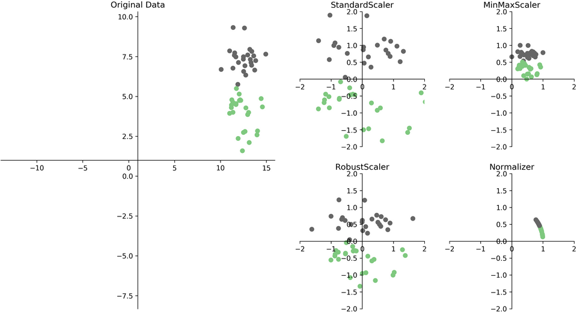
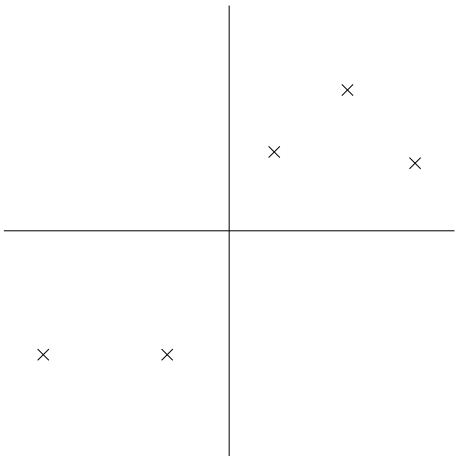
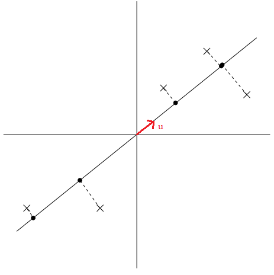
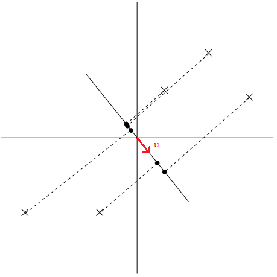
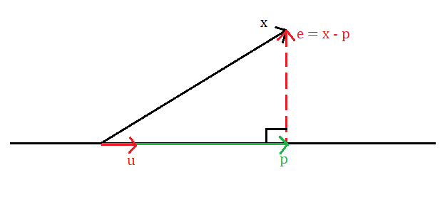



# Tóm tắt

Mở đầu bài viết, ta đưa ra một cái nhìn tổng quan về thuật toán Principal Components Analysis (**PCA**) và việc giảm chiều dữ liệu. Tiếp đến, ta xây dựng **PCA** từ ý tưởng đến hoàn thiện bằng toán học. Cuối cùng, ta tìm hiểu về những ứng dụng của **PCA** và cách sử dụng thuật toán trong python.

# Tổng quan

Principal Components Analysis (**PCA**) là thuật toán học không giám sát với mục đích giảm chiều dữ liệu bằng cách tìm không gian con có số chiều nhỏ hơn không gian ban đầu của dữ liệu.

## Giảm chiều dữ liệu

Ta sẽ tìm hiểu về khái niệm giảm chiều dữ liệu qua ví dụ.
Ta có tập dữ liệu $\{x^{(1)}, x^{(2)},.., x^{(n)}\}$, mỗi điểm dữ liệu $x^{(i)} \in \mathbb{R}^{d}$ thể hiện cho một khách hàng. Một khách hàng $i$ có những thuộc tính: tuổi, nghề nghiệp, thu nhập, tổng giá trị sản phẩm đã mua,... tương ứng với $x_1^{(i)}, x_2^{(i)},..., x_d^{(i)}$. Trong các thuộc tính trên có những thuộc tính có thể phụ thuộc lẫn nhau. Ta có thể dùng suy luận để nhận xét rằng, một người có thu nhập cao sẽ chi ra nhiều tiên để mua sản phẩm của công ty, nói cách khác mối quan hệ của thuộc tính "thu nhập" và "tổng giá trị sản phẩm đã mua" có thể biểu diễn bằng hàm số $y = ax + b$. Do đó, ta chỉ cần một vector $d - 1$ chiều để biểu diễn $x^{(i)} \in \mathbb{R}^{d}$.
Những thuật toán giảm chiều dữ liệu sẽ giúp thực hiện việc suy luận mối quan hệ của các thuộc tính một cách tự động và tối ưu nhất từ đó có thể giảm chiều dữ liệu cho tập dữ liệu ban đầu.

# Chuẩn hóa dữ liệu

**PCA** rất nhạy với đơn vị của thuộc tính, sử dụng đơn vị khác nhau của thuộc tính có thể dẫn đến kết quả khác nhau, ví dụ: sử dụng đơn vị cho thuộc tính "thu nhập" là (triệu) sẽ dẫn đến kết quả khác với sử dụng đơn vị là (ngàn). Do đó việc chuẩn hóa dữ liệu là cần thiết cho **PCA**.

Có nhiều thuật toán chuẩn hóa dữ liệu khác nhau như: Standard Scaling, Min Max Scaling, Robust Scaling, Normailizing,... Việc lựa chọn thuật toán nào sẽ tùy vào mục đích của người dùng.

|                                                            |
| :-----------------------------------------------------------------------------------------------: |
| _Hình 1: Dữ liệu ban đầu (trái) và dữ liệu sau khi chuẩn hóa bằng 4 thuật toán trên (phải). [^1]_ |

Ở đây, **PCA** sẽ sử dụng Stardard Scaling nên ta sẽ trình bày chi tiết về thuật toán đó.
Thuật toán Standard Scaling sẽ đưa từng thuộc tính của dữ liệu về giá trị trung bình bằng 0 và phương sai bằng 1 ($\mu = 0, \sigma^2 = 1$)

$$
\text{Với mỗi giá trị } i,j: \\
x_j^{(i)} := \frac{x_j^{(i)} - \mu_j}{\sigma_j} \\
\text{Với: } \\
\mu_j = \frac{1}{n} \sum_{i=1}^n x_j^{(i)} \\
\sigma_j^2 = \frac{1}{n} \sum_{i=1}^n \left(x_j^{(i)} - \mu_j\right)^2\\
$$

# Thuật toán PCA

Phần tiếp theo ta sẽ trình bày **PCA** về mặt ý tưởng sau đó triển khai thuật toán một cách toán học.

## Ý tưởng

Giả sử ta có tập dữ liệu gồm các điểm dữ liệu thuộc $\mathbb{R}^2$, và đây là tập dữ liệu sau khi được chuẩn hóa.

|                                                |
| :-------------------------------------------------------------------------------------------------------------: |
| _Hình 2: Dữ liệu sau khi được chuẩn hóa. Trục tung và trục hoành là trục thể hiện thuộc tính của dữ liệu. [^2]_ |

Một cách trực quan, khi nhìn vào tập dữ liệu, ta thấy được thông tin về mối quan hệ giữa hai thuộc tính được thể hiện qua phương sai của tập dữ liệu (hay hiệu phương sai của hai thuộc tính). Nói cách khác, nếu một điểm dữ liệu có thuộc tính 1 lớn thì thuộc tính 2 cũng sẽ lớn, và ngược lại (hiệu phương sai dương). Vì lẽ đó, nên khi ta mang những điểm dữ liệu trên vào không gian thấp chiều hơn (trong trường hợp này là $\mathbb{R}$) thì ta muốn ý nghĩa về phương sai trên vẫn được bảo toàn.

Cụ thể hơn, ta muốn tìm những vector đơn vị $u$ sao cho, khi ta chiếu những điểm dữ liệu lên đường thẳng có $u$ là vector chỉ hướng thì phương sai của những điểm dữ liệu mới được tối đa.

Để hiểu rõ hơn về cách chọn vector $u$, ta sẽ xem qua hai trường hợp mà ở đó một trường hợp vector $u$ được chọn tốt còn trường hợp còn lại thì không.

|                           |
| :----------------------------------------------------------------------------------------: |
| _Hình 3: Các điểm dữ liệu được chiếu lên đường thẳng có $u$ là vector chỉ hướng tốt. [^2]_ |

Ta thấy những điểm dữ liệu mới (chấm đen) được chiếu lên đường thẳng có $u$ là vector chỉ hướng vẫn cách nhau khá xa, hay có phương sai lớn. Những điểm dữ liệu mới (chấm đen) thể hiện khá tốt những điểm dữ liệu ban đầu (dấu x). Ngược lại với cách chọn trên, ta có cách chọn vector $u$ không được tốt.

|                                 |
| :----------------------------------------------------------------------------------------------: |
| _Hình 4: Các điểm dữ liệu được chiếu lên đường thẳng có $u$ là vector chỉ hướng không tốt. [^2]_ |

Trong trường hợp này, những điểm dữ liệu mới (chấm đen) rất gần nhau, hay có phương sai nhỏ, đây không phải là cách thể hiện tốt cho những điểm dữ liệu ban đầu (dấu x).

Tóm lại, ý tưởng của **PCA** là tìm ra những vector $u$ sao cho, khi ta chiếu những điểm dữ liệu ban đầu lên các đường thẳng có $u$ là vector chỉ hướng thì những điểm dữ liệu mới sẽ có phướng sai lớn. Sau khi tìm được $k$ vector $u$ lần lượt là $u_1, u_2,...,u_k$ thì ta sẽ chiếu điểm dữ liệu lên $k$ đường thẳng có $u_1, u_2,...,u_k$ lần lượt là vector chỉ hướng, sẽ có được điểm dữ liệu trong tọa độ mới thuộc $\mathbb{R}^k$ (việc làm này sẽ được cụ thể hơn trong phần trình bày bằng toán học).

$$
x^{(i)} \in \mathbb{R}^d \rightarrow x^{(i)'} \in \mathbb{R}^k
$$

Qua đó ta rút ra được những nhận xét:

- Phương sai của tập dữ liệu mới sẽ đúng bằng trung bình cộng của bình phương khoảng cách của những điểm dữ liệu mới đến gốc tọa độ bởi vì tập dữ liệu đã được chuẩn hóa cho giá trị trung bình là 0.
- Những vector $u_1, u_2,...,u_k$ độc lập tuyến tính với nhau vì mục đích của **PCA** là "nén" các điểm dữ liệu vào một chiều không gian nhỏ hơn nên nếu có một vector $u_j$ là tổ hợp tuyến tính của những vector $u$ còn lại thì tọa độ được thể hiện bằng vector $u_j$ xem như bị "thừa".
- $k < d$. Dễ hiểu vì ta đang muốn giảm chiều của dữ liệu.

## Trình bày toán học

Để thuận tiện trong việc trình bày, ta gọi hành động chiếu điểm dữ liệu $x$ lên đường thẳng nhận $u$ làm vector chỉ hướng là chiếu điểm dữ liệu $x$ lên vector $u$.

### Ma trận chiếu của vector

Trước tiên, ta sẽ nhắc lại cách tìm hình chiếu của vector $x$ lên vector $u$

|  |
| :---------------------------------------------------------------: |
|       _Hình 5: Quá trình chiều vector $x$ lên vector $u$._        |

Trong hình vẽ, vector $p$ (màu xanh) là vector có được sau khi thực hiện phép chiếu vector $x$ lên vector $u$. Bằng phép trừ vector ta thu được vector $e = x - p$ vuông góc với vector $p$. Ngoài ra, vector $e$ còn được gọi là vector residual.

Ma trận chiếu của vector $x$ lên vector $u$ là ma trận $P$ sao cho:

$$
p = Px
$$

Một cách toán học, chiều của vector và ma trận phải là:

$$
x,u,p,e \in \mathbb{R}^d \\
P \in \mathbb{R}^{d \times d}
$$

Ta sẽ bắt đầu tìm lại ma trận $P$. Vì vector $u$ và vector $p$ cùng phương nên ta đặt $p = ku$ với $k \in \mathbb{R}$. Vì $u \perp e$ nên:

$$
\begin{aligned}
u^T e &= 0 \\
u^T (x- p) &= 0 \\
u^T (x- ku) &= 0 \\
ku^Tu &= u^Tx \\
k &= \frac{u^T x}{u^T u}
\end{aligned}
$$

Từ đó, ta có:

$$
\begin{aligned}
p &= ku \\
&= uk \\
&= u \frac{u^T x}{u^T u} \\
&= \frac{u u^T}{u^T u} x
\end{aligned}
$$

Vậy:

$$
P = \frac{u u^T}{u^T u}
$$

### Mô hình toán học

Ta có tập dữ liệu đã được chuẩn hóa $\{x^{(1)}, x^{(2)},.., x^{(n)}\}$ với $x^{(i)} \in \mathbb{R}^d$. Ta cần tìm những vector đơn vị $u \in \mathbb{R}^d, u^Tu = 1$ sao cho, khi chiếu những điểm dữ liệu lên vector $u$ thì trung bình cộng của bình phương khoảng cách của những điểm dữ liệu mới đến gốc tọa độ lớn nhất.

Áp dụng tính chất đã trình bày, ta sẽ tìm vector hình chiếu của vector $x$ lên $u$.

$$
p = Px = \frac{u u^T}{u^T u} x = uu^Tx \quad (\because u^Tu = 1)
$$

Từ đó, ta tìm được độ lớn của vector hình chiếu hay khoảng cách của những điểm dữ liệu mới đến gốc tọa độ.

$$
\text{\textbardbl}p\text{\textbardbl} =\text{\textbardbl}uu^T x\text{\textbardbl} = \text{\textbardbl}u^Tx\text{\textbardbl} = \text{\textbardbl}x^Tu\text{\textbardbl} = x^T u \quad(\because u^Tu=1)
$$

Vậy mục tiêu trở thành, tìm vector đơn vị $u$ sao cho đại lượng sau được tối đa:

$$
\begin{aligned}
\frac{1}{n} \sum_{i=1}^n \left(x^{(i)^T} u\right)^2 &= \frac{1}{n} \sum_{i=1}^n u^T x^{(i)} x^{(i)^T} u \\
&= u^T \left( \frac{1}{n} \sum_{i=1}^n x^{(i)} x^{(i)^T} \right)u \\
&= u^T \Sigma u
\end{aligned}
$$

Với $\Sigma = \frac{1}{n} \sum_{i=1}^n x^{(i)} x^{(i)^T}$

Vì tập dữ liệu đã được chuẩn hóa nên có giá trị trung bình là 0, do đó ma trận $\Sigma$ là ma trận hiệu phương sai của tập dữ liệu.

Qua phép biến đổi trên, bài toán trở thành bài toán tối ưu hóa.

$$
\text{Tối đa} \quad f(u) = u^T \Sigma u  \\
\text{Với} \quad u^Tu = 1
$$

Ta giải quyết bài toán bằng cách xây dựng hàm Lagrangian:

$$
\mathcal{L}(u;\lambda) = u^T \Sigma u + \lambda(u^Tu - 1)
$$

Vì ma trận $\Sigma$ là một ma trận đối xứng nên lấy đạo hàm riêng của hàm Lagrangian theo biến $u$ và giải nghiệm ta được:

$$
\begin{aligned}
\frac{\partial \mathcal{L}}{\partial u} &= 0 \\
2 \Sigma u - 2 \lambda u &= 0 \\
\Sigma u &= \lambda u
\end{aligned}
$$

Ta thấy, $u$ là vector riêng và $\lambda$ là giá trị riêng tương ứng của ma trận $\Sigma$. Từ đó, hàm mục tiêu cần tối đa $f(u)$ trở thành:

$$
\begin{aligned}
f(u) &= u^T \Sigma u \\
&= u^T \lambda u &\quad (\because \Sigma u = \lambda u) \\
&= \lambda u^T u \\
&= \lambda &\quad (\because u^T u = 1)
\end{aligned}
$$

Vậy, để tối đa hàm mục tiêu $f(u)$ thì vector $u$ phải là vector riêng ứng với giá trị riêng **lớn nhất** của ma trận $\Sigma$.

Tóm tắt lại, ta vừa tìm được không gian con một chiều để xấp xỉ tập dữ liệu ban đầu bằng cách chiếu từng điểm dữ liệu lên vector $u$. Tổng quát hơn, nếu ta muốn chiếu tập dữ liệu ban đầu lên một không gian con $k$ chiều ($k < d$) thì ta sẽ chọn $u_1, u_2,...,u_k$ là $k$ vector riêng ứng với $k$ giá trị riêng **lớn nhất** của ma trận $\Sigma$. Các vector $u_1, u_2,...,u_k$ còn được gọi là $k$ **principal components** đầu tiên của dữ liệu

Ngoài ra, $k$ vector $u$ tạo thành một hệ cơ sở trực chuẩn mới cho dữ liệu. Ta thể hiện điểm dữ liệu $x^{(i)}$ trong hệ cơ sở mới bằng cách tìm vector $y^{(i)}$ tương ứng.

$$
y^{(i)} =
\begin{bmatrix}
\rule[.5ex]{1.5em}{0.4pt} & u_1^T & \rule[.5ex]{1.5em}{0.4pt} \\
\rule[.5ex]{1.5em}{0.4pt} & u_2^T & \rule[.5ex]{1.5em}{0.4pt} \\
& \vdots & \\
\rule[.5ex]{1.5em}{0.4pt} & u_k^T & \rule[.5ex]{1.5em}{0.4pt}
\end{bmatrix}
x^{(i)} \in \mathbb{R}^k
$$

### Cách chọn số chiều của không gian con (k)

Giả sử sau khi thực hiện phân rã trị riêng trên ma trận $\Sigma$ ta thu được $d$ giá trị riêng $\lambda_1, \lambda_2,...,\lambda_d$ được sắp xếp theo thứ tự giảm dần. Khi này, ta có thể chọn $k$ bằng cách tìm giá trị $k$ nhỏ nhất sao cho:

$$
\frac{\sum_{i=1}^k \lambda_i}{\sum_{i=1}^d \lambda_i} \geq r
$$

Với $r$ là siêu tham số thỏa mãn $0 \leq r \leq 1$.

Ta có thể hiểu, siêu tham số $r$ thể hiện số phần trăm thông tin của dữ liệu ta muốn bảo toàn sau khi thực hiện **PCA**.

Ngoài ra, ta có thể thực hiện **PCA** trước, sau đó lựa chọn giá trị siêu tham số $r$ sau.

### Ma trận hóa

Để việc trình bày súc tích và thuật toán được triển khai nhanh trên các thư viện tính toán của python, ta sẽ đưa dữ liệu vào các ma trận.

Bắt đầu với tập dữ liệu $\{x^{(1)}, x^{(2)},.., x^{(n)}\}$ với $x^{(i)} \in \mathbb{R}^d$, ta sẽ đưa những điểm dữ liệu $x^{(i)}$ vào các **cột** của ma trận $X$

$$
X =
\begin{bmatrix}
\vert & \vert & & \vert \\
x^{(1)} & x^{(2)} & \dots & x^{(n)} \\
\vert & \vert & & \vert
\end{bmatrix}
\in \mathbb{R}^{d \times n}
$$

Bằng cách nhân ma trận, ta thu được kết quả

$$
\Sigma = \frac{1}{n} \sum_{i=1}^n x^{(i)} x^{(i)^T} = \frac{1}{n} XX^T \in \mathbb{R}^{d \times d}
$$

Sau khi thực hiện phân rã trị riêng ma trân $\Sigma$, ta đưa $k$ vector riêng $u_1, u_2,...,u_k$ vào các **hàng** của ma trận $U$

$$
U = \begin{bmatrix}
\rule[.5ex]{1.5em}{0.4pt} & u_1^T & \rule[.5ex]{1.5em}{0.4pt} \\
\rule[.5ex]{1.5em}{0.4pt} & u_2^T & \rule[.5ex]{1.5em}{0.4pt} \\
& \vdots & \\
\rule[.5ex]{1.5em}{0.4pt} & u_k^T & \rule[.5ex]{1.5em}{0.4pt}
\end{bmatrix}
\in \mathbb{R}^{k \times d}
$$

Vậy tọa độ mới của các điểm dữ liệu sẽ là các **cột** của ma trận $Y$

$$
UX = \begin{bmatrix}
\rule[.5ex]{1.5em}{0.4pt} & u_1^T & \rule[.5ex]{1.5em}{0.4pt} \\
\rule[.5ex]{1.5em}{0.4pt} & u_2^T & \rule[.5ex]{1.5em}{0.4pt} \\
& \vdots & \\
\rule[.5ex]{1.5em}{0.4pt} & u_k^T & \rule[.5ex]{1.5em}{0.4pt}
\end{bmatrix}
\begin{bmatrix}
\vert & \vert & & \vert \\
x^{(1)} & x^{(2)} & \dots & x^{(n)} \\
\vert & \vert & & \vert
\end{bmatrix}
= \begin{bmatrix}
\vert & \vert & & \vert \\
y^{(1)} & y^{(2)} & \dots & y^{(n)} \\
\vert & \vert & & \vert
\end{bmatrix}
= Y
\in \mathbb{R}^{k \times n}
$$

### Thuật toán PCA

Khi này ta có thể phát biểu thuật toán **PCA** một cách hoàn thiện.

> **Input**: Ma trận dữ liệu $X$, siêu tham số $r$.
>
> 1. Chuẩn hóa $X$.
> 2. Tính $\Sigma = \frac{1}{n} XX^T $.
> 3. Phân rã trị riêng $ \Sigma $ thu được $d$ vector riêng $u_1, u_2,...,u_d$ ứng với các giá trị riêng $ \lambda_1, \lambda_2,..., \lambda_d$ được sắp xếp theo thứ tự giảm dần.
> 4. Chọn giá trị $k$ nhỏ nhất sao cho $ \frac{\sum^k \lambda_i}{\sum^d \lambda_i} \geq r$.
> 5. Đưa $k$ vector riêng đầu tiên vào các hàng của ma trận $U$.
> 6. Tính $Y = UX$.
>
> **Output**: Ma trận dữ liệu mới $Y$.

### Xây dựng PCA theo cách khác

Nhắc lại phần trước, ta chọn vector đơn vị $u$ sao cho trung bình cộng của bình phương độ lớn vector hình chiếu $p$ của vector $x$ lên $u$ lớn nhất, hay:

$$
u = \arg \max_u \frac{1}{n} \sum_{i=1}^n \left(x^{(i)^T} u\right)^2
$$

Ngoài ra, ta có một bài toán tương đương là chọn vector đơn vị $u$ sao cho trung bình cộng của bình phương độ lớn vector residual $e = x - p$ nhỏ nhất, hay:

$$
\begin{aligned}
u &= \arg \min_u \frac{1}{n} \sum_{i=1}^n \text{\textbardbl}x^{(i)} - p^{(i)}\text{\textbardbl}^2 \\
&= \arg \min_u \frac{1}{n} \sum_{i=1}^n \text{\textbardbl}x^{(i)} - u u^T x^{(i)}\text{\textbardbl}^2 \\
&= \arg \min_u \frac{1}{n} \sum_{i=1}^n \left(x^{(i)} - u u^T x^{(i)}\right)^T \left(x^{(i)} - u u^T x^{(i)}\right) \\
&= \arg \min_u  \frac{1}{n} \sum_{i=1}^n \left( x^{(i)^T} x^{(i)} - 2 \left( u^T x^{(i)}\right)^2 + u^T u \left(u^T x^{(i)}\right)^2 \right) \\
&= \arg \min_u \frac{1}{n}  \sum_{i=1}^n \left( x^{(i)^T} x^{(i)} - 2 \left( u^T x^{(i)}\right)^2 +  \left(u^T x^{(i)}\right)^2 \right)  \quad (\because u^Tu = 1)\\
&= \arg \min_u \frac{1}{n} \sum_{i=1}^n - \left(u^T x^{(i)} \right)^2 \\
&= \arg \max_u \frac{1}{n} \sum_{i=1}^n \left(x^{(i)^T} u \right)^2
\end{aligned}
$$

Vậy ta đã chứng minh được hai bài toán trên tương đương với nhau.

# Ứng dụng của PCA

**PCA** có nhiều ứng dụng, ta sẽ tìm hiểu một vài ứng dụng đó.

Đầu tiên, **PCA** dùng để nén dữ liệu qua việc thể hiện điểm dữ liệu $x^{(i)}$ bằng điểm dữ liệu $y^{(i)}$ trong không gian mới thấp chiều hơn. Nếu ta giảm chiều dữ liệu về $k=2$ hoặc $k=3$, ta có thể vẽ các điểm dữ liệu mới $y^{(i)}$ trong không gian $\mathbb{R}^2$ hoặc $\mathbb{R}^3$. Từ đó, qua hình vẽ ta có thể đưa ra nhận xét về cấu trúc của dữ liệu, như những điểm dữ liệu tương đồng thường ở gần nhau thành cụm.

Tiếp đến, **PCA** dùng để tiền xử lý dữ liệu. Ta có thể giảm chiều cho các điểm dữ liệu $x^{(i)}$ trước khi cho vào thuật toán học có giám sát. Ngoài tác dụng để giảm thời gian tính toán, việc giảm chiều dữ liệu còn giảm độ phức tạp của các hàm giả thiết tránh việc overfitting thường xảy ra trong các thuật toán học có giám sát.

Cuối cùng, **PCA** còn được xem như thuật toán giảm nhiễu cho dữ liệu. Ta có thể thấy rõ ứng dụng trong việc nhận diện vật thể trong ảnh, ví dụ ta có một bức ảnh chân dung 128x128 pixels trên thang độ xám được thể hiện bằng một vector $x \in \mathbb{R}^{128 \times 128} $, khi này $x$ là vector trong không gian 16384 chiều. Việc biến vector $x$ thành vector $y$ trong không gian thấp chiều hơn, ta mong đợi qua việc làm đó ta có tìm được đặc điểm khuôn mặt của người trong ảnh bằng cách loại bỏ những yếu tố gây nhiễu như: sự chêch lệnh ánh sáng, sự thay đổi trong môi trương chụp ảnh,... Đây là ứng dụng khá cũ trong xử lí hình ảnh để nhận diện vật thể, ngày nay ta sử dụng những hệ thống học sâu và cho ra hiệu quả rất cao.

# Triển khai PCA trong python

Trong phần này, ta sẽ tạo tập dữ liệu giả bao gồm 3 thuộc tính độc lập và 2 thuộc tính được tạo nên từ 2 trong 3 thuộc tính độc lập và thêm vào số gây nhiễu. Trên tập dữ liệu vừa tạo được ta lần lượt triển khai thuật toán **PCA** của thư viện **scikit-learn** và thuật toán **PCA** tự xây dựng. Do cách tập dữ liệu được tạo ra như trên, nên ta mong đợi thuật toán trả về một tập dữ liệu mới trong không gian $\mathbb{R}^3$ và giữ lại được tương đối nhiều thông tin.

## Thư viện cần thiết

```python
import numpy as np
import pandas as pd
from sklearn.decomposition import PCA
from sklearn.preprocessing import StandardScaler
import matplotlib.pyplot as plt
```

## Xây dựng dữ liệu

Ta lấy 1000 điểm dữ liệu ngẫu nhiên từ một phân phối chuẩn nhiều biến $\mathcal{N}(0, I_{3 \times 3})$.

Thuộc tính thứ 4 bằng thuộc tính thứ 1 cộng thêm một số gây nhiễu được lấy từ phân phối chuẩn $\mathcal{N}(0, 1)$. Hay một cách toán học: $x_4 = x_1 + \epsilon$ với $\epsilon \sim \mathcal{N}(0, 1)$.

Thuộc tính thứ 5 bằng thuộc tính thứ 2 cộng thêm một số gây nhiễu được lấy từ phân phối chuẩn $\mathcal{N}(0, 1)$. Hay một cách toán học: $x_5 = x_2 + \epsilon$ với $\epsilon \sim \mathcal{N}(0, 1)$.

```python
data = pd.DataFrame(np.random.standard_normal((1000, 3)), columns=['x_1', 'x_2', 'x_3'])
data['x_12'] = data['x_1'] + np.random.standard_normal(1000)
data['x_22'] = data['x_2'] + np.random.standard_normal(1000)
```

10 điểm dữ liệu đầu tiên của tập dữ liệu:

|     |       x_1 |       x_2 |       x_3 |      x_12 |      x_22 |
| --: | --------: | --------: | --------: | --------: | --------: |
|   0 | -0.104956 | -1.602666 | -0.746589 |  0.000711 | -0.843164 |
|   1 |  0.985981 |  1.769158 |  0.529060 |  1.406641 |  0.678612 |
|   2 | -0.451795 |  0.927669 | -1.088793 | -0.927991 |  1.527098 |
|   3 | -0.583225 |  2.169625 |  0.635159 |  1.865672 |  3.452182 |
|   4 |  0.695683 |  0.924896 |  0.136483 |  1.149004 | -1.324765 |
|   5 |  0.319727 | -2.103935 | -0.618945 | -1.307749 | -2.915871 |
|   6 | -0.898247 |  0.281593 |  0.447593 | -1.974785 | -0.526757 |
|   7 |  1.839951 |  0.428175 | -0.479016 |  1.938443 |  1.839200 |
|   8 | -0.253375 |  1.493829 | -0.460393 | -1.132856 |  0.914950 |
|   9 |  0.750355 |  0.553638 |  0.520859 |  0.995447 | -1.680824 |

## PCA của thư viện scikit-learn

Vì **PCA** của **scikit-learn** không trực tiếp hỗ trợ chuẩn hóa dữ liệu nên đầu tiên ta sẽ thực hiện chuẩn hóa dữ liệu bằng **StandardScaler**.

```python
scaled_data = StandardScaler().fit_transform(data)
```

10 điểm dữ liệu đầu tiên của tập dữ liệu sau khi đã chuẩn hóa:

|     |       x_1 |       x_2 |       x_3 |      x_12 |      x_22 |
| --: | --------: | --------: | --------: | --------: | --------: |
|   0 | -0.136994 | -1.611005 | -0.718743 | -0.026567 | -0.577244 |
|   1 |  0.915577 |  1.720680 |  0.555608 |  0.943183 |  0.493353 |
|   2 | -0.471635 |  0.889208 | -1.060599 | -0.667145 |  1.090279 |
|   3 | -0.598444 |  2.116379 |  0.661598 |  1.259804 |  2.444611 |
|   4 |  0.635488 |  0.886468 |  0.163430 |  0.765477 | -0.916060 |
|   5 |  0.272754 | -2.106307 | -0.591229 | -0.929086 | -2.035432 |
|   6 | -0.902387 |  0.250823 |  0.474223 | -1.389179 | -0.354646 |
|   7 |  1.739514 |  0.395660 | -0.451443 |  1.309998 |  1.309849 |
|   8 | -0.280194 |  1.448628 | -0.432838 | -0.808453 |  0.659622 |
|   9 |  0.688237 |  0.519629 |  0.547414 |  0.659559 | -1.166554 |

Triển khai thuật toán **PCA**:

```
pca = PCA().fit(scaled_data)
```

Vẽ đồ thị sự phụ thuộc của "Phần trăm thông tin được bảo toàn (%)" với "Số chiều của không gian con"

```python
plt.plot(np.arange(1,6), 100 * np.cumsum(pca.explained_variance_ratio_))
plt.xlabel('Chiều của không gian con')
plt.ylabel('Phần trăm thông tin được bảo toàn (%)')
plt.xticks(np.arange(1,6))
plt.grid()
plt.show()
```

| ![img](data:image/png;base64,iVBORw0KGgoAAAANSUhEUgAAAYYAAAEHCAYAAACqbOGYAAAAOXRFWHRTb2Z0d2FyZQBNYXRwbG90bGliIHZlcnNpb24zLjQuMywgaHR0cHM6Ly9tYXRwbG90bGliLm9yZy/MnkTPAAAACXBIWXMAAAsTAAALEwEAmpwYAAAxDElEQVR4nO3deXxU1dnA8d/DGiBAEpAQ1gTZRFmTsLggca0rahVxaa1VqeKCtbYufevy9rVia622ai2ttlRZRK3i0lqXEpUqYhL2VSAQWQNkgQDZn/ePe8EJJMxMMpM7yTzfzyefmTl3OU/OB/LMveeec0RVMcYYYw5r4XUAxhhjIoslBmOMMTVYYjDGGFODJQZjjDE1WGIwxhhTQyuvA2iorl27anJycr2PP3DgAB06dAhdQM2ctVdwrL2CY+0VnIa0V3Z29h5VPaG2bU0+MSQnJ5OVlVXv4zMzM5kwYULoAmrmrL2CY+0VHGuv4DSkvURkS13b7FaSMcaYGiwxGGOMqcESgzHGmBosMRhjjKnBEoMxxpgawpoYROQlEckXkZU+ZQki8qGIfO2+xvtse0BENojIOhE5P5yxGWOMqV24rxj+BnznqLL7gY9VdQDwsfsZERkCTAZOdo95XkRahjk+Y4wxRwlrYlDVT4GCo4onAjPd9zOBy3zK56pqmarmAhuA0eGMzxhjmprKqmpWbivmpYW5LN5ZGZY6vBjglqiqOwBUdYeIdHPLewKLfPbb6pYdQ0SmAFMAEhMTyczMrHcwJSUlDTo+2lh7BcfaKzjWXscqr1I2FVezvrCK9QXVbCiqorTK2ZZ6goalvSJp5LPUUlbrKkKqOgOYAZCWlqYNGSlpIy2DY+0VHGuv4Fh7QfGhCrK3FLA4t5CvNhewYmsx5VXVAAxK7MiV6fGkJyeQnpzA+qVfhqW9vEgMu0Qkyb1aSALy3fKtQG+f/XoB2xs9OmOMaUQ7i0tZvLmAr3IL+GpzAet27UcVWrUQhvbqzI2nJZOenEBacjxx7dvUOHZ9mGIKKjGISAegVFWrGlDn28ANwHT3db5P+WwReQroAQwAFjegHmOMiSiqyqY9B/gqt8BJBpsL+KbgEADt27QktW88Fw5NIj05gRG942jXxpvnb46bGESkBc6TQtcB6UAZ0FZEdgP/BGao6tfHOX4OMAHoKiJbgYdxEsI8EbkJyAOuAlDVVSIyD1gNVAK3NzABGWOMpyqrqlm9Yx+LcwvI2lxI1pYC9pSUA9ClQxvSkuO5YVwyo1MSGJLUiVYtI2Nomb8rhgXAR8ADwEpVrQZnLAKQAUwXkTdV9ZXaDlbVa+o479l17P8Y8FgggRtjTKQprahiSV4RX7lXAzlbCjlQ7ny/7Z3QjvEDT2B0cgJpyQmceEIHRGrrWvWev8RwjqpWHF2oqgXAG8AbItI6LJEZY0yEKzpYTtbmwiOJYMW2YiqqFBGno/iKUb1IT0lgdHIC3TvHeB1uwI6bGI5OCiISA1wPtANmq+re2hKHMcY0RzuKD7HY7ST+KreQdbv2A9C6pTCsVxw/PD3FuSLom0Dn9k33O3OwTyU9A+QApcBbwBmhDsgYYyKBqrJxdwmLcwvJ2ux0Fm8tdDqKO7Rpyai+8Vw8LIn0FKejOKZ185mowV/n82zgF6q60S1KAGa576eFMzBjjGlMlVXVrNq+j682FzidxVsKKTjgdBR3jW1DenICN57mXBGclNQxYjqKw8HfFcP/AP8nItuBXwJP4jxWGgM8Et7QjDEmfA6VV7Ekr5Cv3D6CnLxCDrodxX0S2pMxqBujU5zBZCldI7ejOBz89TFsAq4VkdOBV4H3gHPtMVJjTFNTdLD8SBJYnFvAym3FVFY7HcWDu3fiytRepCcnMDolgcROTaejOBz83UqKB64FKoBJOBPe/VtEnlbVd8MfnjHG1M+2okNO34DbWbx+VwkAbVq2YFivztwyvh+jkxMY1Teezu2abkdxOPi7lfQW8DLQHnhZVSeKyGvAz0RkiqpeGu4AjTHGH1VlQ36Jz9QShWwrcjqKY9u2YlTfeC4d3oP05ASGN7OO4nDwlxi6ALNxHk/9PoCqHgIedec5MsaYRldxuKPYnVoia3MBhQedJ+e7xrZldEo8N5+RQnpyAicldaJli+jpHwgFf4nhYeBDoAp3QZ3DDk+dbYwx4XawvJIleUVHbgstySviUIXT1dm3S3vOPimR0ckJpKckkNylfVR1FIeDv87nN3BGOBtjTKMpPFB+ZDTx4s2FrPLpKD6peyeuTu/tTj0dT7co7ygOB3+dzzOA36vqylq2dQCuBspUddYxBxtjTIB2FpeyaNNe3lpZxmM5n/B1/rcdxcN7d2bK+H6kpySQ2jeeTjHWURxu/m4lPQ88JCJDgZXAbpwxDAOATsBLfDvgzRhjApK/r5QvNu1l0aa9LNpUQO6eAwC0awVjTmzHZSN7kp6cwLBena2j2AP+biUtBSaJSCyQBiQBh4A1qrou/OEZY5qD/P2lLNpU4CaCvWza7SSCjjGtGJOSwHVj+jC2Xxfy1+dwVoYt9e61gOZKUtUSIDO8oRhjmovd+8v4MtdJAl9s3MtGNxHEtm3F6JQEJqf3Zly/rgzpUfOJocyvrdM4EkTSms/GmCZqb0kZX+YW8MVGJxkc7iPo0KYl6SkJTErrzdh+XTi5R+QsRmPqZonBGBO0ggPlfOnTR3B4+un2bVqSnpzAFaN6MbZfAkN7drZE0ARZYjDG+FV4oJwvc7/tI1i700kE7Vq3JC05nktH9GDciV0Y2rMzrS0RNHkBJQYRGQj8FOjre4yqnhWmuIwxHio+WMGXuXvdJ4cKWLtzH6oQ07oFaX0TuPe8JDcRxNGmlSWC5ibQK4bXgBeAP+OMgjbGNCPFhyr4KrfgyCOkq3c4iaBtqxak9o3nnnMGMvbELgzvZYkgGgSaGCpV9Y9hjcQY02j2lTqJYNEm56pg1XYnEbRp1YLUPvHcffZAxp3YheG9O9O2lY0jiDaBJoZ3RGQq8CZQdrhQVQvqW7GITANuAQT4s6o+LSIJOOs+JAObgUmqWljfOowxjv2lFWRtLjxyRbByWzHV6owsHtknjrvOGsC4E7s0uyUqTf0EmhhucF9/6lOmQL/6VCoip+AkhdFAOfC+iLznln2sqtNF5H6cifvuq08dxkSzkrJKsjYXHOkjWLmtmKpqpXVLYWTveO44awBj+yUwqk+8JQJzjEAHuKWEuN6TgEWqehBARD4BLgcmAhPcfWbiDKqzxGCMHwfKKsnaUnhkQNkKn0QwonccUyecyNh+XRjVJ552bSwRmOML+HFV91v+EJy5kgBQ1b/Xs96VwGMi0gVnio0LgSwg8fB03qq6Q0S61fP8xjRrB8sryd5SeGRA2fKtzuyjrVoIw3vHceuZ/RjXryuj+sbRvo09lW6CI6rqfyeRh3G+yQ8B/glcACxU1SvrXbHITcDtQAmwGidB3KiqcT77FKpqfC3HTgGmACQmJqbOnTu3vmFQUlJCbGxsvY+PNtZewQlVe5VVKRuLqlmzt4q1BVVsKq6mSqGFQEqnFpzUpSWDE1rQP64lMa2a7rQS9u8rOA1pr4yMjGxVTatt23ETg4h0B04GngaGA0tUdbiIJAJ/UdVL6hXRsfX8CtgKTAMmuFcLSUCmqg463rFpaWmalZVV77ozMzOZMGFCvY+PNtZewalve5VWVJFz+NbQpr0s/aaIiiqlZQvhlJ6dGdevC2P7JZCWnEBs2+ZzRWD/voLTkPYSkToTQ53/okTkHOBunG/mh1S1WkQqRaQTkE89O559zt9NVfNFpA9wBTAOSMHp6J7uvs5vSB3GNBWlFVUsySs68tTQ0rwiyquqaSEwtGdnfnhaCmNP7EJa33g62noEJsyO91VjD3CZqlaKSJaIxOEMcMvGuf2zuIF1v+H2MVQAt6tqoYhMB+a5t5nygKsaWIcxEamssoqlPokgJ6+I8konEZzcozM/OC35yBWBLUxjGludicFdi+Hw+6nu2xdE5H2gk6oub0jFqnpGLWV7gbMbcl5jIlFZZRXLvik+8tRQTl4hZZXViMCQpE58f2xfxvbrQnpKAp3bWSIw3grmqaRLgfHux0+ABiUGY5q7lduKeXtjOX/esIjsLYWUVlQfWbP4ujF9GdsvgTEpXejc3hKBiSyBTqI3HUjn22U87xKRU1X1gbBFZkwTVVWtPP3Rev7wnw0ADO5ezuT0Pow7sQtjUhKIa9/G4wiNOb5ArxguBEaoajWAiMwElgCWGIzxUXSwnGlzl/LJ+t1cmdqLMzsXcMl54/0faEwECWaaxDif951DHIcxTd7KbcVc8uxCPt+4h/+77BR+c+UwOrZpumMKTPQK9IrhcWCJiCzAmfRuPPBg2KIypol5I3srD765gvj2bZj3o3GM7HPMuExjmoxA50qaIyKZOP0MAtynqjvDGZgxTUF5ZTW/fHc1Ly/awth+CTx77Si6xrb1OixjGiTQzuePVfVs4O1ayoyJSjuLS7ltVjZL8oqYMr4fPzt/kK1vbJqF4yYGEYkB2gNdRSQe52oBoBPQI8yxGROxFm3ayx2zczhYXsVz147iomFJXodkTMj4u2L4Ec60GD1wRjwfTgz7gOfCF5YxkUlVeXFhLo//ay19E9oz55axDEjs6HVYxoTUcRODqj4DPCMid6rqHxopJmMi0oGySu57YznvLt/B+Scn8uRVw23eItMsBdr5bEnBRLVNu0u49ZVsNuSXcN93BnPrmf0QsUdRTfPUfObrNSZM/r1qJz+Zt4zWLYW//3AMpw/o6nVIxoSVJQZj6lBVrfz2g3U8n7mRYb0688frU+kZ187rsIwJu3pPoqeq74QnJGO8V3CgnGlzl/DZ13uYnN6bRy49mZjWtlayiQ6BjmN4HBiNTaJnosCKrcXc+ko2u/eXMf2KoUwe3cfrkIxpVIFeMVyETaJnosC8r77hf+avpGuHNrx26ziG947zOiRjGl0wfQxxQIH73ibRM81KWWUVj7y9mjmL8zitfxd+P3kkXWxqCxOlGjKJnl0tmGZhe9EhbpuVw7Jvirj1zBO597yBNrWFiWo2iZ6Jap9v2MOdc5ZQVlnNC9eP4jun2NQWxgRzK6kU2AnEAANFZKCqfhqesIwJL1VlxqebeOL9tfQ7IZYXrk+lf7dYr8MyJiLUmRhEpBVQrarVInIzMA3oBSwFxgJfAGc1RpDGhFJJWSU/fW0Z/1q5kwuHdufXVw4ntq0N6THmsOP9b5gPrBCRF3CSQjqwSFUzRGQw8GhjBGhMKG3IL+FHL2eRu+cAD144mFvOsKktjDna8XrYKoHHgAqgVFVLAUSkraquBQY1pGIR+bGIrBKRlSIyR0RiRCRBRD4Uka/dV1sGy4TMv1bsYOKzCyk6WMErN49hyvgTLSkYU4s6E4OqTlTV/aq6DdgqInHAW8CHIjIf2F7fSkWkJ3AXkKaqpwAtgcnA/cDHqjoA+Nj9bEyDVFZV8/i/1nDbrBz6J3bk3btO59QTbb4jY+oS6FNJl7tvH3EfWe0MvB+CutuJSAXOYkDbcR6BneBunwlkAvc1sB4TxfaWlHHnnCV8vnEv147pw8OXDKFtK5vawpjjEVUNbEeRUcDpgAL/VdWcBlUsMg3nVtUh4ANVvU5EilQ1zmefQlU95naSiEwBpgAkJiamzp07t95xlJSUEBtrT6MEqim116aiKp5dWsa+cuWGIW04o1fjr53QlNorElh7Bach7ZWRkZGtqmm1bQt0rqSHgKuAf7hFfxWR11T1/+oTkNt3MBFIAYqA10Tk+kCPV9UZwAyAtLQ0nTBhQn3CACAzM5OGHB9tmkp7zVmcx/QPV3FCxxhm3pzK0F7eDNZvKu0VKay9ghOu9gr0Gb1rgJE+HdDTgRygXokBOAfIVdXd7vn+AZwK7BKRJFXdISJJQH49z2+iVGlFFQ/PX8WrWd9wxoCu/H7ySOI7tPE6LGOalEATw2acgW2l7ue2wMYG1JsHjBWR9ji3ks4GsoADwA3AdPd1fgPqMFFma+FBps7KYfnWYu7I6M+Pzx1Iyxb21JExwTpuYhCRP+D0KZQBq0TkQ/fzucDC+laqql+KyOs4Vx2VODO1zgBigXkichNO8riqvnWY6LLw6z3cOSeHyiplxvdSOe/k7l6HZEyT5e+KIct9zQbe9CnPbGjFqvow8PBRxWU4Vw/GBERV+eMnG3ny3+vo382Z2qLfCdZ5aUxDHDcxqOrMxgrEmGDtL63gJ/OW8cHqXVw8LIknvjuMDja1hTENZv+LTJP09a79/OjlbLYUHOQXFw/hh6cl2yhmY0LEEoNpct5bvoOfvr6M9m1aMfvmMYzp18XrkIxpViwxmCajsqqaJ95fy58/y2VUnzievy6V7p1jvA7LmGYnoGWq3Ant4nw+x4vIv8MWlTFH2b2/jOtf/JI/f5bL98f1Ze6UcZYUjAmTQK8Yuqpq0eEPqlooIt3CE5IxNeXkFTL1lRwKD5bz26uG893UXl6HZEyzFmhiqBaRPqqaByAifXHGMxgTNqrKK1/m8b/vrKJ75xj+MfVUTu7hzdQWxkSTQBPDz4GFIvKJ+3k87iR2xoRDaUUVP39zJW/kbGXCoBN4+uoRxLW3qS2MaQx+E4OItFHV993ZVce6xT9W1T3hDc1Eq28KDnLrK9ms2r6Pu84ewN1nD6CFTW1hTKPxNyVGLPCEu7DOS8CZfHsL6d0wx2ai0CfrdzNt7hKqq5UXb0jj7JMSvQ7JmKjjb+RzCXC7iFTjzGM02900TUROU9UHwh2giQ7V1cpzCzbw1EfrGZTYkT99L5W+XTp4HZYxUSnQPoZVwHmqWg0gIjNxJr57QER+pqq/DleApvkrPlTBT+Yt5aM1+Vw2ogePXzGMdm1slTVjvBJoYlAgDihwP/s+GrImlAGZ6LJu535+9HIWWwsP8cglQ7jhVJvawhivBZoYHgeWuOs9C85TSQ8AqOo7YYrNNHNvL9vOfa8vJzamFXOmjCU9OcHrkIwx+O98bgVcgbNuwlggHScx3KeqO8MfnmmOKqqqefyfa3npv7mkJ8fz3LWj6NbJRjEbEyn8XTEIsBV4CzgPWOqWt/Ed8GZMoPL3l3LHrCUs3lzAjacl8+CFJ9G6ZUAzsxhjGom/p5IqgM9FZBDwHk6iiAGSgfXAyeEO0DQf2VsKuO2VHPaVVvDM5BFMHNHT65CMMbUIqI9BVWt8pXMHu9nIZxMQVeXvX2zhl++upmd8O2b+cDQnJXXyOixjTB3qNe22quaIyOhQB2Oan0PlVTz45greXLKNswd346mrR9C5XWuvwzLGHEdAiUFE7vH52AIYBewOS0Sm2diy9wC3vpLD2p37uOfcgdyR0d+mtjCmCQj0iqGjz/tKnP6GN0IfjmkuFqzNZ9rcJYgIL/0gnYxBNku7MU2Fv8dVr1fVV1T10VBW6nZmv+pT1A94CPi7W54MbAYmqWphKOs24VVdrfz+P1/zzMdfc1L3TrxwfSp9urT3OixjTBD8XTE8KyKT6tqoqpfWp1JVXQeMABCRlsA24E3gfuBjVZ0uIve7n++rTx2m8RUfrODH85byn7X5XDGqJ49dNtSmtjCmCfKXGHYDv8UZ5NYdeMUtvwbnG30onA1sVNUtIjIRmOCWzwQyscTQJKzZsY8fvZzNjuJD/PKyU7h+TB+b2sKYJkpU616ITUT+oapXiMinqjr+qG3HlNUrAJGXgBxVfVZEilQ1zmdboarG13LMFNzHZRMTE1Pnzp1b7/pLSkqIjY2t9/HRprb2+nx7JX9bWUb71sIdI9rSP96uEg6zf1/BsfYKTkPaKyMjI1tV02rdqKp+f3Amyuvn8zkFWBPIsX7O2wbYAyS6n4uO2l7o7xypqanaEAsWLGjQ8dHGt73KKqr0obdWaN/73tVJL3yu+ftKvQssQtm/r+BYewWnIe0FZGkdf1cDfSrpx0CmiGxyPycTmgFuF+BcLexyP+8SkSRV3SEiSUB+COowYbBrXylTZ+WQvaWQm09P4b4LBtvUFsY0E4GOfH5fRAYAg92itapaFoL6rwHm+Hx+G7gBmO6+zg9BHSbEFucWcPvsHA6UVfKHa0ZyyfAeXodkjAmhgEc+u4lgWagqFpH2wLnAj3yKpwPzROQmIA+4KlT1mYZTVT7YXMG8DxbRO6E9s24ew8DEjv4PNMY0KfWaEiMUVPUg0OWosr04TymZCFNZVc29ry3jrbXlnDskkd9OGk6nGJvawpjmyLPEYJqWJz9Yz1tLt3PFgNY8eX2qTW1hTDMWcGIQkZ5AX99jVPXTcARlIsvHa3bxwicbuXZMH86L32tJwZhmLtBJ9J4ArgZWA1VusQKWGJq5bUWH+MlryxiS1ImHLh7Cov9+5nVIxpgwC/SK4TJgUIieRDJNRHllNXfMzqGySnn+ulHEtLaBa8ZEg0AfPN8EWE9jlHni/bUsySvi11cOI7lrB6/DMcY0kkCvGA4CS0XkY+DIVYOq3hWWqIzn3l+5kxcX5vKDU5O5cGiS1+EYYxpRoInhbffHRIG8vQf56evLGN6rMw9cONj/AcaYZiXQkc8zwx2IiQxllVXcPjsHAZ69dhRtW1m/gjHRxt9CPfNUdZKIrMB5CqkGVR0WtsiMJ3713hpWbCtmxvdS6Z1gC+wYE438XTFMc18vDncgxnvvLt/OzC+2cPPpKZx3cnevwzHGeOS4TyWp6g737VRV3eL7A0wNf3imseTuOcD9b6xgVJ847rvA+hWMiWaBPq56bi1lF4QyEOOd0ooqps7KoVVL4dlrR9n02cZEOX99DLfhXBn0E5HlPps6Av8NZ2Cm8Tz6zmrW7NjHX3+QTo+4dl6HY4zxmL8+htnAv4DHgft9yverakHYojKN5q0l25izOI/bJpxIxuBuXodjjIkAx00MqloMFOMsqGOamQ35JTz45gpGJyfwk3MHeh2OMSZC2M3kKHWovIqps7Jp17olf7h2JK2sX8EY47L1GKLUL+av5Ov8Ev7+w9EkdorxOhxjTASxr4lRaF7WN7yevZU7zxrAGQNO8DocY0yECXQ9hv0cO/K5GMgCfqKqm0IdmAmPdTv389D8lZx6YhemnT3A63CMMREo0FtJTwHbcZ5SEmAy0B1YB7wETAhHcCa0DpRVMnVWNh1jWvP05BG0tJXYjDG1CPRW0ndU9U+qul9V96nqDOBCVX0ViA9jfCZEVJUH31xB7p4D/H7ySLp1tH4FY0ztAk0M1SIySURauD+TfLYdM7leIEQkTkReF5G1IrJGRMaJSIKIfCgiX7uvlnRCZM7ib5i/dDs/Pmcg407s4nU4xpgIFmhiuA74HpAP7HLfXy8i7YA76ln3M8D7qjoYGA6swRlE97GqDgA+puagOlNPq7YX88g7qxg/8ARuz+jvdTjGmAgX6HoMm4BL6ti8MNhKRaQTMB74gXv+cqBcRCbybX/FTCATuC/Y85tv7S+t4PZZOSS0b8PvJg2nhfUrGGP8CPSppBOAW4Bk32NU9Yf1rLcfsBv4q4gMB7JxpvhOPDyjq6ruEBGbo6EBVJX731jBN4WHmDtlLF1i23odkjGmCRBV/10EIvI58BnOH/Cqw+Wq+ka9KhVJAxYBp6nqlyLyDLAPuFNV43z2K1TVY/oZRGQKMAUgMTExde7cufUJA4CSkhJiY2PrfXwk+2hLBa+sKWfSwNZc2K9NSM7ZnNsrHKy9gmPtFZyGtFdGRka2qqbVulFV/f4ASwPZL9AfnEddN/t8PgN4D+fx1yS3LAlY5+9cqamp2hALFixo0PGRatk3hdr/wff0xr8u1qqq6pCdt7m2V7hYewXH2is4DWkvIEvr+LsaaOfzuyJyYb3SUu3JaCfwjYgMcovOBlYDbwM3uGU3APNDVWc0KT5YwdRZOXTrGMNvr7J+BWNMcAId4DYNeFBEyoEKt0xVtVMD6r4TmCUibYBNwI04T0nNE5GbgDzgqgacPyqpKve+voydxaXMu3Uc8R1CcwvJGBM9An0qqWOoK1bVpUBt97fODnVd0eTFhbl8uHoXv7h4CKP62DAQY0zwAp5dVUQuxXnEFCBTVd8NT0imvnLyCpn+r7Wcf3IiPzwt2etwjDFN1HH7GETkPPd1Os7tpNXuzzS3zESIwgPl3DErh6S4GH595XBErF/BGFM/dV4xuNNe9AA+AC4ERqhqtbttJrAEG5kcEaqrlXvmLWVPSTmv3zaOzu1aex2SMaYJO94Vw2ZgkM/nOJ/3ncMRjKmfP326iQXrdvM/F5/EsF5xXodjjGni6rxiUNXFIrLN/fg4sEREFuBMuz0eeKAR4jN+LM4t4MkP1nHRsCS+N7av1+EYY5qB43Y+q+o293WOiGQC6TiJ4T53LILx0J6SMu6ck0OfhPZMv2Ko9SsYY0IimKU9WwB7gEJgoIiM97O/CaOqauXHry6l8GAFz147ko4x1q9gjAmNQCfRewK4GlgFVLvFCnwapriMH88t2MBnX+/h8SuGcnIP6/IxxoROoOMYLgMGqWpZGGMxAfp84x6e/mg9l43oweT03l6HY4xpZgK9lbQJsHsVESB/fyl3zVlKStcOPHa59SsYY0LvuFcMIvIHnFtGB4GlIvIxcOSqQVXvCm94xldVtTJtzlJKyiqYdfMYOrQNeOC6McYEzN9fliz3NRtn5lNf9Vrr2dTfMx+t54tNe/nNlcMY1D3k01cZYwzg/3HVmQAiMk1Vn/HdJiLTwhmYqenT9bv5w4INXJXai6vSrF/BGBM+gfYx3FBL2Q9CGIc5jp3Fpdz96lIGduvI/048xetwjDHNnL8+hmuAa4EUEfG9ldQR2BvOwIyjsqqaO+fkUFpRxXPXjaJdm5Zeh2SMaeb89TF8DuwAugK/9SnfDywPV1DmW09+sJ6vNhfyzOQR9O9ma+EaY8LPXx/DFmALMK5xwjG+/rN2Fy98spFrRvdh4oieXodjjIkSwUyJYRrRtqJD3DNvGUOSOvHwJUO8DscYE0UsMUSg8spq7pidQ2WV8vx1o4hpbf0KxpjGYyOkItAT769lSV4Rz107iuSuHbwOxxgTZQK6YhCRi0VkiYgUiMg+EdkvIvvCHVw0+veqnby4MJcbxvXlomFJXodjjIlCgV4xPA1cAaxQVRvxHCZ5ew9y72vLGNarMw9edJLX4RhjolSgieEbYGUok4KIbMZ57LUKqFTVNBFJAF4FknGWFp2kqoWhqjOSlVVWcfvsHACeu3YUbVtZv4IxxhuBJoafAf8UkU+oOYneUw2sP0NV9/h8vh/4WFWni8j97uf7GlhHk/Cr99awYlsxf/peKr0T2nsdjjEmigX6VNJjODOsxuCMej78E2oTgZnu+5k460A0e+8u387ML7Zw8+kpnH9yd6/DMcZEOQnk7pCIZKlqWkgrFsnFWSZUgT+p6gwRKVLVOJ99ClU1vpZjpwBTABITE1Pnzp1b7zhKSkqIjfVuRPHOA9U88vkhesa24IExMbRqEdnrK3jdXk2NtVdwrL2C05D2ysjIyK7r73qgt5I+EpHzVPWDekVQu9NUdbuIdAM+FJG1gR6oqjOAGQBpaWk6YcKEegeRmZlJQ45viNKKKi5//nNi2lby99vOoGdcO0/iCIaX7dUUWXsFx9orOOFqr0BvJd0OvC8ih0L1uKqqbndf84E3gdHALhFJAnBf8xtSR6R79J3VrNmxj6cmDW8SScEYEx0CSgyq2lFVW6hqO1Xt5H7uVN9KRaSDiHQ8/B44D1iJsxjQ4Sm+bwDm17eOSPfWkm3MWZzHrWeeyFmDE70Oxxhjjgh45LOIxAMDcDqgAVDVT+tZbyLwprtecStgtqq+LyJfAfNE5CYgD7iqnuePaBvyS3jwzRWMTk7g3vMGeh2OMcbU4G89hsGqulZEbgHuBrrhfLNPB5YAZ9SnUlXdBAyvpXwvcHZ9ztlUHCqvYuqsbNq1bsnvrxlJq5Y2XZUxJrL4+6v0J/f1LiANWK2qGThXDuvCGVhz9Yv5K/k6v4TfXT2C7p1j/B9gjDGNzF9iOPyXq1RVDwGtRKS1qu4A6t3HEK1ey/qG17O3cmdGf8YPPMHrcIwxplb++hh+577mi0gc8E9ggYjkATY8Nwjrdu7nF/NXMq5fF6adY/0KxpjI5W8Ft7nu60Vu0WMi8hkQD7wf5tiajQNllUydlU1s29Y8c80IWkb4IDZjTHTz+1SSiLQAlqvqKdCgJ5Gikqry4JsryN1zgFduHkO3jtavYIyJbH4fiVHVamCZiPRphHianTmLv2H+0u3cfc5ATj2xq9fhGGOMX4GOY0gCVonIYuDA4UJVvTQsUTUTq7YX88g7qzhjQFfuyOjvdTjGGBOQQBPDo2GNohnaX1rB7bNyiG/fmqevHkEL61cwxjQRgSaGC1W1xroIIvIE8EnoQ2r6VJX731jBN4WHmHPLWLrEtvU6JGOMCVigw27PraXsglAG0py8vGgL763Ywb3nDWJ0SoLX4RhjTFD8TYlxGzAV6Cciy302dQT+G87AmqrlW4v45buryRh0Aj8a38/rcIwxJmj+biXNBv4FPI6zzOZh+1W1IGxRNVHFByuYOiuHE2Lb8tQk61cwxjRN/ga4FQPFwDWNE07Tparc+/oydhaXMu/WccR3aON1SMYYUy82tWeIvLgwlw9X7+L+CwYzqs8xq5EaY0yTYYkhBHLyCpn+r7WcNySRm05P8TocY4xpEEsMDVR4oJw7ZuXQvXMMv7lyOO7iQ8YY02QFlBhE5AoR+VpEikO15nNzUF2t3DNvKXtKynn+ulF0bt/a65CMMabBAh3g9mvgElVdE85gmpo/fbqJBet28+ilJzOsV5zX4RhjTEgEeitplyWFmhbnFvDkB+u4aGgS3x/X1+twjDEmZAK9YsgSkVeBt4Cyw4Wq+o9wBBXp9pSUceecHHrHt2P6d4dav4IxplkJNDF0Ag4C5/mUKRB1iaG6Wvnxq0spPFjBS1PT6Rhj/QrGmOYloMSgqjeGo3IRaQlkAdtU9WIRSQBeBZKBzcAkVS0MR9319dyCDXz29R5+dflQTu7R2etwjDEm5OrsYxCR1iIS776PEZHbReR5EXnp8E8I6p8G+PZd3A98rKoDgI+pOQ2H5z7fuIfffbSeiSN6cM3o3l6HY4wxYXG8zufXgAwR6Q68DHQHzseZarsXsL8hFYtIL+Ai4C8+xROBme77mcBlDakjlPL3l3LXnKWkdO3Ary63fgVjTPMlqlr7BpFk4BeqepOILFHVkSKyXFWHiUhr4N+qela9KxZ5HWdyvo7Ave6tpCJVjfPZp1BVj5lfQkSmAFMAEhMTU+fOnVvfMCgpKSE2Nva4+1Sr8puvStlYVM1D49rRq2P0jgsMpL3Mt6y9gmPtFZyGtFdGRka2qqbVtq3OPgZV3Swiu0WkG1DhFheJyCnATpx+gHoRkYuBfFXNFpEJwR6vqjOAGQBpaWk6YULQpzgiMzMTf8c/9cE61hRs4DdXDuOqtOi+hRRIe5lvWXsFx9orOOFqL3+zq94vIi2AGW5/wy+At4FY4KEG1HsacKmIXAjEAJ1E5BVgl4gkqeoOEUkC8htQR0h8un43f1iwgStTe0V9UjDGRAe/90RUtVpV/6Kqhar6iar2U9VuqvpCfStV1QdUtZeqJgOTgf+o6vU4SecGd7cbgPn1rSMUdhaXcverSxnQLZZfTjzFy1CMMabRBPS4qoi0Bb6Lc/voyDGq+r8hjmc6ME9EbgLygKtCfP6AVVZVc+ecHEorqnj+ulG0a9PSq1CMMaZRBTrAbT7Ogj3Z+Ix8DgVVzQQy3fd7gbNDef76evKD9Xy1uZCnrx5B/24dvQ7HGGMaTaCJoZeqfieskUSQ/6zdxQufbOSa0X24bGRPr8MxxphGFehzl5+LyNCwRhIhthUd4p55yzgpqRMPXzLE63CMMabRHfeKQURW4MyJ1Aq4UUQ24dxKEkBVdVj4Q2w85ZXV3DE7h8oq5fnrRhHT2voVjDHRx9+tpIsbJYoI8ev317Ikr4hnrx1JStcOXodjjDGe8JcYdgG3Av2BFcCLqloZ9qg88O9VO/nLwly+P64vFw/r4XU4xhjjGX99DDOBNJykcAHw27BH5IG8vQe597VlDO3ZmZ9fdJLX4RhjjKf8XTEMUdWhACLyIrA4/CE1ropq5fbZOQA8f90o2rayfgVjTHTzlxgOz5GEqlY2xxlF564tZ8W2g7xwfSq9E9p7HY4xxnjOX2IYLiL73PcCtHM/H34qqVNYowuzd5dv5+O8Sm46PYXvnNLd63CMMSYi+JtEr9neV8ndc4D731hBv84tuO87g70OxxhjIkagI5+bnVYthJF94pjY4wBtWkXv+grGGHO0qP2L2DuhPS/fNIau7aK2CYwxplb2V9EYY0wNlhiMMcbUYInBGGNMDZYYjDHG1GCJwRhjTA2WGIwxxtRgicEYY0wNlhiMMcbUIKrqdQwNIiK7gS0NOEVXYE+IwokG1l7BsfYKjrVXcBrSXn1V9YTaNjT5xNBQIpKlqmlex9FUWHsFx9orONZewQlXe9mtJGOMMTVYYjDGGFODJQaY4XUATYy1V3CsvYJj7RWcsLRX1PcxGGOMqcmuGIwxxtRgicEYY0wNUZkYROQlEckXkZVex9IUiEhvEVkgImtEZJWITPM6pkgmIjEislhElrnt9ajXMTUFItJSRJaIyLtex9IUiMhmEVkhIktFJCuk547GPgYRGQ+UAH9X1VO8jifSiUgSkKSqOSLSEcgGLlPV1R6HFpFERIAOqloiIq2BhcA0VV3kcWgRTUTuAdKATqp6sdfxRDoR2QykqWrIBwRG5RWDqn4KFHgdR1OhqjtUNcd9vx9YA/T0NqrIpY4S92Nr9yf6voEFQUR6ARcBf/E6FhOlicHUn4gkAyOBLz0OJaK5t0WWAvnAh6pq7XV8TwM/A6o9jqMpUeADEckWkSmhPLElBhMwEYkF3gDuVtV9XscTyVS1SlVHAL2A0SJityzrICIXA/mqmu11LE3Maao6CrgAuN29RR4SlhhMQNx75W8As1T1H17H01SoahGQCXzH20gi2mnApe4987nAWSLyirchRT5V3e6+5gNvAqNDdW5LDMYvtzP1RWCNqj7ldTyRTkROEJE493074BxgradBRTBVfUBVe6lqMjAZ+I+qXu9xWBFNRDq4D4IgIh2A84CQPWUZlYlBROYAXwCDRGSriNzkdUwR7jTgezjf5Ja6Pxd6HVQESwIWiMhy4CucPgZ7BNOEUiKwUESWAYuB91T1/VCdPCofVzXGGFO3qLxiMMYYUzdLDMYYY2qwxGCMMaYGSwzGGGNqsMRgjDGmBksMpkkQkcEi8rqItArR+a4Ska9E5OpQnC+A+s4XkfMboy5jGsoSgwkrEekuInNFZKOIrBaRf4rIQBGZUNf0yiLyFxEZ4r4XEXkOuA94GYgNUWjvAg/jzLIbsLriFpFHROTeOo4ZAWQAE9z3YeXbfsbUR0i+fRlTG3fE9JvATFWd7JaNwBmcUydVvdnnYxucP+AFQKI7xUSDqeohEdmuqktDcT4/dS0Fwl6PT303+9/LmLrZFYMJpwygQlVfOFygqktV9TP3Y6x7e2itiMxyEwkikikiae4+ZwLvAFnA792J/A4vUtLVfZ8mIplHV+7OcPqku5jJchG50/dYVV3qe6yIjBaRz93FYj4XkUHH++VEJN3dt59bNMSNfZOI3OWz3z0istL9udstS3YXPvqzu5jPB+70GYfPu1xEvhCR30gtC0qJSAsRed499l33SuzKo9tPRP4oIlly1IJBbhs8KiI5bvsMDqL9znZ/7xXiLHrVNtBzmqbBEoMJp1NwFvWpy0jgbmAI0A9n6o0j3D/8/wOc484imQXcE0T9U4AUYKSqDgNm+dl/LTBeVUcCDwG/qmtHETkVeAGYqKqb3OLBwPk4k5k9LCKtRSQVuBEYA4wFbhGRke7+A4DnVPVkoAj4rlv+V+BWVR0HVNURwhVAMjAUuBkYV8d+P1fVNGAYcKaIDPPZtsdt1z8Ctd0GO6b9RCQG+BtwtaoOxbnrcFsQ5zRNgCUG46XFqrpVVatxbrUkH7V9LE7S+K84axvcAPQN4vznAC+oaiWAqvpbnKkz8Jr7Df13wMl17HcSMAO4RFXzfMrfU9Uyd0WtfJxbZqcDb6rqAXfxnn8AZ7j75/rcysoGksWZfK+jqn7uls+uI4bTgddUtVpVdwIL6thvkojkAEvc38e37+HwLLnZHNv2UHv7DXLjXu/uMxPwne7Z3zlNE2B9DCacVgFXHmd7mc/7Ko799yg4E9BdU8uxlXz7xSamjvMLta+cVtexvwQWqOrl4ixIlFnHeXe4x40EtvuU1/b7SB3nqG3/dn729+V3PxFJwfnWnq6qhSLyN2r+vofrr63tD9dxdPv5q9ffOU0TYFcMJpz+A7QVkVsOF7j3z88M8PhFwGki0t89tr2IDHS3bQZS3fffreVYgA+AW8V9xFVEEvwc2xnY5r7/wXHiKsJZhvJXIjLBz+/wKXCZG3sH4HLgs7p2VtVCYL+IjHWLJtex60Lgu25fQyJQWxydgANAsbvPBX5iPVpt7bcW58qmv7vP94BPgjyviXCWGEzYqDN17+XAueI8rroKeISa37KPd/xunD/Qc8SZwnoRzn18gEeBZ0TkM+q+D/8XIA9YLs70xNf6OfbXwOMi8l+gpZ/YdgGXAM+JyJjj7JeDc09+Mc5yqH9R1SXHOzdwEzBDRL7A+YZeXMs+bwBbcebg/5N77hr7qeoynFtIq4CXgP/6qfdox7Sfqpbi9Jm8JiIrcJbifOE45zBNkE27bUyEEZFYtz8CEbkfSFLVaXXtJyJdcBLPaW5/gzENYvcAjYk8F4nIAzj/P7dQ922td93O6jbALy0pmFCxKwZjjDE1WB+DMcaYGiwxGGOMqcESgzHGmBosMRhjjKnBEoMxxpga/h8NYU3eG17G5QAAAABJRU5ErkJggg==) |
| :------------------------------------------------------------------------------------------------------------------------------------------------------------------------------------------------------------------------------------------------------------------------------------------------------------------------------------------------------------------------------------------------------------------------------------------------------------------------------------------------------------------------------------------------------------------------------------------------------------------------------------------------------------------------------------------------------------------------------------------------------------------------------------------------------------------------------------------------------------------------------------------------------------------------------------------------------------------------------------------------------------------------------------------------------------------------------------------------------------------------------------------------------------------------------------------------------------------------------------------------------------------------------------------------------------------------------------------------------------------------------------------------------------------------------------------------------------------------------------------------------------------------------------------------------------------------------------------------------------------------------------------------------------------------------------------------------------------------------------------------------------------------------------------------------------------------------------------------------------------------------------------------------------------------------------------------------------------------------------------------------------------------------------------------------------------------------------------------------------------------------------------------------------------------------------------------------------------------------------------------------------------------------------------------------------------------------------------------------------------------------------------------------------------------------------------------------------------------------------------------------------------------------------------------------------------------------------------------------------------------------------------------------------------------------------------------------------------------------------------------------------------------------------------------------------------------------------------------------------------------------------------------------------------------------------------------------------------------------------------------------------------------------------------------------------------------------------------------------------------------------------------------------------------------------------------------------------------------------------------------------------------------------------------------------------------------------------------------------------------------------------------------------------------------------------------------------------------------------------------------------------------------------------------------------------------------------------------------------------------------------------------------------------------------------------------------------------------------------------------------------------------------------------------------------------------------------------------------------------------------------------------------------------------------------------------------------------------------------------------------------------------------------------------------------------------------------------------------------------------------------------------------------------------------------------------------------------------------------------------------------------------------------------------------------------------------------------------------------------------------------------------------------------------------------------------------------------------------------------------------------------------------------------------------------------------------------------------------------------------------------------------------------------------------------------------------------------------------------------------------------------------------------------------------------------------------------------------------------------------------------------------------------------------------------------------------------------------------------------------------------------------------------------------------------------------------------------------------------------------------------------------------------------------------------------------------------------------------------------------------------------------------------------------------------------------------------------------------------------------------------------------------------------------------------------------------------------------------------------------------------------------------------------------------------------------------------------------------------------------------------------------------------------------------------------------------------------------------------------------------------------------------------------------------------------------------------------------------------------------------------------------------------------------------------------------------------------------------------------------------------------------------------------------------------------------------------------------------------------------------------------------------------------------------------------------------------------------------------------------------------------------------------------------------------------------------------------------------------------------------------------------------------------------------------------------------------------------------------------------------------------------------------------------------------------------------------------------------------------------------------------------------------------------------------------------------------------------------------------------------------------------------------------------------------------------------------------------------------------------------------------------------------------------------------------------------------------------------------------------------------------------------------------------------------------------------------------------------------------------------------------------------------------------------------------------------------------------------------------------------------------------------------------------------------------------------------------------------------------------------------------------------------------------------------------------------------------------------------------------------------------------------------------------------------------------------------------------------------------------------------------------------------------------------------------------------------------------------------------------------------------------------------------------------------------------------------------------------------------------------------------------------------------------------------------------------------------------------------------------------------------------------------------------------------------------------------------------------------------------------------------------------------------------------------------------------------------------------------------------------------------------------------------------------------------------------------------------------------------------------------------------------------------------------------------------------------------------------------------------------------------------------------------------------------------------------------------------------------------------------------------------------------------------------------------------------------------------------------------------------------------------------------------------------------------------------------------------------------------------------------------------------------------------------------------------------------------------------------------------------------------------------------------------------------------------------------------------------------------------------------------------------------------------------------------------------------------------------------------------------------------------------------------------------------------------------------------------------------------------------------------------------------------------------------------------------------------------------------------------------------------------------------------------------------------------------------------------------------------------------------------------------------------------------------------------------------------------------------------------------------------------------------------------------------------------------------------------------------------------------------------------------------------------------------------------------------------------------------------------------------------------------------------------------------------------------------------------------------------------------------------------------------------------------------------------------------------------------------------------------------------------------------------------------------------------------------------------------------------------------------------------------------------------------------------------------------------------------------------------------------------------------------------------------------------------------------------------------------------------------------------------------------------------------------------------------------------------------------------------------------------------------------------------------------------------------------------------------------------------------------------------------------------------------------------------------------------------------------------------------------------------------------------------------------------------------------------------------------------------------------------------------------------------------------------------------------------------------------------------------------------------------------------------------------------------------------------------------------------------------------------------------------------------------------------------------------------------------------------------------------------------------------------------------------------------------------------------------------------------------------------------------------------------------------------------------------------------------------------------------------------------------------------------------------------------------------------------------------------------------------------------------------------------------------------------------------------------------------------------------------------------------------------------------------------------------------------------------------------------------------------------------------------------------------------------------------------------------------------------------------------------------------------------------------------------------------------------------------------------------------------------------------------------------------------------------------------------------------------------------------------------------------------------------------------------------------------------------------------------------------------------------------------------------------------------------------------------------------------------------------------------------------------------------------------------------------------------------------------------------------------------------------------------------------------------------------------------------------------------------------------------------------------------------------------------------------------------------------------------------------------------------------------------------------------------------------------------------------------------------------------------------------------------------------------------------------------------------------------------------------------------------------------------------------------------------------------------------------------------------------------------------------------------------------------------------------------------------------------------------------------------------------------------------------------------------------------------------------------------------------------------------------------------------------------------------------------------------------------------------------------------------------------------------------------------------------------------------------------------------------------------------------------------------------------------------------------------------------------------------------------------------------------------------------------------------------------------------------------------------------------------------------------------------------------------------------------------------------------------------------------------------------------------------------------------------------------------------------------------------------------------------------------------------------------------------------------------------------------------------------------------------------------------------------------------------------------------------------------------------------------------------------------------------------------------------------------------------------------------------------------------------------------------------------------------------------------------------------------------------------------------------------------------------------------------------------------------------------------------------------------------------------------------------------------------------------------------------------------------------------------------------------------------------------------------------------------------------------------------------------------------------------------------------------------------------------------------------------------------------------------------------------------------------------------------------------------------------------------------------------------------------------------------------------------------------------------------------------------------------------------------------------------------------------------------------------------------------------------------------------------------------------------------------------------------------------------------------------------------------------------------------------------------------------------------------------------------------------------------------------------------------------------------------------------------------------------------------------------------------------------------------------------------------------------------------------------------------------------------------------------------------------------------------------------------------------------------------------------------------------------------------------------------------------------------------------------------------------------------------------------------------------------------------------------------------------------------------------------------------------------------------------------------------------------------------------------------------------------------------------------------------------------------------------------------------------------------------------------------------------------------------------------------------------------------------------------------------------------------------------------------------------------------------------------------------------------------------------------------------------------------------------------------------------------------------------------------------------------------------------------------------------------------------------------------------------------------------------------------------------------------------------------------------------------------------------------------------------------------------------------------------------------------------: |
|                                                                                                                                                                                                                                                                                                                                                                                                                                                                                                                                                                                                                                                                                                                                                                                                                                                                                                                                                                                                                                                                                                                                                                                                                                                                                                                                                                                                                                                                                                                                                                                                                                                                                                                                                                                                                                                                                                                                                                                                                                                                                                                                                                                                                                                                                                                                                                                                                                                                                                                                                                                                                                                                                                                                                                                                                                                                                                                                                                                                                                                                                                                                                                                                                                                                                                                                                                                                                                                                                                                                                                                                                                                                                                                                                                                                                                                                                                                                                                                                                                                                                                                                                                                                                                                                                                                                                                                                                                                                                                                                                                                                                                                                                                                                                                                                                                                                                                                                                                                                                                                                                                                                                                                                                                                                                                                                                                                                                                                                                                                                                                                                                                                                                                                                                                                                                                                                                                                                                                                                                                                                                                                                                                                                                                                                                                                                                                                                                                                                                                                                                                                                                                                                                                                                                                                                                                                                                                                                                                                                                                                                                                                                                                                                                                                                                                                                                                                                                                                                                                                                                                                                                                                                                                                                                                                                                                                                                                                                                                                                                                                                                                                                                                                                                                                                                                                                                                                                                                                                                                                                                                                                                                                                                                                                                                                _Hình 6: Đồ thị sự phụ thuộc của "Phần trăm thông tin được bảo toàn (%)" với "Số chiều của không gian con"_                                                                                                                                                                                                                                                                                                                                                                                                                                                                                                                                                                                                                                                                                                                                                                                                                                                                                                                                                                                                                                                                                                                                                                                                                                                                                                                                                                                                                                                                                                                                                                                                                                                                                                                                                                                                                                                                                                                                                                                                                                                                                                                                                                                                                                                                                                                                                                                                                                                                                                                                                                                                                                                                                                                                                                                                                                                                                                                                                                                                                                                                                                                                                                                                                                                                                                                                                                                                                                                                                                                                                                                                                                                                                                                                                                                                                                                                                                                                                                                                                                                                                                                                                                                                                                                                                                                                                                                                                                                                                                                                                                                                                                                                                                                                                                                                                                                                                                                                                                                                                                                                                                                                                                                                                                                                                                                                                                                                                                                                                                                                                                                                                                                                                                                                                                                                                                                                                                                                                                                                                                                                                                                                                                                                                                                                                                                                                                                                                                                                                                                                                                                                                                                                                                                                                                                                                                                                                                                                                                                                                                                                                                                                                                                                                                                                                                                                                                                                                                                                                                                                                                                                                                                                                                                                                                                                                                                                                                                                                                                                                                                                                                                                                                                                                                                                                                                                                                                                                                                                                                                                                                                                                                                                                                                                                                                 |

Như được dự đoán ở phần mở đầu, số chiều của không gian con là 3 sẽ bảo toàn gần 90% thông tin.

Ta sẽ triển khai lại thuật toán **PCA** với số chiều không gian con là 3:

```python
pca = PCA(n_components=3).fit(scaled_data)
transformed_data = pd.DataFrame(pca.transform(scaled_data), columns=['x_1', 'x_2', 'x_3'])
```

10 điểm dữ liệu đầu tiên của tập dữ liệu sau khi được đưa vào không gian $\mathbb{R}^3$:

|     |       x_1 |       x_2 |       x_3 |
| --: | --------: | --------: | --------: |
|   0 |  0.893049 | -1.228696 |  0.777021 |
|   1 | -0.083939 |  2.071402 | -0.455980 |
|   2 | -1.683841 |  0.379668 |  0.861742 |
|   3 | -1.851660 |  2.688211 | -0.777881 |
|   4 |  0.741922 |  0.695305 | -0.017572 |
|   5 |  1.647348 | -2.463856 |  0.689215 |
|   6 | -1.017713 | -1.159880 | -0.676756 |
|   7 |  0.618802 |  2.330974 |  0.659760 |
|   8 | -1.628825 |  0.503613 |  0.246420 |
|   9 |  1.072540 |  0.374732 | -0.378429 |

## PCA tự xây dựng

Ta sẽ xây dựng **PCA** theo hướng đối tượng tương tự như thư viện **scikit-learn**. Cụ thể hơn, ta sẽ tạo **PCA** là một class, khi sử dụng ta sẽ tạo một instance của class đó. Trong class sẽ có những methods phục vụ cho thuật toán.

### Kiến trúc của class

- Tên class: simple_PCA.

- Attribute: _principal_components_ (Ma trận chứa tất cả eigenvectors của $\Sigma$), _eigenvalues_ (Những giá trị eigenvalues tương ứng), scaled_data (Dữ liệu đã được chuẩn hóa), scores (Phần trăm thông tin được bảo toàn)
- Method: _init()_, _fit(X, isStandardized=False)_, _transform_k(n_components)_, _transform_r(r)_, _plot_scores()_.

### Method _init()_

Đặt _principal_components_, _eigenvalues_, _scaled_data_ và _scores_ là None.

```python
def __init__(self):
        self.principal_components = None
        self.eigenvalues = None
        self.scaled_data = None
        self.scores = None
```

### Method _fit(X, isStandardized=False)_

Nếu isStandardized là False thì sẽ thực hiện chuẩn hóa dữ liệu, ngược lại thì không (Mặc định là False). Tính ma trận $\Sigma$, thực hiện phân rã trị riêng và gán các vector riêng và giá trị riêng lần lượt cho _principal_components_ và _eigenvalues_, cập nhật _scaled_data_ và _scores_.


```python
def fit(self, X, isStandardized=False):
        '''
        Input:
            X: ndarray, shape (n, d).
            isStandardized: boolean.
        Output: None
        '''
        n, d = X.shape
        # Chuẩn hóa dữ liệu
        if (not isStandardized):
            mean = X.mean(axis=0)
            std = X.std(axis=0)
            self.scaled_data = (X - mean) / std
        else:
            self.scaled_data = X
        # Tính ma trận Sigma
        Sigma = 1/n * self.scaled_data.T @ self.scaled_data
        # Thực hiện phân rã trị riêng
        eigenvalues, eigenvector = np.linalg.eig(Sigma)
        # Cập nhật principal_components và eigenvalues
        sorted_index = np.argsort(eigenvalues)[::-1]
        self.eigenvalues = eigenvalues[sorted_index]
        self.principal_components = eigenvector[sorted_index]
        #Cập nhật scores
        self.scores = 100 * np.cumsum(self.eigenvalues / self.eigenvalues.sum())
```

### Method _transform_k(n_components)_

Trả về tập dữ liệu mới trong không gian con _n_components_ chiều.

```python
def transform_k(self, n_components):
        '''
        Input:
            n_components: int.
        Output:
            Y: ndarray, shape (n, n_components).
        '''
        return self.scaled_data @ self.principal_components[:n_components].T
```

### Method _transform_r(r)_

Trả về tập dữ liệu với ít nhất _r_ phần trăm thông tin được bảo toàn.

```python
def transform_r(self, r):
        '''
        Input:
            r: float, 0 <= r <= 100.
        Output:
            Y: ndarray, shape (n, n_components).
        '''
        n_components = np.searchsorted(self.scores, r) + 1
        return self.scaled_data @ self.principal_components[:n_components].T
```

### Method _plot_scores()_

Vẽ đồ thị sự phụ thuộc của "Phần trăm thông tin được bảo toàn (%)" với "Số chiều của không gian con".

```python
def plot_scores(self):
        n, d = self.scaled_data.shape
        plt.plot(np.arange(1, d+1), self.eigenvalues)
        plt.xlabel('Chiều của không gian con')
        plt.ylabel('Phần trăm thông tin được bảo toàn (%)')
        plt.xticks(np.arange(1, d+1))
        plt.grid()
        plt.show()
```

### Kết quả

Khởi tạo một instance simple_PCA và fit dữ liệu:

```python
pca = simple_PCA()
pca.fit(data)
```

Vẽ đồ thị sự phụ thuộc của "Phần trăm thông tin được bảo toàn (%)" với "Số chiều của không gian con".

```python
pca.plot_scores()
```

| ![img](data:image/png;base64,iVBORw0KGgoAAAANSUhEUgAAAYYAAAEHCAYAAACqbOGYAAAAOXRFWHRTb2Z0d2FyZQBNYXRwbG90bGliIHZlcnNpb24zLjQuMywgaHR0cHM6Ly9tYXRwbG90bGliLm9yZy/MnkTPAAAACXBIWXMAAAsTAAALEwEAmpwYAAAwgklEQVR4nO3deXxU5bnA8d8TAgQTSMIW1iSigAICIRFwKYVraesKblhcahWlrV7F0luXeqv12lZaa6+2trXYeotWCFK0KPWKFolL1WuzscmOgGxhMStLSDLP/eOcYAJJZiYzw5lknu/nM5+ZOXPOeR9eYJ55z3ve9xVVxRhjjKkX53UAxhhjooslBmOMMY1YYjDGGNOIJQZjjDGNWGIwxhjTSLzXAYSqZ8+empmZ2erjDx06RGJiYvgCauesvoJj9RUcq6/ghFJfBQUFB1S1V1OftfnEkJmZSX5+fquPz8vLY+LEieELqJ2z+gqO1VdwrL6CE0p9icj25j6zS0nGGGMascRgjDGmEUsMxhhjGrHEYIwxphFLDMYYYxqJaGIQkedEZJ+IrGmwrbuIvCUim9zn1AafPSAim0Vkg4h8LZKxGWOMaVqkWwx/Br5+wrb7geWqOhhY7r5HRIYB3wCGu8f8TkQ6RDg+Y4wxJ4hoYlDVd4HPT9g8BZjnvp4HTG2wPVdVq1X1U2AzMDaS8RljTFtTXVtH0Y5S/vT+p3y8tzYiZXgxwC1NVfcAqOoeEentbu8PfNRgv53utpOIyExgJkBaWhp5eXmtDqaqqiqk42ON1VdwrL6CY/V1soNHfGwp97GltI4t5T62Vfio9TmfZffSiNRXNI18lia2NbmKkKrOBeYC5OTkaCgjJW2kZXCsvoJj9RWcWK+vozV1rNlVTtGOMgp3lFK0o4y9FUcB6Bwfx8gByVw0MpWs9BSy0lNZV/hRROrLi8RQIiJ93dZCX2Cfu30nMLDBfgOA3ac8OmOMOQVUlZ2lR44ngKIdpXyyp4KaOuf3cHr30xg3qDtj0p1EcHbfbnTs0Pjq/7oIxRZUYhCRROCoqtaFUOarwM3AHPd5SYPt80XkV0A/YDDwcQjlGGNM1Dh8rJZVOxu3Bg5UVQPQpWMHRg1M5rYvDWJMeiqjB6bQq2tnz2JtMTGISBzOnUI3AOcC1UBnEdkPvA7MVdVNLRy/AJgI9BSRncDDOAnhJRGZAewArgVQ1bUi8hLwCVAL3BliAjLGGE+oKtsPHj6eAAp3lLJ+byV1Pqc1cHrPRCYM6UlWeipj0lMYmtaV+A7RM6zMX4thBfAP4AFgjar6wBmLAEwC5ojIK6r6l6YOVtXpzZz3omb2/ynw00ACN8aYaFFVXcuqz75oCRR9Vsbnh44BkNQ5nlEDk7lj4hlO38DAVFITO3kcccv8JYavqGrNiRtV9XNgMbBYRDpGJDJjjIlCPp+y9cAhinaUUuj2DWwsqcRtDHBm7yQuOqs3YzKcvoHBvbvSIa6pe2uiV4uJ4cSkICIJwI1AF2C+qh5sKnEYY0x7UX6khpWflR2/JFT8WRnlR5yvva4J8WSlp/K14X0Yk5HK6AEpJJ/W9n8rB3tX0lNAIXAU+BvwpXAHZIwxXvH5lE37qtzWgHNZaPP+KlRBBIb07sol5/Qha2AqYzJSGNQzibg21hoIhL/O5/nAj1R1i7upO/Ci+3pWJAMzxphIKzt87PitooU7ylj5WRmV1c5o4pTTOjImPZUrRvUjKz2VUQOT6ZrQ9lsDgfDXYvhP4Ccisht4FPglzm2lCcCPIxuaMcaET22dj40lVY3GDWw9cAiAOIGz+nRjSlY/tzWQSmaP0xBpf62BQPjrY9gKXC8iFwILgb8Dk+02UmNMtDtYVd1ozMDKnWUcPuZ8dfVI7ERWeirX5Awga2AqIwckk9g5miaC8Ja/S0mpwPVADTANZ8K7ZSLypKoujXx4xhjjX02dj/V7Kin6rJTC7aUUfVbG9oOHAYiPE4b168a12QOcO4UGpjKwe5eYbQ0Ewl+K/BvwAnAa8IKqThGRRcC9IjJTVa+IdIDGGHOifRVHnVtFPyulaHsZq3aVcbTGmVmud9fOjElP5fqx6YzJSGVEv2S6dLIZ/IPhLzH0AObj3J76TQBVPQI84s5zZIwxEXWs1sfa3Y2nkthVdgSAjh2E4f2SuX5sBlnpKYzJSKVfcoK1BkLkLzE8DLwF1OEuqFOvfupsY4wJpz3lRyjcXnb8ltE1uys45s4z3S85gaz0VG65IJOs9FSG9+tGQkdrDYSbv87nxTgjnI0xJuzqWwMF250k8OHGw5S+8TYAneLjGNk/mZvPy3BnGE2lT3KCxxHHBn+dz3OBX6vqmiY+SwSuA6pV9cWTDjbGmBPsr6ymcIfTQVy4o5SVO8uPtwb6p3RhaPc4vpYzlDHpqZzdtxud4qNnYrlY4u9S0u+Ah0TkHGANsB9nDMNgoBvwHF8MeDPGmOPqfMrGkkqnNbC9lIIdpcfvFOrUIY7h/bvxzfEZZGc44wbSuiU4C/VccLrHkRt/l5KKgWkikgTkAH2BI8A6Vd0Q+fCMMW1F+ZEaij8rO54Iij8ro8odRdwzqTPZGSncMC6d7IxUhvdLtr6BKBbQiA5VrQLyIhuKMaatUFU+PXCIwh1fJIKN+ypR/WIU8dSsfmRnpJKd3t3GDbQxNtTPGOPXkWN1rNpZRsHx/oEv1hvomhDPmPRULh3Zl+yMVEYNTCHJRhG3afa3Z4w5ye6yIxRsL6VgeylFO0pZu7uCWnfBgUG9Eo+vN5CdkcqZvdrnDKOxzBKDMTGups7HJ7srnETgtgj2lB8FIKFjHKMGpDBzwiCyM5xbRrtH+epjJnQBJQYRGQL8AMhoeIyq/luE4jLGRMjBqupGfQMrd5ZR3eCW0ZzM7mSnp5Cd0Z2z+nalYxStRWxOjUBbDIuAZ4BncUZBG2PagDqfsmlfJYXby44PIvvUnWq6fjqJG8bV3zKaQt/kLh5HbKJBoImhVlV/H9FIjDEhqzz6xS2jBdtLKd7xxcIzPRI7MSYjlevOHUh2Rirn9LdbRk3TAk0Mr4nIHcArQHX9RlX9PCJRGWP8UlW2HzzcqG9gQ0nl8WUoh6Z15YrRzi2jY9JTyYjhhWdMcAJNDDe7zz9osE2BQa0tWERmAbcDAjyrqk+KSHecBYEygW3ANFUtbW0ZxrQnR2vqWL2r/HhroHB7KQfrbxntHM/o9BS+PqIP2RmpjB6YEjPLUJrwC3SAW1jHqIvICJykMBY4BrwhIn93ty1X1Tkicj/OjK73hbNsY9qKveVHjyeBgh2lfLK7nJo655bR03smMnFob2cAWUYqZ/ZOooPdMmrCJODbVd0v82E4cyUBoKrPt7Lcs4GPVPWwe+53gCuBKcBEd595OKOtLTGYdq+mzse6PRXunEJlFG4vPb7mQOf4OEYNTGHGhYPcy0Ip9Ejq7HHEpj0TVfW/k8jDOF/Yw4DXgYuB91X1mlYVKnI2sAQ4D2fupeVAPnCTqqY02K9UVVObOH4mMBMgLS0tOzc3tzVhAFBVVUVSUlKrj481Vl/Baa6+Ko8pW8rq2FzmY1NpHZ+W+zjm3DFK9wThzJQ4zkzpwJmpcaR3jSM+RloD9u8rOKHU16RJkwpUNaepz/xNu90HGA5cA4wCilT1FhFJA/7YqmgAVV0nIj/HWQSoClgJ1AZx/FxgLkBOTo5OnDixtaE4szmGcHyssfoKTl5eHhMmfJnN+6sa9Q1sPfDFesTD+3XjhmGpxzuJ+6XE7i2j9u8rOJGqr2YTg4h8BbgH55f5EVX1iUitiHQD9hFCxzOAqv4J+JNb1s+AnUCJiPRV1T3u0qH7QinDGK/U1vmY9+F2/pZ/lLvy3qTyqPO7p3tiJ8akp3BNzgCy01MZOSDF1iM2UaelFsMBYKqq1opIvoik4AxwK8D5lf9xKAWLSG9V3Sci6cBVOJeVTse5A2qO+7wklDKM8cLnh45x14JC/rn5IP2ThMtGDjzeSZxpt4yaNqDZxOCuxVD/+g735TMi8gbQTVVXhVj2YhHpAdQAd6pqqYjMAV4SkRnADuDaEMsw5pRau7ucb79QwL7Kah6/ZiS9qrYwceI5XodlTFCCuSvpCmCC+/YdIKTEoKpfamLbQeCiUM5rjFeWFO/ivsWrSD2tE4u+fR6jBqaQl7fF67CMCVqgk+jNAc7li2U87xaR81X1gYhFZkwbUVvn4+dvrOfZ9z5lbGZ3fnvDGHp1tdtJTdsVaIvhEmC0qvoARGQeUARYYjAxrfTQMe5aUMT7mw9w83kZ/Odlw2w2UtPmBbMeQwpQPzdScvhDMaZt+WR3BTNfyGdfRTW/uGYk03IGeh2SMWERaGJ4DCgSkRU4cxtNAH4YsaiMiXKvrtzNvX9dSUqXTrz0nfMYPTDF65CMCZtA50paICJ5OP0MAtynqnsjGZgx0ajOp/zijfX84d2tnJuZym9vGEPvrgn+DzSmDQm083m5ql4EvNrENmNiQtlhpz/hvU0HuGl8Bj+6bBid4q0/wbQ//qbESABOA3qKSCpOawGgG9AvwrEZEzXW7XH6E0rKq/n51edw3bnpXodkTMT4azF8G2dajH44I57rE0MF8NvIhWVM9Fi6ajc/WLSKbl3iWfjt8WSlnzSvozHtSouJQVWfAp4SkbtU9TenKCZjokKdT/nFsvX84Z2t5GSk8rsbrT/BxIZAO58tKZiY0rA/4cbx6Tx02XDrTzAxI5hxDMbEhPV7K5j5fAF7y48y56pz+MZY608wscUSgzEN/H3VHv5j0Uq6JsST++3xjLH+BBODWj2Jnqq+FpmQjDn16nzKL9/cwO/ztpCdkcrvbxhD727Wn2BiU6DjGB4DxmKT6Jl2qOzwMe7OLebdjfu5flw6P77c+hNMbAu0xXApNomeaYfq+xP2lB/hsavOYbr1Jxhjk+iZ2PX6aqc/IalzPLkzzyM7w/oTjIHQJtGz1oJpk+p8yhNvbuB3eVsYk57C72/MJs36E4w5zibRMzGl/HANsxYWkbdhP9PHDuTHVwync3wHr8MyJqoEcynpKLAXSACGiMgQVX03MmEZE34bSyq5/fl8dpcd4adXjuCGcRleh2RMVGo2MYhIPOBTVZ+I3AbMAgYAxcB44EPg305FkMaE6n9X7+H7i1aS2DmeBbePJyezu9chGRO1WronbwnwMxHJxEkK5wLbVXUSkAXsj3x4xoSmzqc8vmw9332xkCFpXVl614WWFIzxo6VLSbXAT3Gm2D6qqkdFBBHprKrrRWRoKAWLyPeA2wAFVgO34EzxvRDIBLYB01S1NJRyTOwqP1LDrFynP+Eb5w7kkSnWn2BMIJpNDKo6xX1ZKSI7RSQF+BvwloiUArtbW6iI9AfuBoap6hEReQn4BjAMWK6qc0TkfuB+4L7WlmNi18aSSmY+n8/O0iP8ZOoIbhiXjoj4P9AYE/BdSVe6L3/s3rKaDLwRhrK7iEgNTkthN84tsBPdz+cBeVhiMEF6Y80evv/SSrp0imfBzPGca5eOjAmKqGpgO4qMAS7EufTzT1UtDKlgkVk4l6qOAG+q6g0iUqaqKQ32KVXVk0YdichMYCZAWlpadm5ubqvjqKqqIikpqdXHx5pori+fKq9sruG1LTUMSo7jrqzOpCZ4O7VFNNdXNLL6Ck4o9TVp0qQCVc1p6rNA50p6CLgWeNnd9D8iskhVf9KagNxlQqcApwNlwCIRuTHQ41V1LjAXICcnRydOnNiaMADIy8sjlONjTbTWV/mRGr63sJi3t+xjWs4A/mvKCBI6et+fEK31Fa2svoITqfoKdBzDdCBLVY8CiMgcoBBoVWIAvgJ8qqr73fO9DJwPlIhIX1XdIyJ9gX2tPL+JIZtKKpn5QgGffX6YR6cM58bxGdafYEwIAk0M23AGth1133cGtoRQ7g5gvIichnMp6SIgHzgE3AzMcZ+XhFCGiQHL1u5l9sJiunTqwPzbxzP2dOtPMCZULSYGEfkNTp9CNbBWRN5y308G3m9toar6fyLyV5xWRy3OTK1zgSTgJRGZgZM8rm1tGaZ98/mUJ/+xkV+/vZlRA5J55qZs+iZ38TosY9oFfy2GfPe5AHilwfa8UAtW1YeBh0/YXI3TejCmWRVHa/hebjHL1+/j2uwBPDo1OvoTjGkvWkwMqjrvVAViTCA276tk5vMF7Pj8MP81ZTg3WX+CMWFnaz6bNuPNtXuZ/dJKEjrG8eJt4xg3qIfXIRnTLlliMFHP51OeWr6Jp5ZvYuSAZJ65MZt+KdafYEykWGIwUa3iaA2zF67kH+tKuHrMAH56pfUnGBNpAQ0LFZG33LmS6t+nisiyiEVlDLB5XxVTf/tPVmzYx48vH8Yvrx1pScGYUyDQFkNPVS2rf6OqpSLSOzIhGQNvfVLC9xYW0zne6U8Yb/0JxpwygSYGn4ikq+oOABHJwBnPYExY+XzKr9/exJP/2MQ5/Z3xCf2tP8GYUyrQxPAg8L6IvOO+n4A7iZ0x4VJ5tIbvuf0JV43pz8+uPMcuHRnjAb+JQUQ6qeob7uyq493N31PVA5ENzcSSLfurmPl8PtsOHubhy4fxrfMzbXyCMR7xNyVGEvBzd2Gd54Av88UlpKURjs3EiH+4/Qkd4+P4y4xxnHeG9ScY4yV/I5+rgDtFxIczj9F896NZInKBqj4Q6QBN++XzKb95ezP//Y+NjOjfjWduzGZA6mleh2VMzAu0j2Et8FVV9QGIyDycie8eEJF7VfUXkQrQtE+VR2v4/ksrefOTEq7M6s9jV1l/gjHRItDEoEAK8Ln7PrnBZ+vCGZBp/7bur2LmCwV8euAQP7psGLdeYP0JxkSTQBPDY0CRu96z4NyV9ACAqr4WodhMO7R8XQn35BYT30F4YcZYzj+jp9chGWNO4K/zOR64CmfdhPHAuTiJ4T5V3Rv58Ex74fMpv12xmV/9YyPD+nbjDzdZf4Ix0cpfi0GAncDfgK8Cxe72Tg0HvBnTkqrqWr7/UjHL1pYwdXQ/HrtqJF06WX+CMdHK311JNcAHIjIU+DtOokgAMoGNwPBIB2jatk8PHGLm8/lsPXCI/7z0bGZceLr1JxgT5QLqY1DVRpPtuYPdbOSzadGK9fu4O7eI+DjhhVvHcv6Z1p9gTFvQqmm3VbVQRMaGOxjTPqg6/QlPvLWRs/s4/QkDu1t/gjFtRUCJQURmN3gbB4wB9kckItOmVVXX8h8vreSNtXu5YlQ/fn619ScY09YE2mLo2uB1LU5/w+Lwh2Pasvr+hC37q3jwkrO57UvWn2BMW+TvdtUbVfUvqvrIqQrItE0rNuzj7gVFdIgTnr91HBcOtv4EY9oqfy2Gp0VkWnMfquoVrSnUvctpYYNNg4CHgOfd7ZnANmCaqpa2pgxzaqgqv8vbwi/f3MBZfbox1/oTjGnz/C3tuR94AvgUOAI86z6qgDWtLVRVN6jqaFUdDWQDh4FXgPuB5ao6GFjuvjdR6lB1LXe8WMjjyzZw2ch+LP7ueZYUjGkH/LUYVqvqOyLyqKpOaLD9NRF5N0wxXARsUdXtIjIFmOhunwfkAfeFqRwTRtsOHOLbLxSwaV8lP7zkLG7/0iDrTzCmnRBV/yt0isg64FJV3eq+Px14XVXPDjkAkeeAQlV9WkTKVDWlwWelqpraxDEzccdRpKWlZefm5ra6/KqqKpKSklp9fKypqqpi65EEnllZjQh8d1QCI3raXUfNsX9fwbH6Ck4o9TVp0qQCVc1p6rNAE8PXgbnAVndTJjBTVd9sVURfnLcTsBsYrqolgSaGhnJycjQ/P7/VMeTl5TFx4sRWHx9LVJUf/M9bLN5Uw9C0rsy9KYf0HnbpqCX27ys4Vl/BCaW+RKTZxBDoyOc3RGQwcJa7ab2qVrcqmsYuxmktlLjvS0Skr6ruEZG+wL4wlGHCoKbOxz0Li/n7xhouHdmXx68ZyWmdWjU+0hgT5fx1Ph+nqtWqutJ9hCMpAEwHFjR4/ypws/v6ZmBJmMoxIXrizY38fdUerhnckaenZ1lSMKYdCzgxhJuInAZMBl5usHkOMFlENrmfzfEiNtPYOxv388w7W5g+diCXndHJOpmNaec8SwyqelhVe6hqeYNtB1X1IlUd7D5/3tI5TOSVVBxl9sJihqZ15aHLbDJdY2JBwNcDRKQ/kNHwGFUN1y2rJgrV+ZR7cos5fKyOp6/PsjmPjIkRgU6i93PgOuAToM7drIAlhnbs6bc38+HWg/zimpEMTuvq/wBjTLsQaIthKjA0jJ3OJsp9tPUgTy3fyJVZ/bk2e4DX4RhjTqFA+xi2Ah0jGYiJHgerqpmVW0Rmj0QenTrCOpuNiTGBthgOA8Uishw43mpQ1bsjEpXxjM+nfH/RSkoP1/Dct84lqbPdlmpMrAn0f/2r7sO0c8++t5W8Dft5dMpwhvdL9jocY4wHAh35PC/SgRjvFe4o5fFlG7h4RB9uHJ/hdTjGGI/4W6jnJVWdJiKrce5CakRVR0YsMnNKlR+u4a75RfRJTmDO1SOtX8GYGOavxTDLfb4s0oEY76gq9y5eSUnFURZ95zySu9h9BsbEshbvSlLVPe7LO1R1e8MHcEfkwzOnwgsfbWfZ2hLu/fpQstJbnMzWGBMDAr1ddXIT2y4OZyDGG2t2lfOTpeuYNLQXt104yOtwjDFRwF8fw3dxWgaDRGRVg4+6Av+MZGAm8qqqa7lrQRGpiR15Ytpo4uKsX8EY47+PYT7wv8BjNF5/udImuGvbVJUHX1nN9oOHWHD7eLondvI6JGNMlGgxMbgzn5bjrJtg2pFF+TtZUryb2ZOHMG5QD6/DMcZEEc+m3Tbe2VRSyUOvruH8M3pw56QzvQ7HGBNlLDHEmCPH6rhzfiGJneJ58rrRdLB+BWPMCWwinBjzyGtr2VhSxfO3jqV3twSvwzHGRKFA12Oo5OSRz+VAPvB9Vd0a7sBM+C0p3kXuvz7jjolnMGFIL6/DMcZEqUBbDL8CduPcpSTAN4A+wAbgOWBiJIIz4bPtwCF++PJqsjNSmT15iNfhGGOiWKB9DF9X1T+oaqWqVqjqXOASVV0I2FDZKFddW8e/LygkvkMcv56eRXwH61oyxjQv0G8In4hME5E49zGtwWcnTa5nostjr69nza4KfnntKPqndPE6HGNMlAs0MdwA3ATsA0rc1zeKSBfg31tTsIikiMhfRWS9iKwTkfNEpLuIvCUim9xna42EaNnavfz5g23cckEmk4eleR2OMaYNCCgxqOpWVb1cVXuqai/39WZVPaKq77ey7KeAN1T1LGAUsA5ndPVyVR0MLKfxaGsTpJ2lh/nBopWc0z+Z+y8+y+twjDFtRKB3JfUCbgcyGx6jqre2plAR6QZMAL7lnucYcExEpvBFR/Y8IA+4rzVlxLqaOh93LyjCp/D09Vl0ju/gdUjGmDZCVP13EYjIB8B7QAFQV79dVRe3qlCR0cBc4BOc1kIBztoPu1Q1pcF+pap60uUkEZkJzARIS0vLzs3NbU0YAFRVVZGUlNTq46PVSxuO8fqnNXxnVGfG9w3fcJX2Wl+RYvUVHKuv4IRSX5MmTSpQ1ZwmP1RVvw+gOJD9An0AOUAtMM59/xTwKFB2wn6l/s6VnZ2toVixYkVIx0ejvA37NOO+pXr/4lVhP3d7rK9IsvoKjtVXcEKpLyBfm/leDbTzeamIXNKqtNS0ncBOVf0/9/1fgTFAiYj0BXCf94WxzJhQUnGU2QuLGZrWlYcvH+Z1OMaYNijQxDALJzkcFZFK91HR2kJVdS/wmYgMdTddhHNZ6VXgZnfbzcCS1pYRi+p8yj25xRw+VsfT12eR0NH6FYwxwQvo4rOqdo1A2XcBL4pIJ2ArcAtOonpJRGYAO4BrI1Buu/X025v5cOtBfnHNSAanReKvzBgTCwLulRSRK3DuJALIU9WloRSsqsU4fQ0nuiiU88aqj7Ye5KnlG7kyqz/XZg/wOhxjTBvW4qUkEfmq+zwH53LSJ+5jlrvNRIGDVdXMyi0is0cij04dgYhNpW2Mab1mWwzutBf9gDeBS4DRqupzP5sHFGED0Dzn8ynfX7SS0sM1PPetc0nqbDOpG2NC01KLYRswtMH7lAavkyMRjAnes+9tJW/Dfn506dkM72d/LcaY0DX781JVPxaRXe7bx4AiEVmBM+32BOCBUxCfaUHhjlIeX7aBi0f04cbxGV6HY4xpJ1q87qCqu9znBSKSB5yLkxjuc285NR4pP1zDXfOL6JOcwJyrR1q/gjEmbIKZmD8OOACUAkNEZIKf/U2EqCr3Ll5JScVRfjM9i+QuHb0OyRjTjgQ6id7PgeuAtYDP3azAuxGKy7TghY+2s2xtCQ9ecjZZ6TYzuTEmvAK9hWUqMFRVqyMYiwnAml3l/GTpOiYN7cWMC0/3OhxjTDsU6KWkrYBdr/BYVXUtdy0oIjWxI09MG01cnPUrGGPCr8UWg4j8BueS0WGgWESWA8dbDap6d2TDM/VUlQdfWc32g4dYcPt4uid28jokY0w75e9SUr77XIAzwV1DttbzKbQofydLincze/IQxg3q4XU4xph2zN/tqvMARGSWqj7V8DMRmRXJwMwXNpVU8tCrazj/jB7cOelMr8MxxrRzgfYx3NzEtm+FMQ7TjCPH6rhzfiGJneJ58rrRdLB+BWNMhPnrY5gOXA+cLiINLyV1BQ5GMjDjeOS1tWwsqeL5W8fSu1uC1+EYY2KAvz6GD4A9QE/giQbbK4FVkQrKOJYU7yL3X59xx8QzmDCkl9fhGGNihL8+hu3AduC8UxOOqbftwCF++PJqsjNSmT15iNfhGGNiSDBTYphTpLq2jn9fUEh8hzh+PT2L+A7212SMOXVs8v4o9Njr61mzq4Jnv5lD/5QuXodjjIkx9lM0yixbu5c/f7CNWy7IZPKwNK/DMcbEoIASg4hcJiJFIvK5iFSISKWIVEQ6uFizs/QwP1i0knP6J3P/xWd5HY4xJkYFeinpSeAqYLWq2ojnCKip83H3giJ8Ck9fn0Xn+A5eh2SMiVGBJobPgDWWFCLniTc3UrijjF9PzyKjR6LX4RhjYligieFe4HUReYfGk+j9qrUFi8g2nPEQdUCtquaISHdgIZCJs+b0NFUtbW0ZbcU7G/fzzDtbmD42nStG9fM6HGNMjAu08/mnODOsJuCMeq5/hGqSqo5W1Rz3/f3AclUdDCx337drJRVHmb2wmKFpXXn48mFeh2OMMQG3GLqr6lcjGoljCjDRfT0PyAPuOwXleqLOp9yTW8zhY3U8fX0WCR2tX8EY4z0JpNtAROYAb6vqm2ErWORTnPWjFfiDqs4VkTJVTWmwT6mqnrR2pYjMBGYCpKWlZefm5rY6jqqqKpKSklp9fCiWbD7GK5trmDGiE18a0DbWQfKyvtoiq6/gWH0FJ5T6mjRpUkGDqzWNqarfB05fgA84AlS47ysCObaFc/Zzn3sDK4EJQNkJ+5T6O092draGYsWKFSEd31ofbjmgp9+/VO/JLVKfz+dJDK3hVX21VVZfwbH6Ck4o9QXkazPfqwFdSlLVcPQnnHjO3e7zPhF5BRgLlIhIX1XdIyJ9gX3hLjcaHKyqZlZuEZk9Enl06ghEbCptY0z0CHjks4ikishYEZlQ/2htoSKSKCJd618DXwXW4KwSV7/2w83AktaWEa18PuX7i1ZSeriG31yfRVJnm5XEGBNd/K3HcJaqrheR24F7cC77rAHOBYqAL7Wy3DTgFfeXcjwwX1XfEJF/AS+JyAxgB3BtK88ftZ59byt5G/bz6JThDO+X7HU4xhhzEn8/V/8AfBm4G8gB3lDVSe5lnkdbW6iqbgVGNbH9IHBRa88b7Qp3lPL4sg1cPKIPN47P8DocY4xpkr9LSfVLhh1V1SNAvIh0VNU9QLfIhta+lB+u4a75RfRJTmDO1SOtX8EYE7X8tRj+233eJyIpwOvAChHZAZwWycDaE1Xl3sUrKak4yqLvnEdyl7Zxa6oxJjb5W8Et132+1N30UxF5D0gF3ohwbO3GCx9tZ9naEh685Gyy0k8almGMMVHF7y0xIhIHrFLVEQCq+m7Eo2pH1uwq5ydL1zFpaC9mXHi61+EYY4xffm9XVVUfsFJE0k9BPO1KVXUtdy0oIjWxI09MG01cnPUrGGOiX6A30fcF1orIx8Ch+o2qekVEomoHVJUHX1nN9oOHWHD7eLondvI6JGOMCUigieGRiEbRDi3K38mS4t3MnjyEcYN6eB2OMcYELNDEcImqNprlVER+DrwT/pDavk0llTz06hrOP6MHd0460+twjDEmKIFOiTG5iW0XhzOQ9uLIsTrunF9IUud4nrxuNB2sX8EY08b4mxLju8AdwCARWdXgo67APyMZWFv1yGtr2VhSxfO3jqV3twT/BxhjTJTxdylpPvC/wGM0Xk2tUlU/j1hUbdSS4l3k/usz7ph4BhOG9PI6HGOMaRV/A9zKgXJg+qkJp+3aduAQP3x5NdkZqcyePMTrcIwxptUCnnbbNK+6to5/X1BIfIc4fj09i/gOVq3GmLbLFgMIg8deX8+aXRU8+80c+qd08TocY4wJif20DdGytXv58wfbuOWCTCYPS/M6HGOMCVlAiUFErhKRTSJSLiIVIlIpIhWRDi7a7Sw9zA8WreSc/sncf/FZXodjjDFhEeilpF8Al6vqukgG05bU1Pm4e0ERPoWnr8+ic3wHr0MyxpiwCDQxlFhSaOyJNzdSuKOM30zPIqNHotfhGGNM2ASaGPJFZCHwN6C6fqOqvhyJoKLdOxv388w7W5g+Np3LR/XzOhxjjAmrQBNDN+Aw8NUG2xSIucRQUnGU2QuLGZrWlYcvH+Z1OMYYE3YBJQZVvSXSgbQFdT7lntxiDh+r4+nrs0joaP0Kxpj2p9nEICIdgSRVLRWRBGAGMBw4PgGQqt4aSuEi0gHIB3ap6mUi0h1YCGQC24BpqloaShnh9PTbm/lw60Eev2Ykg9O6eh2OMcZEREu3qy4CJolIH+AFoA/wNZyptgcAlWEofxbQsFP7fmC5qg4GltN4fiZPfbT1IE8t38iVWf25JnuA1+EYY0zEtJQY7gEuVdW9wJmq+iPgkKrOAy4FzgmlYBEZ4J7njw02TwHmua/nAVNDKSNcDlZVMyu3iMweiTw6dQQiNpW2Mab9avZSkqpuE5H9ItIbqHE3l4nICGAvzuWeUDwJ3IszhXe9NFXd45a/xy37JCIyE5gJkJaWRl5eXquDqKqqavF4nypPFlRzsKqOO8YL+R++3+qy2gN/9WUas/oKjtVXcCJWX6ra4gOnVXEbkAp8GdgK7AO+4+/YFs55GfA79/VEYKn7uuyE/Ur9nSs7O1tDsWLFihY/fyZvs2bct1Sf/+DTkMppL/zVl2nM6is4Vl/BCaW+gHxt5nvV711Jqurji8s97wCDwpCPLgCuEJFLcDqzu4nIX4ASEemrTmuhr5uAPFO4o5THl23g4hF9uHF8hpehGGPMKRPQ7aoi0hm4Gufy0fFjVPW/WlOoqj4APOCeeyLwH6p6o4g8DtwMzHGfl7Tm/OFQfriGu+YX0Sc5gTlXj7R+BWNMzAh0gNsSnAV7Cmgw8jkC5gAvicgMYAdwbQTLapaqcu/ilZRUHOWv3z2f5C4dvQjDGGM8EWhiGKCqX49EAKqaB+S5rw8CF0WinGC88NF2lq0t4cFLzmb0wBSvwzHGmFMq0PUYPhCRkG5PbSvW7CrnJ0vXMWloL2ZceLrX4RhjzCnXYotBRFbjzIkUD9wiIltxLiUJoKo6MvIhnjpV1bXctaCI1MSOPDFtNHFx1q9gjIk9/i4lXXZKoogCqsqDr6xm+8FDLLh9PN0TO3kdkjHGeMJfYigBvgOcCawG/qSqtRGPygOL8neypHg3sycPYdygHl6HY4wxnvHXxzAPyMFJChcDT0Q8Ig9sKqnkoVfXcP4ZPbhz0pleh2OMMZ7y12IYpqrnAIjIn4CPIx/SqVVdp9w5v5CkzvE8ed1oOli/gjEmxvlLDPVzJKGqte1xkNeL646xsaSW528dS+9uCf4PMMaYds5fYhglIhXuawG6uO/r70rqFtHoImxJ8S7e3VnLHRPPYMKQXl6HY4wxUaHFxKCq7XaJsm0HDvHDl1czOCWO2ZOHeB2OMcZEjUBHPrc7cSKMyUhlar9DxHcIdJyfMca0fzH7jZje4zRemDGOHl1itgqMMaZJ9q1ojDGmEUsMxhhjGrHEYIwxphFLDMYYYxqxxGCMMaYRSwzGGGMascRgjDGmEUsMxhhjGhFV9TqGkIjIfmB7CKfoCRwIUzixwOorOFZfwbH6Ck4o9ZWhqk1OEtfmE0OoRCRfVXO8jqOtsPoKjtVXcKy+ghOp+rJLScYYYxqxxGCMMaYRSwww1+sA2hirr+BYfQXH6is4EamvmO9jMMYY05i1GIwxxjRiicEYY0wjMZkYROQ5EdknImu8jqUtEJGBIrJCRNaJyFoRmeV1TNFMRBJE5GMRWenW1yNex9QWiEgHESkSkaVex9IWiMg2EVktIsUikh/Wc8diH4OITACqgOdVdYTX8UQ7EekL9FXVQhHpChQAU1X1E49Di0oiIkCiqlaJSEfgfWCWqn7kcWhRTURmAzlAN1W9zOt4op2IbANyVDXsAwJjssWgqu8Cn3sdR1uhqntUtdB9XQmsA/p7G1X0UkeV+7aj+4i9X2BBEJEBwKXAH72OxcRoYjCtJyKZQBbwfx6HEtXcyyLFwD7gLVW1+mrZk8C9gM/jONoSBd4UkQIRmRnOE1tiMAETkSRgMXCPqlZ4HU80U9U6VR0NDADGiohdsmyGiFwG7FPVAq9jaWMuUNUxwMXAne4l8rCwxGAC4l4rXwy8qKovex1PW6GqZUAe8HVvI4lqFwBXuNfMc4F/E5G/eBtS9FPV3e7zPuAVYGy4zm2Jwfjldqb+CVinqr/yOp5oJyK9RCTFfd0F+Aqw3tOgopiqPqCqA1Q1E/gG8Laq3uhxWFFNRBLdG0EQkUTgq0DY7rKMycQgIguAD4GhIrJTRGZ4HVOUuwC4CeeXXLH7uMTroKJYX2CFiKwC/oXTx2C3YJpwSgPeF5GVwMfA31X1jXCdPCZvVzXGGNO8mGwxGGOMaZ4lBmOMMY1YYjDGGNOIJQZjjDGNWGIwxhjTiCUG0yaIyFki8lcRiQ/T+a4VkX+JyHXhOF8A5X1NRL52KsoyJlSWGExEiUgfEckVkS0i8omIvC4iQ0RkYnPTK4vIH0VkmPtaROS3wH3AC0BSmEJbCjyMM8tuwJqLW0R+LCL/0cwxo4FJwET3dUQ1rD9jWiMsv76MaYo7YvoVYJ6qfsPdNhpncE6zVPW2Bm874XyBfw6kuVNMhExVj4jIblUtDsf5/JRVDES8nAbl3eZ/L2OaZy0GE0mTgBpVfaZ+g6oWq+p77tsk9/LQehF50U0kiEieiOS4+3wZeA3IB37tTuRXv0hJT/d1jojknVi4O8PpL93FTFaJyF0Nj1XV4obHishYEfnAXSzmAxEZ2tIfTkTOdfcd5G4a5sa+VUTubrDfbBFZ4z7ucbdlugsfPesu5vOmO31G/XlXiciHIvK4NLGglIjEicjv3GOXui2xa06sPxH5vYjkywkLBrl18IiIFLr1c1YQ9XeR++deLc6iV50DPadpGywxmEgagbOoT3OygHuAYcAgnKk3jnO/+P8T+Io7i2Q+MDuI8mcCpwNZqjoSeNHP/uuBCaqaBTwE/Ky5HUXkfOAZYIqqbnU3nwV8DWcys4dFpKOIZAO3AOOA8cDtIpLl7j8Y+K2qDgfKgKvd7f8DfEdVzwPqmgnhKiATOAe4DTivmf0eVNUcYCTwZREZ2eCzA269/h5o6jLYSfUnIgnAn4HrVPUcnKsO3w3inKYNsMRgvPSxqu5UVR/OpZbMEz4fj5M0/inO2gY3AxlBnP8rwDOqWgugqv4WZ0oGFrm/0P8bGN7MfmcDc4HLVXVHg+1/V9Vqd0WtfTiXzC4EXlHVQ+7iPS8DX3L3/7TBpawCIFOcyfe6quoH7vb5zcRwIbBIVX2quhdY0cx+00SkEChy/zwN+x7qZ8kt4OS6h6brb6gb90Z3n3lAw+me/Z3TtAHWx2AiaS1wTQufVzd4XcfJ/x4FZwK66U0cW8sXP2wSmjm/0PTKac0d+yiwQlWvFGdBorxmzrvHPS4L2N1ge1N/HmnmHE3t38XP/g353U9ETsf51X6uqpaKyJ9p/OetL7+puq8v48T681euv3OaNsBaDCaS3gY6i8jt9Rvc6+dfDvD4j4ALRORM99jTRGSI+9k2INt9fXUTxwK8CXxH3FtcRaS7n2OTgV3u62+1EFcZzjKUPxORiX7+DO8CU93YE4Ergfea21lVS4FKERnvbvpGM7u+D1zt9jWkAU3F0Q04BJS7+1zsJ9YTNVV/63FaNme6+9wEvBPkeU2Us8RgIkadqXuvBCaLc7vqWuDHNP6V3dLx+3G+oBeIM4X1RzjX8QEeAZ4Skfdo/jr8H4EdwCpxpie+3s+xvwAeE5F/Ah38xFYCXA78VkTGtbBfIc41+Y9xlkP9o6oWtXRuYAYwV0Q+xPmFXt7EPouBnThz8P/BPXej/VR1Jc4lpLXAc8A//ZR7opPqT1WP4vSZLBKR1ThLcT7TwjlMG2TTbhsTZUQkye2PQETuB/qq6qzm9hORHjiJ5wK3v8GYkNg1QGOiz6Ui8gDO/8/tNH9Za6nbWd0JeNSSggkXazEYY4xpxPoYjDHGNGKJwRhjTCOWGIwxxjRiicEYY0wjlhiMMcY08v+DxuC5OhGpqgAAAABJRU5ErkJggg==) |
| :--------------------------------------------------------------------------------------------------------------------------------------------------------------------------------------------------------------------------------------------------------------------------------------------------------------------------------------------------------------------------------------------------------------------------------------------------------------------------------------------------------------------------------------------------------------------------------------------------------------------------------------------------------------------------------------------------------------------------------------------------------------------------------------------------------------------------------------------------------------------------------------------------------------------------------------------------------------------------------------------------------------------------------------------------------------------------------------------------------------------------------------------------------------------------------------------------------------------------------------------------------------------------------------------------------------------------------------------------------------------------------------------------------------------------------------------------------------------------------------------------------------------------------------------------------------------------------------------------------------------------------------------------------------------------------------------------------------------------------------------------------------------------------------------------------------------------------------------------------------------------------------------------------------------------------------------------------------------------------------------------------------------------------------------------------------------------------------------------------------------------------------------------------------------------------------------------------------------------------------------------------------------------------------------------------------------------------------------------------------------------------------------------------------------------------------------------------------------------------------------------------------------------------------------------------------------------------------------------------------------------------------------------------------------------------------------------------------------------------------------------------------------------------------------------------------------------------------------------------------------------------------------------------------------------------------------------------------------------------------------------------------------------------------------------------------------------------------------------------------------------------------------------------------------------------------------------------------------------------------------------------------------------------------------------------------------------------------------------------------------------------------------------------------------------------------------------------------------------------------------------------------------------------------------------------------------------------------------------------------------------------------------------------------------------------------------------------------------------------------------------------------------------------------------------------------------------------------------------------------------------------------------------------------------------------------------------------------------------------------------------------------------------------------------------------------------------------------------------------------------------------------------------------------------------------------------------------------------------------------------------------------------------------------------------------------------------------------------------------------------------------------------------------------------------------------------------------------------------------------------------------------------------------------------------------------------------------------------------------------------------------------------------------------------------------------------------------------------------------------------------------------------------------------------------------------------------------------------------------------------------------------------------------------------------------------------------------------------------------------------------------------------------------------------------------------------------------------------------------------------------------------------------------------------------------------------------------------------------------------------------------------------------------------------------------------------------------------------------------------------------------------------------------------------------------------------------------------------------------------------------------------------------------------------------------------------------------------------------------------------------------------------------------------------------------------------------------------------------------------------------------------------------------------------------------------------------------------------------------------------------------------------------------------------------------------------------------------------------------------------------------------------------------------------------------------------------------------------------------------------------------------------------------------------------------------------------------------------------------------------------------------------------------------------------------------------------------------------------------------------------------------------------------------------------------------------------------------------------------------------------------------------------------------------------------------------------------------------------------------------------------------------------------------------------------------------------------------------------------------------------------------------------------------------------------------------------------------------------------------------------------------------------------------------------------------------------------------------------------------------------------------------------------------------------------------------------------------------------------------------------------------------------------------------------------------------------------------------------------------------------------------------------------------------------------------------------------------------------------------------------------------------------------------------------------------------------------------------------------------------------------------------------------------------------------------------------------------------------------------------------------------------------------------------------------------------------------------------------------------------------------------------------------------------------------------------------------------------------------------------------------------------------------------------------------------------------------------------------------------------------------------------------------------------------------------------------------------------------------------------------------------------------------------------------------------------------------------------------------------------------------------------------------------------------------------------------------------------------------------------------------------------------------------------------------------------------------------------------------------------------------------------------------------------------------------------------------------------------------------------------------------------------------------------------------------------------------------------------------------------------------------------------------------------------------------------------------------------------------------------------------------------------------------------------------------------------------------------------------------------------------------------------------------------------------------------------------------------------------------------------------------------------------------------------------------------------------------------------------------------------------------------------------------------------------------------------------------------------------------------------------------------------------------------------------------------------------------------------------------------------------------------------------------------------------------------------------------------------------------------------------------------------------------------------------------------------------------------------------------------------------------------------------------------------------------------------------------------------------------------------------------------------------------------------------------------------------------------------------------------------------------------------------------------------------------------------------------------------------------------------------------------------------------------------------------------------------------------------------------------------------------------------------------------------------------------------------------------------------------------------------------------------------------------------------------------------------------------------------------------------------------------------------------------------------------------------------------------------------------------------------------------------------------------------------------------------------------------------------------------------------------------------------------------------------------------------------------------------------------------------------------------------------------------------------------------------------------------------------------------------------------------------------------------------------------------------------------------------------------------------------------------------------------------------------------------------------------------------------------------------------------------------------------------------------------------------------------------------------------------------------------------------------------------------------------------------------------------------------------------------------------------------------------------------------------------------------------------------------------------------------------------------------------------------------------------------------------------------------------------------------------------------------------------------------------------------------------------------------------------------------------------------------------------------------------------------------------------------------------------------------------------------------------------------------------------------------------------------------------------------------------------------------------------------------------------------------------------------------------------------------------------------------------------------------------------------------------------------------------------------------------------------------------------------------------------------------------------------------------------------------------------------------------------------------------------------------------------------------------------------------------------------------------------------------------------------------------------------------------------------------------------------------------------------------------------------------------------------------------------------------------------------------------------------------------------------------------------------------------------------------------------------------------------------------------------------------------------------------------------------------------------------------------------------------------------------------------------------------------------------------------------------------------------------------------------------------------------------------------------------------------------------------------------------------------------------------------------------------------------------------------------------------------------------------------------------------------------------------------------------------------------------------------------------------------------------------------------------------------------------------------------------------------------------------------------------------------------------------------------------------------------------------------------------------------------------------------------------------------------------------------------------------------------------------------------------------------------------------------------------------------------------------------------------------------------------------------------------------------------------------------------------------------------------------------------------------------------------------------------------------------------------------------------------------------------------------------------------------------------------------------------------------------------------------------------------------------------------------------------------------------------------------------------------------------------------------------------------------------------------------------------------------------------------------------------------------------------------------------------------------------------------------------------------------------------------------------------------------------------------------------------------------------------------------------------------------------------------------------------------------------------------------------------------------------------------------------------------------------------------------------------------------------------------------------------------------------------------------------------------------------------------------------------------------------------------------------------------------------------------------------------------------------------------------------------------------------------------------------------------------------------------------------------------------------------------------------------------------------------------------------------------------------------------------------------------------------------------------------------------------------------------------------------------------------------------------------------------------------------------------------------------------------------------------------------------------------------------------------------------------------------------------------------------------------------------------------------------------------------------------------------------------------------------------------------------------------------------------------------------------------------------------------------------------------------------------------------------------------------------------------------------------------------------------------------------------------------------------------------------------------------------------------------------------------------------------------------------------------------------------------------------------------------------------------------------------------------------------------------------------------------------------------------------------------------------------------------------------------------------------------------------------------------------------------------------------------------------------------------------------------------------------------------------------------------------------------------------------------------------------------------------------------------------------------------------------------------------------------------------------------------------------------------------------------------------------------------------------: |
|                                                                                                                                                                                                                                                                                                                                                                                                                                                                                                                                                                                                                                                                                                                                                                                                                                                                                                                                                                                                                                                                                                                                                                                                                                                                                                                                                                                                                                                                                                                                                                                                                                                                                                                                                                                                                                                                                                                                                                                                                                                                                                                                                                                                                                                                                                                                                                                                                                                                                                                                                                                                                                                                                                                                                                                                                                                                                                                                                                                                                                                                                                                                                                                                                                                                                                                                                                                                                                                                                                                                                                                                                                                                                                                                                                                                                                                                                                                                                                                                                                                                                                                                                                                                                                                                                                                                                                                                                                                                                                                                                                                                                                                                                                                                                                                                                                                                                                                                                                                                                                                                                                                                                                                                                                                                                                                                                                                                                                                                                                                                                                                                                                                                                                                                                                                                                                                                                                                                                                                                                                                                                                                                                                                                                                                                                                                                                                                                                                                                                                                                                                                                                                                                                                                                                                                                                                                                                                                                                                                                                                                                                                                                                                                                                                                                                                                                                                                                                                                                                                                                                                                                                                                                                                                                                                                                                                                                                                                                                                                                                                                                                                                                                                                                                                                                                                                                                                                                                                                                                                                                                                                                                                                                                    _Hình 7: Đồ thị sự phụ thuộc của "Phần trăm thông tin được bảo toàn (%)" với "Số chiều của không gian con"_                                                                                                                                                                                                                                                                                                                                                                                                                                                                                                                                                                                                                                                                                                                                                                                                                                                                                                                                                                                                                                                                                                                                                                                                                                                                                                                                                                                                                                                                                                                                                                                                                                                                                                                                                                                                                                                                                                                                                                                                                                                                                                                                                                                                                                                                                                                                                                                                                                                                                                                                                                                                                                                                                                                                                                                                                                                                                                                                                                                                                                                                                                                                                                                                                                                                                                                                                                                                                                                                                                                                                                                                                                                                                                                                                                                                                                                                                                                                                                                                                                                                                                                                                                                                                                                                                                                                                                                                                                                                                                                                                                                                                                                                                                                                                                                                                                                                                                                                                                                                                                                                                                                                                                                                                                                                                                                                                                                                                                                                                                                                                                                                                                                                                                                                                                                                                                                                                                                                                                                                                                                                                                                                                                                                                                                                                                                                                                                                                                                                                                                                                                                                                                                                                                                                                                                                                                                                                                                                                                                                                                                                                                                                                                                                                                                                                                                                                                                                                                                                                                                                                                                                                                                                                                                                                                                                                                                                                                                                                                                                                                                                                                                                                                                                                                                                                                                                                                                                                                                                                                                                                                                                                                                                                     |

Biến đổi dữ liệu bằng _transform_k(3)_ và xem 5 điểm dữ liệu đầu tiên.

```python
pca.transform_k(3)
```

|     |       x_1 |       x_2 |       x_3 |
| --: | --------: | --------: | --------: |
|   0 | -0.179461 | -0.983026 |  0.654038 |
|   1 | -0.323677 | -1.029329 |  0.006958 |
|   2 |  0.548274 |  0.847151 | -0.344913 |
|   3 | -1.208117 | -0.349382 |  1.392836 |
|   4 | -0.683511 |  0.742557 |  0.081008 |

Biến đổi dữ liệu bằng _transform_r(80)_ và xem 5 điểm dữ liệu đầu tiên.

```python
pca.transform_r(80)
```

|     |       x_1 |       x_2 |       x_3 |
| --: | --------: | --------: | --------: |
|   0 | -0.179461 | -0.983026 |  0.654038 |
|   1 | -0.323677 | -1.029329 |  0.006958 |
|   2 |  0.548274 |  0.847151 | -0.344913 |
|   3 | -1.208117 | -0.349382 |  1.392836 |
|   4 | -0.683511 |  0.742557 |  0.081008 |

## Code Link

https://github.com/iamnmt/blog-code/blob/main/principal-component-analysis.ipynb

# Kết luận

**PCA** là một thuật toán cổ điển trong giảm chiều dữ liệu. Cách xây dựng thuật toán dễ hiểu và áp dụng khá đơn giản nên thuật toán vẫn được sử dụng tương đối nhiều. Ngày nay, **PCA** thường được dùng chủ yếu trong việc tiền xử lý dữ liệu cho ra một tập dữ liệu gọn, súc tích để chuyển vào các thuật toán học có giám sát tiếp theo.

# Thuật ngữ đã sử dụng

| Tiếng Việt          | Tiếng Anh                | Tiếng Việt                 | Tiếng Anh                          |
| ------------------- | ------------------------ | -------------------------- | ---------------------------------- |
| Chuẩn hóa           | Standardize              | Học sâu                    | Deep learning                      |
| Cụm                 | Cluster                  | Không gian con             | Subspace                           |
| Đạo hàm riêng       | Partial Derivative       | Ma trận chiếu              | Projection matrix                  |
| Điểm dữ liệu        | Datapoint                | Phân phối chuẩn nhiều biến | Multivariate gaussian distribution |
| Giá trị riêng       | Eigenvalue               | Phân rã trị riêng          | Eigendecomposition                 |
| Giá trị trung bình  | Mean                     | Phương sai                 | Variance                           |
| Giảm chiều dữ liệu  | Dimensionality reduction | Siêu tham số               | Hyperparameter                     |
| Giảm nhiễu          | Noise reduction          | Tập dữ liệu                | Dataset                            |
| Hệ cơ sở trực chuẩn | Orthogonal basis         | Thang độ xám               | Greyscale                          |
| Hiệu phương sai     | Covariance               | Thuộc tính                 | Feature                            |
| Học có giám sát     | Supervised learning      | Vector riêng               | Eigenvector                        |
| Học không giám sát  | Unsupervised Learning    |                            |                                    |

[^1]: Andreas C. Müller. COMS W4995 Applied Machine Learning Spring 2020. Lecture 4: Preprocessing.
[^2]: Andrew Ng. CS229 Lecture notes. Part XI: Principal components analysis.
