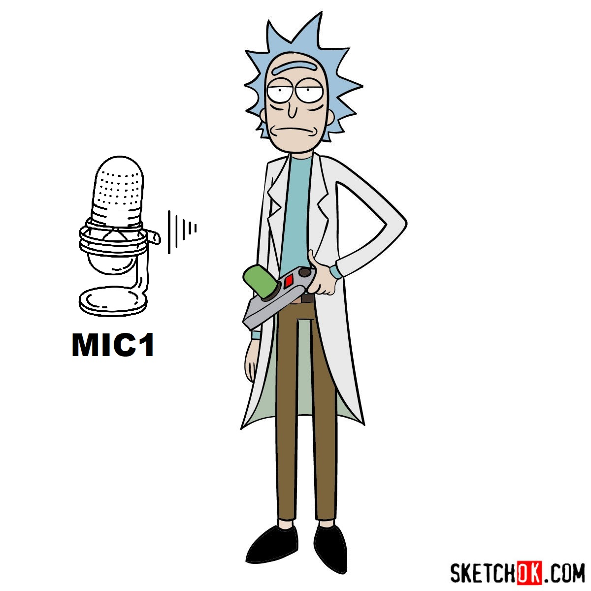

# Tóm tắt

Để hiểu được mục tiêu của Independent Component Analysis (**ICA**), ta mở đầu bài viết bằng *Cuộc trò chuyện của gia đình Rick and Morty* và kết quả ta muốn đạt được khi nghe cuộc trò chuyện đó.

# Giới thiệu

Câu chuyện bắt đầu khi *Rick Sanchez* đang ở trong phòng riêng của mình và bắt đầu nói về tình yêu. Khi đó, âm thanh phát ra từ Rick được thu lại bằng *MIC1*.

|  |
| :-------------------------------------: |
|     *Hình 1: Rick đang trò chuyện.*     |



Ở căn phòng khác, *Morty* và *Birdperson* đang nói về catchphrase "Wubba lubba dub dub!" của *Rick*. Khi đó, âm thanh phát ra từ *Morty* và *Birdperson* được thu lại bằng *MIC2*.

|        |
| :--------------------------------------------: |
| *Hình 2: Morty và Birdperson đang trò chuyện.* |



Cuối cùng, ở tầng hầm, *Jerry* và *Beth* đang cãi nhau về quái vật ngoài hành tinh của *Rick*. Khi đó, âm thanh phát ra từ *Jerry* và *Beth* được thu lại bằng *MIC3*.

|  |
| :--------------------------------------: |
| *Hình 3: Jerry và Beth đang trò chuyện.* |



Ta nhận thấy rằng, vì 3 cuộc trò chuyện diễn ra ở 3 căn phòng khác nhau nên âm thanh thu được ở từng *MIC* nghe rất rõ ràng.

Trong một bối cảnh khác, 3 cuộc trò chuyện này diễn ra trong cùng một căn phòng.

|  |
| :--------------------------------------: |
|  *Hình 4: Cả gia đình đang trò chuyện.*  |



Âm thanh phía trên được thu từ *MIC1*. Ta nhận thấy rằng, vì 3 cuộc trò chuyện diễn ra ở cùng một căn phòng nên các âm thanh đè lên nhau. Nhưng vì âm thanh được thu từ *MIC1* gần *Rick* nhất nên ta nghe thấy tiếng nói của *Rick* lớn nhất. Tương tự như vậy, âm thanh thu được ở *MIC2* và *MIC3* sẽ nghe thấy những người gần đó lớn nhất nhất.

> Trong trường hợp này, để tìm lại âm thanh riêng biệt của mỗi cuộc trò chuyện như các cuộc trò chuyện diễn ra trong những căn phòng khác nhau. Khi này, ta có thể sử dụng Independent Component Analysis (**ICA**).
>

# Kết luận

# Thuật ngữ đã sử dụng

