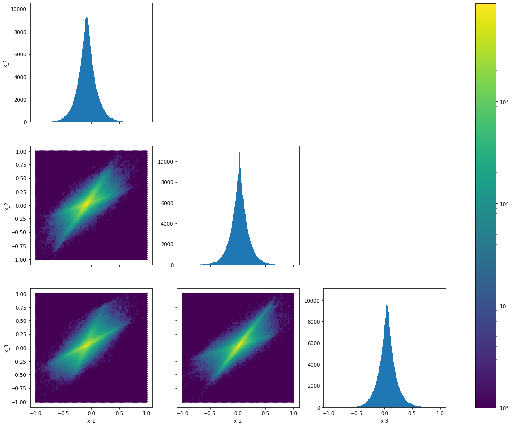

# Tóm tắt

Để hiểu được mục tiêu của Independent Component Analysis (**ICA**), ta mở đầu bài viết bằng *Cuộc trò chuyện của gia đình Rick and Morty* và kết quả ta muốn đạt được khi nghe cuộc trò chuyện đó.

Tiếp đến ta sẽ đưa ra mô hình toán học và trình bày những giả thiết và hạn chế của thuật toán **ICA**

Cuối cùng, ta bắt đầu xây dựng thuật toán **ICA** theo cách trình bày của *Bell* và *Sejnowski* [^1], ta sẽ xem **ICA** như một thuật toán sử dụng ước lượng hợp lí cực đại.

# Giới thiệu

Câu chuyện bắt đầu khi *Rick Sanchez* đang ở trong phòng riêng của mình và bắt đầu nói về tình yêu. Khi đó, âm thanh phát ra từ Rick được thu lại bằng *MIC1*.

|  |
| :-------------------------------------: |
|     *Hình 1: Rick đang trò chuyện.*     |



Ở căn phòng khác, *Morty* và *Birdperson* đang nói về catchphrase "Wubba lubba dub dub!" của *Rick*. Khi đó, âm thanh phát ra từ *Morty* và *Birdperson* được thu lại bằng *MIC2*.

|        |
| :--------------------------------------------: |
| *Hình 2: Morty và Birdperson đang trò chuyện.* |



Cuối cùng, ở tầng hầm, *Jerry* và *Beth* đang cãi nhau về quái vật ngoài hành tinh của *Rick*. Khi đó, âm thanh phát ra từ *Jerry* và *Beth* được thu lại bằng *MIC3*.

|  |
| :--------------------------------------: |
| *Hình 3: Jerry và Beth đang trò chuyện.* |



Ta nhận thấy rằng, vì 3 cuộc trò chuyện diễn ra ở 3 căn phòng khác nhau nên âm thanh thu được ở từng *MIC* nghe rất rõ ràng.

Trong một bối cảnh khác, 3 cuộc trò chuyện này diễn ra trong cùng một căn phòng.

|  |
| :--------------------------------------: |
|  *Hình 4: Cả gia đình đang trò chuyện.*  |



Âm thanh phía trên được thu từ *MIC1*. Ta nhận thấy rằng, vì 3 cuộc trò chuyện diễn ra ở cùng một căn phòng nên các âm thanh bị trộn vào nhau. Nhưng vì âm thanh được thu từ *MIC1* gần *Rick* nhất nên ta nghe thấy tiếng nói của *Rick* lớn nhất. Tương tự như vậy, âm thanh thu được ở *MIC2* và *MIC3* sẽ nghe thấy những người gần đó lớn nhất nhất.

> Trong trường hợp này, để tìm lại âm thanh riêng biệt của mỗi cuộc trò chuyện như các cuộc trò chuyện diễn ra trong những căn phòng khác nhau. Khi này, ta có thể sử dụng thuật toán Independent Component Analysis (**ICA**).
>

## Tổng quan

Independent Component Analysis (**ICA**) là thuật toán học không giám sát với mục đích tách dữ liệu thành những thành phần độc lập với nhau.

|  |
| :--------------------------------------: |
|  *Hình: **ICA** tách dữ liệu thành những thành phần độc lập.[^2]*  |

# Tính chất toán học được sử dụng

## Biến đổi tuyến tính của vector ngẫu nhiên

Xét một vector ngẫu nhiên $$X \in \mathbb{R}^d$$ là kết quả của phép biến đổi tuyến tính vector ngẫu nhiên $$S \in \mathbb{R}^d$$ bằng ma trận $$A \in \mathbb{R}^{d \times d}$$ khả nghịch.

$$
X = AS
$$

Khi đó, hàm mật độ xác suất của vector ngẫu nhiên $$X$$ được tính bằng:

$$
\begin{equation}
p_X(x) = \frac{1}{\left|A\right|}{p_S(A^{-1} x)}
\end{equation}
$$

### Chứng minh

Xét $$x,s \in \mathbb{R}^d$$ là giá trị xác định của các vector ngẫu nhiên $$X,S \in \mathbb{R}^d$$. Từ tính chất trên, ta có:

$$
x = As \\
s = A^{-1}x
$$

 Áp dụng *công thức đổi biến cho hàm số nhiều biến*, ta có:

$$
\begin{aligned}
p_X(x)  &= \left| \frac{\partial s}{\partial x}  \right| \; p_S(s) \\
p_X(x) &= \left| \frac{\partial \textcolor{yellow}{A^{-1}x}}{\partial x} \right| \; p_S(\textcolor{yellow}{A^{-1}x}) \quad (\because s = A^{-1}x )\\
p_X(x) &= \left| A^{-1} \right| \;  p_S(A^{-1}x) \\
p_X(x) &= \frac{1}{\left|A\right|} p_S(A^{-1}x) & \blacksquare
\end{aligned}
$$

## Đạo hàm của định thức ma trận

Trước tiên, ta sẽ nhắc lại định nghĩa của định thức ma trận. Xét ma trận $$A \in \mathbb{R}^{d \times d} $$ và ma trận $$A_{/i, /j} \in \mathbb{R}^{(d-1) \times (d-1)} $$ là kết quả có được khi bỏ đi hàng $$i$$ và cột $$j$$ của ma trận $$A$$. Khi này, định thức ma trận $$A$$ là:

$$
\begin{equation}
\begin{split}
\left|A\right| &\triangleq \sum_{i=1}^{d}(-1)^{i+j} A_{ij} \left| A_{/i,/j}\right| \quad (\forall \; j \in \{1, 2,...,d\}) \\
 &\triangleq \sum_{j=1}^{d}(-1)^{i+j} A_{ij} \left| A_{/i,/j}\right| \quad (\forall \; i \in \{1, 2,...,d\}) \\
\end{split}
\end{equation} \\
\text{Với } \left| A \right| \triangleq A_{11} \text{ khi } A \in \mathbb{R}^{1 \times 1} 
$$

Ngoài ra, ta định nghĩa ma trận liên hợp của ma trận $$A$$, ký hiệu là $$\text{adj}(A)$$, như sau:

$$
\begin{equation}
\begin{split}
\text{adj}(A) &\in \mathbb{R}^{d \times d} \\
(\text{adj}(A))_{ij} &\triangleq (-1)^{i + j} \left|A_{/j, /i} \right|
\end{split}
\end{equation}
$$

Khi này, nếu ma trận $$A$$ khả nghịch, ta có thể tính được nghịch đảo của ma trận $$A$$ như sau:

$$
\begin{equation}
A^{-1} = \frac{1}{\left|A \right|} \text{adj}(A)
\end{equation}
$$

Từ đó, đạo hàm của định thức ma trận được tính bằng công thức sau:

$$
\begin{equation}
\frac{\partial }{\partial A} \left| A \right| = \left|A \right| A^{-T}
\end{equation}
$$

### Chứng minh

Ta có: 

$$
\begin{aligned}
\frac{\partial} {\partial A_{kl}} \left| A \right| &= \frac{\partial} {\partial A_{kl}} \sum_{i=1}^{d}(-1)^{i+j} A_{ij} \left| A_{/i,/j}\right| \quad (\forall \; j \in \{1, 2,...,d\}) \\
&= (-1)^{k +l} \left | A_{/k,/l} \right| \\
&= (\text{adj}(A))_{lk} \\
&= (\text{adj}(A))^T \\
&= (A^{-1} \left| A \right|)^T \\
&= \left| A \right| A^{-T} & \blacksquare
\end{aligned}
$$

# Mô hình toán học

Ta có tập dữ liệu quan sát được $$ \{x^{(1)}, x^{(2)},...x^{(n)}\} $$, với mỗi $$ x^{(i)} \in \mathbb{R}^{d} $$ là một giá trị xác định của vector ngẫu nhiên $$ X^{(i)} $$. Khi đó, hàm mật độ xác suất của vector ngẫu nhiên $$ X^{(i)} $$ được ký hiệu gọn là:

$$
\begin{equation}
p_X(x^{(i)}) \triangleq f_{X^{(i)}}(x^{(i)})
\end{equation}
$$

Ngoài ra, ta có tập dữ liệu nguồn bị ẩn $$ \{s^{(1)}, s^{(2)},...s^{(n)}\} $$, với mỗi $$ s^{(i)} \in \mathbb{R}^{d} $$ là một giá trị xác định của vector ngẫu nhiên $$ S^{(i)} $$. Mỗi điểm dữ liệu $$s^{(i)}$$ được tạo nên từ $$d$$ nguồn khác nhau. Ta có thể viết vector ngẫu nhiên $$ S^{(i)} $$ dưới dạng một vector bao gồm các biến ngẫu nhiên như sau:

$$
\begin{equation}
S^{(i)} \triangleq 
\begin{bmatrix}
S_1^{(i)} \\
S_2^{(i)} \\
\vdots \\
S_d^{(i)} 
\end{bmatrix}
\end{equation}
$$

Trong đó, $$S_j^{(i)}$$ là biến ngẫu nhiên cho ra giá trị xác định $$s_j^{(i)} \in \mathbb{R}$$ của điểm dữ liệu nguồn bị ẩn thứ $$i$$ ứng với nguồn $$j$$. Ta có thể viết vector $$s^{(i)}$$ dưới dạng một vector bao gồm giá trị xác định của các nguồn như sau:

$$
\begin{equation}
s^{(i)} \triangleq 
\begin{bmatrix}
s_1^{(i)} \\
s_2^{(i)} \\
\vdots \\
s_d^{(i)} 
\end{bmatrix}
\end{equation}
$$

 Khi đó, hàm mật độ xác suất của vector ngẫu nhiên $$ S^{(i)} $$ và hàm mật độ xác suất của biến ngẫu nhiên $$ S_j^{(i)} $$ được ký hiệu gọn là:

$$
\begin{equation}
\begin{split}
p_S (s^{(i)}) &\triangleq f_{S^{(i)}}(s^{(i)}) \\
p_S(s_j^{(i)}) &\triangleq f_{S_j^{(i)}}(s_j^{(i)})
\end{split}
\end{equation}
$$

Dữ liệu quan sát được và dữ liệu nguồn được liên kết qua đẳng thức sau:

$$
\begin{equation}
x^{(i)} = A s^{(i)}
\end{equation}
$$

Trong đó: $$ A \in \mathbb{R}^{d \times d}$$ được gọi là **ma trận trộn**.

Thông thường, ma trận $$A$$ sẽ là một ma trận khả nghịch nên ta có ma trận nghịch đảo của $$A$$:

$$
\begin{equation}
W = A^{-1}
\end{equation}
$$

Trong đó: $$W \in \mathbb{R}^{d \times d} $$ được gọi là **ma trận phân lớp**.

Ta nhận thấy rằng, hai ma trận $$A$$ và $$W$$ liên hệ với nhau qua phép nghịch đảo nên hai việc làm "tìm ma trận $$A$$" và "tìm ma trận $$W$$" là tương đương nhau.

Để thuận tiện trong việc trình bày, ta gọi hàng thứ $$j$$ của ma trận $$ W $$ là $$ w_j^{T} \in \mathbb{R}^d $$. Ma trận $$W$$ trở thành:

$$
\begin{equation}
W \triangleq 
\begin{bmatrix}
\rule[.5ex]{1.5em}{0.4pt} & w_1^T & \rule[.5ex]{1.5em}{0.4pt} \\
\rule[.5ex]{1.5em}{0.4pt} & w_2^T & \rule[.5ex]{1.5em}{0.4pt} \\
& \vdots & \\
\rule[.5ex]{1.5em}{0.4pt} & w_d^T & \rule[.5ex]{1.5em}{0.4pt}
\end{bmatrix}
\end{equation}
$$

Khi này, bằng phép nhân ma trận, giá trị của điểm dữ liệu nguồn bị ẩn ứng với nguồn $$j$$ có thể được tính bằng:

$$
\begin{equation}
s_j^{(i)} = w_j^T x^{(i)}
\end{equation}
$$

> Tóm lại, trong **ICA** ta có:
>
> - Tập dữ liệu quan sát được: $$ \{x^{(1)}, x^{(2)},...x^{(n)}\} $$ với $$x^{(i)} \in \mathbb{R}^d$$.
> - Tập dữ liệu nguồn bị ẩn: $$ \{s^{(1)}, s^{(2)},...s^{(n)}\} $$ với $$s^{(i)} \in \mathbb{R}^d$$.
> - Tham số: ma trận $$W \in \mathbb{R}^{d \times d}$$.
>
> Mục tiêu của **ICA**: Ước lượng ma trận $$W$$ từ đó tìm lại tập dữ liệu nguồn bị ẩn $$ \{s^{(1)}, s^{(2)},...s^{(n)}\} $$.

# Liên hệ đến bài toàn ban đầu

Để hiểu rõ hơn về Mô hình toán học đã xây dựng phía trên của thuật toán **ICA**, ta sẽ áp dụng vào *Cuộc trò truyện của gia đình Rick và Morty* ban đầu.

Trong bài toán ban đầu, ta có 3 *MIC* là: *MIC1*, *MIC2*, *MIC3* ở 3 vị trí khác nhau trong cùng một căn phòng. Âm thanh thu được từ các *MIC* là những cuộc trò truyện bị trộn lẫn vào nhau. Mục tiêu ở đây, ta muốn tách âm thanh của các *MIC* sao cho âm thanh thu được các cuộc trò truyện không bị trộn lẫn vào nhau.

Khi này, áp dụng mô hình trên, ta có thể hiểu, điểm dữ liệu quan sát được $$x^{(i)} \in \mathbb{R}^3$$ là một vector như sau:

$$
x^{(i)} = 
\begin{bmatrix}
x_1^{(i)} \\
x_2^{(i)} \\
x_3^{(i)}
\end{bmatrix}
$$

> Trong đó, $$ x_j^{(i)} \in \mathbb{R}$$ được hiểu là **âm thanh thu được từ *MIC* $$j$$ tại thời điểm $$i$$**

Ngoài ra, điểm dữ liệu nguồn bị ẩn $$s^{(i)} \in \mathbb{R}^{3} $$ là một vector như sau:

$$
s^{(i)} =
\begin{bmatrix}
s_1^{(i)} \\
s_2^{(i)} \\
s_3^{(i)}
\end{bmatrix}
$$

> Trong đó, $$ s_j^{(i)} \in \mathbb{R}$$ được hiểu là **âm thanh phát ra từ nguồn (cuộc trò truyện) thứ $$j$$ tại thời điểm $$i$$**.

> Từ đó, ta nhận thấy, mục tiêu tách âm thanh của các *MIC* tương đương với việc đi tìm lại tập dữ liệu nguồn bị ẩn $$ \{s^{(1)}, s^{(2)},...s^{(n)}\} $$

Để hiểu rõ thêm và cấu trúc của tập dữ liệu $$ \{x^{(1)}, x^{(2)},...x^{(n)}\} $$, ta có quan sát đồ thị Âm thanh thu được của các *MIC* trong một khoảng thời gian ngắn. 

|                      |
| :---------------------------------------------------------: |
| *Hình 5: Đồ thị sự phụ thuộc của $$x_j^{(i)}$$ theo $$i$$.* |

Từ đồ thị trên, ta có nhận xét, âm thanh thu được của từng *MIC* không hoàn toàn khác nhau, ta có thể thấy được sự tương đồng tại một vài vị trí. Lí do cho hiện tượng trên là vì âm thanh thu được của từng *MIC* là tổng hợp của 3 nguồn giống nhau (*Rick*, *Morty* và *Birdperson*, *Jerry* và *Beth*).

Ngoài ra, ta có thể bỏ qua yếu tố thời gian trong tập dữ liệu $$ \{x^{(1)}, x^{(2)},...x^{(n)}\} $$ để biểu diễn các điểm dữ liệu này độc lập với nhau. Vì $$ x^{(i)} \in \mathbb{R}^3 $$ nên ta phải biểu diễn tập dữ liệu $$ \{x^{(1)}, x^{(2)},...x^{(n)}\} $$ trong không gian 3-chiều. Nhưng hình vẽ trong không gian 3-chiều sẽ không thể cho ta cái nhìn trực quan nhất về cấu trúc của tập dữ liệu. Do đó, ta sẽ biểu diễn tập dữ liệu trên theo một kiểu khác.

Ta chọn 2 thuộc tính và biểu diễn tập dữ liệu trong không gian 2-chiều của 2 thuộc tính đó. Vì mỗi điểm dữ liệu có 3 thuộc tính, nên ta có 3 đồ thị để biểu diễn tập dữ liệu:

|                       |
| :----------------------------------------------------------: |
| *Hình 6: Biểu diễn tập dữ liệu $$ \{x^{(1)}, x^{(2)},...x^{(n)}\} $$ trong những không gian 2-chiều.* |

Ta sẽ từng bước giải thích ý nghĩa của biểu đồ trên. Biểu đồ trên bao gồm 6 biểu đồ nhỏ: 

- 3 biểu đồ trên đường chéo được gọi là biểu đồ tần số cho ta biết phân phối của tập dữ liệu khi được biểu diễn bằng 1 thuộc tính.
- 3 biểu đồ còn lại được gọi là biểu đồ mật độ cho ta biết phân phối của tập dữ liệu khi được biểu diễn bằng 2 thuộc tính. 

Từ biểu đồ trên, ta có nhận xét:

- Đối với biểu đồ tần số: các điểm dữ liệu phân bố **rất nhiều** vào phần trung tâm, càng đi xa trung tâm số lượng điểm dữ liệu giảm đi **rất nhanh**. Ta có thể đưa ra phán đoán rằng, các điểm dữ liệu **không** được phân bố theo phân phối chuẩn. Đây là nhận xét rất quan trọng sẽ được đề cập rất nhiều về sau.
- Đối với biểu đồ mật độ: Các điểm dữ liệu được phân bố nhiều trên 2 trục chính. Tên gọi của 2 trục này sẽ được đề cập ở phần sau. Ta cũng có thể đưa ra phán đoán rằng, các điểm dữ liệu **không** được phân bố theo phân phối chuẩn.

## Thông số của âm thanh được sử dụng

Phần này ta đề cập đến vấn đề hơi ngoài lề không liên quan đến **ICA**, ta sẽ nói rõ hơn về bằng cách nào ta có thể biểu diễn một đoạn âm thanh thành một tập dữ liệu.

Trước nhất, ta tìm hiểu về đại lượng *Tốc độ lấy mẫu âm thanh*. Qua tên gọi đã cho ta biết ý nghĩa về đại lượng này, số lượng *mẫu âm thanh* được lấy trong một giây. Những *Tốc độ lấy mẫu âm thanh* phổ biến: 

- 8kHz: thường được dùng trong liên lạc điện thoại.
- 44.1kHz: thường được dùng trong âm nhạc phổ biến.
- 48kHz: thường được dùng trong âm nhạc trên phim ảnh.

> Ở đây, những đoạn trò truyện trên có *Tốc độ lấy mẫu âm thanh* là: 44.1kHz. Ta có thể hiểu, để thể hiện âm thanh trong một giây ta cần 44100 giá trị số.

Giả sử ta chỉ có một *MIC*, âm thanh thu được từ *MIC* này là một tập dữ liệu $$ \{x^{(1)}, x^{(2)},...x^{(n)}\} $$, với $$x^{(i)} \in \mathbb{R}$$. Khi này, một cách chính xác, giá trị $$x^{(i)}$$ thể hiện âm thanh thu được tại thời điểm $$ \frac{i}{44100} $$ giây. Nhưng để thuận tiện, ta vẫn gọi giá trị này là âm thanh thu được tại thời điểm $$i$$.

Ngoài ra, nếu quan sát kĩ ở *Hình 6*, ta sẽ thấy giá trị của điểm dữ liệu thuộc đoạn $$[-1, 1]$$, hiện tượng này xảy ra là do cách ta chọn định dạng dữ liệu khi đọc đoạn âm thanh bằng thư viện `scipy`.

|                       |
| :----------------------------------------------------------: |
| *Hình 7: Những định dạng dữ liệu được hỗ trợ trong `scipy` [^3].* |

Ở đây, ta sử dụng định dạng dữ liệu `32-bit floating-point` nên giá trị của điểm dữ liệu thuộc đoạn $$[-1, 1]$$.

# Giả thiết và hạn chế của thuật toán ICA

Nếu ta tiếp cận bài toán cần giải quyết trong **ICA** bằng phương pháp giải phương trình thông thường thì số lượng ẩn sẽ lớn hơn rất nhiều so với số lượng phương trình có được. Do đó, để giải quyết được bài toán trên ta cần có những giả thiết về cấu trúc của tập dữ liệu quan sát được và tập dữ liệu nguồn bị ẩn. Vì bài toán được đặt dưới những giả thiết nên sẽ gây ra nhiều hạn chế cho kết quả thu được.

## Giả thiết

### Số chiều của dữ liệu

> **Giả thiết 1:** Số chiều của điểm dữ liệu quan sát được và điểm dữ liệu nguồn bị ẩn phải bằng nhau. Hay, một cách toán học: $$x^{(i)}, s^{(i)} \in \mathbb{R}^d$$.

Liên hệ đến bài toán ban đầu, ta có thể hiểu, để **ICA** có thể hoạt động thì số lượng *MIC* phải đúng bằng số lượng cuộc trò truyện cần tách ra.

Thật ra, giả thiết này có thể được "nới lỏng" thành: Số chiều của điểm dữ liệu quan sát được phải **lớn hơn hoặc bằng** số chiều của điểm dữ liệu nguồn bị ẩn. Hay, một cách toán học: $$ x^{(i)} \in \mathbb{R}^{d}; \; s^{(i)} \in \mathbb{R}^{k}$$, trong đó: $$ d \geq k $$.

Việc "nới lỏng" trên khả thi vì ta dễ dàng đưa $$x^{(i)} \in \mathbb{R}^d$$ về chiều không gian thấp hơn là $$k$$. Ngoài ra, ta có thể xem như $$s^{(i)} \in \mathbb{R}^d$$ và áp dụng **ICA**, quan sát kết quả thu được ta có thể chỉ ra được đâu là những kết quả bị thừa. 

Cụ thể hơn, trong bài toán ban đầu, nếu trong phòng lúc bấy giờ có 5 *MIC* lớn hơn số lượng cuộc trò truyện (*Rick*, *Morty* và *Birdperson*, *Jerry* và *Beth*) thì khi áp dụng **ICA** ta sẽ thu được 3 nguồn ứng với 3 cuộc trò truyện và 2 nguồn còn lại không có âm thanh.

Một lưu ý rằng, **ICA** không thể hoạt động nếu số chiều của điểm dữ liệu quan sát được **nhỏ hơn** số chiều của điểm dữ liệu nguồn bị ẩn. Đây là lĩnh vực vẫn đang được nghiên cứu trong **ICA**.

### Tính độc lập

> **Giả thiết 2**: Các điểm dữ liệu của tập dữ liệu quan sát được, được lấy mẫu từ cùng một phân phối và quá trình lấy mẫu là độc lập với nhau. Nói cách khác, các vector ngẫu nhiên $$X^{(1)}, X^{(2)},...,X^{(n)} $$ độc lập thống kê.

Đây là giả thiết thường được thấy trong những bài toán thống kê, mục đích của giả thiết trên là giúp ta dễ dàng xây dựng hàm Log-likelihood.

$$
\begin{equation}
\ell(W) = \sum_{i=1}^n \log p_X(x^{(i)})
\end{equation}
$$

> **Giả thiết 3**: Dữ liệu phát ra từ các nguồn là độc lập với nhau. Nói cách khác, các biến ngẫu nhiên $$S_1^{(i)}, S_2^{(i)},...,S_d^{(i)}$$ độc lập với nhau.

Liên hệ đến bài toán ban đầu, ta có thể hiểu, nội dung trò truyện của *Rick*, *Morty* và *Birdperson*, *Jerry* và *Beth* sẽ không liên quan đến nhau, mục đích của giả thiết trên là giúp ta dễ dàng tính hàm mật độ xác suất của vector ngẫu nhiên $$S^{(i)}$$.

$$
\begin{equation}
p_S(s^{(i)}) = \prod_{j=1}^d p_S(s_j^{(i)})
\end{equation}
$$

### Mối quan hệ

> **Giả thiết 4**: Mối quan hệ giữa điểm dữ liệu quan sát được và điểm dữ liệu nguồn bị ẩn là: $$s^{(i)} = W x^{(i)}$$ (hoặc $$x^{(i)} = A s^{(i)}$$)

Trong *mô hình toán học*, ta đề cập đến giả thiết trên như một thiết kế của mô hình, nhưng một cách chính xác thì mối quan hệ trên phải là một giả thiết. Do đó, nếu dữ liệu quan sát được, được tạo ra từ một cách phức tạp hơn (không chỉ đơn giản là nhân điểm dữ liệu nguồn bị ẩn với một ma trận) thì thuật toán **ICA** có thể không hoạt động được.

### Phân phối chuẩn

> **Giả thiết 5**: Dữ liệu phát ra từ các nguồn **không** được phân bố theo phân phối chuẩn. Hay, các biến ngẫu nhiên $$ S_j^{(1)}, S_j^{(2)},...,S_j^{(n)}$$ **không** được lấy mẫu từ phân phối chuẩn. Nói cách khác, các vecor ngẫu nhiên $$S^{(1)}, S^{(2)},...,S^{(n)}$$ **không** được lấy mẫu từ phân phối chuẩn nhiều chiều.

Để hiểu rõ hơn về giả sử này, ta quan sát vấn đề gặp phải khi $$S^{(1)}, S^{(2)},...,S^{(n)}$$ được lấy mẫu từ phân phối chuẩn nhiều chiều.

Ta xét trường hợp trong không gian 2-chiều, giả sử $$S^{(i)} \sim \mathcal{N}(0, I_{2 \times 2}) $$. Khi đó, hàm mật độ xác suất của vector ngẫu nhiên $$S^{(i)}$$ là:

$$
p_S(s) = \frac{1}{2 \pi} \exp \left(-\frac{1}{2} s^Ts \right)
$$

Với $$x = As$$, áp dụng tính chất *Biến đổi tuyến tính của vector ngẫu nhiên*, ta có:

$$
\begin{aligned}
p_X(x) &= \frac{1}{\left|A\right|}{p_S(A^{-1}x)} \\
&= \frac{1}{\left|A\right|} \frac{1}{2 \pi} \exp \left(-\frac{1}{2}(A^{-1}x)^T (A^{-1}x)  \right ) \\
&= \frac{1}{2 \pi \left| A \right|} \exp \left(-\frac{1}{2} x^T A^{-T} A^{-1} x \right) \\
&= \frac{1}{2 \pi \sqrt{\left| \textcolor{yellow}{A A^T} \right|}} \exp \left( - \frac{1}{2}x^T \left( \textcolor{yellow}{A A^T}\right)^{-1} x\right)
\end{aligned}
$$

Do đó, $$X^{(i)} \sim \mathcal{N}(0, A A^T)$$.

Xét ma trận trực giao $$R \in \mathbb{R}^{2 \times 2}$$ bất kì (ma trận $$R$$ thỏa mãn: $$R R^T = R^T R = I_{2 \times 2}$$), ta xây dựng ma trận trộn mới $$A^{'} = A R $$. Giả sử, ta có những điểm dữ liệu mới được tạo nên từ ma trận trộn $$A^{'}$$, hay $$x^{'} = A^{'}s$$. Khi đó, áp dụng tính chất *Biến đổi tuyến tính của vector ngẫu nhiên*, ta có:

$$
\begin{aligned}
p_{X^{'}}(x^{'}) &= \frac{1}{\left|A^{'}\right|}{p_S({A^{'}}^{-1}x^{'})} \\
&=\frac{1}{\left|AR\right|}{p_S((AR)^{-1}x^{'})}\\
&= \frac{1}{\left|AR\right|} \frac{1}{2 \pi} \exp \left(-\frac{1}{2}((AR)^{-1}x)^T ((AR)^{-1}x)  \right ) \\
&= \frac{1}{2 \pi \left| AR \right|} \exp \left(-\frac{1}{2} x^T (AR)^{-T} (AR)^{-1} x \right) \\
&= \frac{1}{2 \pi \sqrt{\left| \textcolor{yellow}{AR R^T A^T} \right|}} \exp \left( - \frac{1}{2}x^T \left( \textcolor{yellow}{AR R^T A^T}\right)^{-1} x\right) \\
&= \frac{1}{2 \pi \sqrt{\left| \textcolor{yellow}{A A^T} \right|}} \exp \left( - \frac{1}{2}x^T \left( \textcolor{yellow}{A A^T}\right)^{-1} x\right) \quad(\because RR^T = I_{2 \times 2})
\end{aligned}
$$

Do đó, $${X^{'}}^{(i)} \sim \mathcal{N}(0, A A^T)$$.

> Ta kết luận, dù sử dụng ma trận trộn $$A$$ hay $$A^{'}$$ thì các vector ngẫu nhiên $$X^{(i)}$$ cũng được lấy mẫu từ phân phối $$\mathcal{N}(0, AA^T)$$.

Vì kết luận trên nên ta không thể biết được đâu là ma trận trộn $$A$$ ban đầu từ đó không thể tìm lại các điểm dữ liệu nguồn bị ẩn $$\{s^{(1)}, s^{(2)},..., s^{(n)}, \}$$.

Ngoài ra, ta có thể hiểu rõ hơn về mức độ quan trọng của giả sử trên bằng cách lập luận trên cấu trúc của tập dữ liệu.

Giả sử, ta có tập dữ liệu nguồn $$ \{s^{(1)}, s^{(2)},...,s^{(n)}\} $$, với mỗi $$s^{(i)} \in \mathbb{R}^2$$. Các vector ngẫu nhiên $$S^{(i)}$$ được lấy mẫu từ một phân phối **đều** có giá trị nhỏ nhất là $$-1$$, giá trị lớn nhất là $$1$$. Xét ma trận trộn $$A = \begin{bmatrix} \cos\left( \frac{1}{6} \pi \right) & - \sin\left( \frac{1}{6} \pi \right) \\ \sin\left( \frac{1}{6} \pi \right) & \cos\left( \frac{1}{6} \pi \right) \end{bmatrix}$$, ma trận trộn $$A$$ sẽ xoay mặt phẳng $$\mathbb{R}^2$$ một góc $$\frac{1}{6} \pi$$ theo chiều kim đồng hồ. Khi này, sử dụng ma trận $$A$$ ta có tập dữ liệu mới $$x^{(i)} = A s^{(i)} $$.

|                       |
| :----------------------------------------------------------: |
| *Hình 8: Tập dữ liệu nguồn (trái). Tập dữ liệu mới (phải). Cơ sở của từng tập dữ liệu (mũi tên màu đỏ)* |

Ta có thể hiểu, việc nhân ma trận $$A$$ cho những điểm dữ liệu nguồn sẽ tương đương với việc thay đổi cơ sở cho những điểm dữ liệu đó.

$$
\left[1, 0\right]^T \rightarrow \left[\cos\left( \frac{1}{6} \pi \right), - \sin\left( \frac{1}{6} \pi \right) \right]^T \\
\left[0, 1\right]^T \rightarrow \left[\sin\left( \frac{1}{6} \pi \right),  \cos\left( \frac{1}{6} \pi \right) \right]^T
$$

>
> Dựa vào hình vẽ trên, do hình dạng của phân phối **đều** trước và sau khi biến đổi khác nhau (hình vuông và hình bình hành) nên ta thấy việc tìm lại cơ sở ban đầu cho tập dữ liệu là **khả thi**. Nói cách khác, việc tìm lại ma trận $$A$$ là **khả thi**.
>

Mặt khác, xét tập dữ liệu nguồn $$ \{s^{(1)}, s^{(2)},...,s^{(n)}\} $$, với mỗi $$s^{(i)} \in \mathbb{R}^2$$. Các vector ngẫu nhiên $$S^{(i)}$$ được lấy mẫu từ một phân phối **chuẩn** $$\mathcal{N}(0, I_{2 \times 2})$$. Xét ma trận trộn $$A = \begin{bmatrix} \cos\left( \frac{1}{6} \pi \right) & - \sin\left( \frac{1}{6} \pi \right) \\ \sin\left( \frac{1}{6} \pi \right) & \cos\left( \frac{1}{6} \pi \right) \end{bmatrix}$$. Khi này, sử dụng ma trận $$A$$ ta có tập dữ liệu mới $$x^{(i)} = A s^{(i)} $$.

|                       |
| :----------------------------------------------------------: |
| *Hình 9: Tập dữ liệu nguồn (trái). Tập dữ liệu mới (phải). Cơ sở của từng tập dữ liệu (mũi tên màu đỏ). Cơ sở **có thể** là cơ sở của tập dữ liệu (mũi tên màu xanh).* |

> Dựa vào hình vẽ trên, do hình dạng của phân phối **chuẩn** trước và sau khi biến đổi giống nhau (đều là hình tròn) nên ta có **nhiều** cách chọn cơ sở để biểu diễn cho tập dữ liệu. Từ đó ta không thể tìm được ma trận $$A$$ dẫn đến thuật toán **ICA** không thể hoạt động.

Hy vọng rằng phần trình bày trên đủ thuyết phục các bạn rằng tại sao **giả thiết 5** là cần thiết.

## Hạn chế

Mục tiêu của thuật toán **ICA** là ước lượng ma trận $$W \in \mathbb{R}^{d \times d}$$:

$$
A^{-1} = W = \begin{bmatrix}
\rule[.5ex]{1.5em}{0.4pt} & w_1^T & \rule[.5ex]{1.5em}{0.4pt} \\
\rule[.5ex]{1.5em}{0.4pt} & w_2^T & \rule[.5ex]{1.5em}{0.4pt} \\
& \vdots & \\
\rule[.5ex]{1.5em}{0.4pt} & w_d^T & \rule[.5ex]{1.5em}{0.4pt}
\end{bmatrix}
$$

Ta sẽ không hoàn toàn tìm được $$W$$ phù hợp, thay vào đó kết quả thu được sẽ có nhiều hạn chế.

### Tính hoán vị

Xét ma trân hoán vị $$P \in \mathbb{R}^{d \times d}$$, ma trận hoán vị là ma trận có đúng một số $$1$$ trên mỗi hàng và mỗi cột của ma trận và các vị trị còn lại bằng $$0$$. Đây là một vài ví dụ của ma trận hoán vị:

$$
P = \begin{bmatrix}
0 & 1 & 0 \\
0 & 0 & 1 \\
1 & 0 & 0 
\end{bmatrix}
\quad
P= \begin{bmatrix}
0 & 1 \\
1 & 0
\end{bmatrix}
\quad
P= \begin{bmatrix}
1 & 0 \\
0 & 1
\end{bmatrix}
$$

Với một vector $$z \in \mathbb{R}^d$$ bất kỳ, thì $$Pz$$ là một vector bao gồm hoán vị tọa độ của vector $$z$$.

Vì ta chỉ quan sát được tâp dữ liệu $$\{ x^{(1)}, x^{(2)},...,x^{(n)}\}$$ nên ta không thể phân biệt được hai ma trận $$W$$ và $$PW$$ với nhau. Cụ thể hơn, liên hệ đến bài toán ban đầu, sau khi áp dụng **ICA** thì kết quả âm thanh của nguồn tìm lại được có thể là (*Rick*, *Jerry* và *Beth*, *Morty* và *Birdperson*); (*Morty* và *Birdperson*, *Rick*, *Jerry* và *Beth*);... không giống với thứ tự các nguồn ban đầu. 

> Nhìn chung, hạn chế này không ảnh hưởng gì đến mục đích ta muốn đạt được.

### Độ lớn của dữ liệu

> Ta không thể tìm lại chính xác độ lớn của những hàng $$w_j^T$$.

Giả sử, ta thay đổi ma trận trộn $$A$$ thành $$2A$$, thay đổi mỗi điểm dữ liệu nguồn $$s^{(i)}$$ thành $$(0.5) s^{(i)}$$, thì điểm dữ liệu quan sát được $$x^{(i)} = 2A \times (0.5) s^{(i)} $$ vẫn giống như cũ. Một cách tổng quát, khi ta thay đổi ma trận trộn $$A$$ theo tỉ lệ $$ \alpha $$ và thay đổi điểm dữ liệu nguồn $$s^{(i)}$$ theo tỉ lệ $$ \frac{1}{\alpha}$$ thì điểm dữ liệu quan sát được $$x^{(i)}$$ không thay đổi.

Do đó, ta không thể tìm lại chính xác độ lớn của những điểm dữ liệu nguồn $$s^{(i)}$$ cũng như độ lớn của những hàng $$w_j^T$$.

> Nhưng, hạn chế này dễ dàng được khắc phục khi ta chuẩn hóa kết quả có được theo định dạng mong muốn.

### Phân phối chuẩn

> Dữ liệu phát ra từ các nguồn **không** được phân bố theo phân phối chuẩn.

Hạn chế này xảy ra vì ta phải chấp nhận **giả thiết 5** để thuật toán có thể hoạt động. Nhưng trong phần lớn trường hợp, thì những dữ liệu dạng: tín hiệu, âm thanh, hình ảnh,... sẽ không phân bố theo phân phối chuẩn và ta sẽ an toàn với giả thiết trên.

|                |
| :-----------------------------------------------------: |
| *Hình 10: Dữ liệu âm thanh không theo phân phối chuẩn.* |

# Xây dựng thuật toán ICA

Ở phần này, ta bắt đầu xây dựng thuật toán **ICA** theo cách trình bày của *Bell* và *Sejnowski* [^1], ta sẽ xem **ICA** như một thuật toán sử dụng ước lượng hợp lí cực đại. Cách xây dựng này khác với cách xây dựng cổ điển sử dụng *infomax principal*. Nhìn chung, quá trình xây dựng thuật toán **ICA** không quá khó khăn, đa phần ta sẽ đưa những *tính chất* và *giả thiết* của phần trước lại với nhau.

## Hàm Log-Likelihood

Trước nhất, ta xây dựng hàm mật độ xác suất cho một điểm dữ liệu quan sát được $$x$$. 

Vì $$x = As$$ nên áp dụng tính chất *Biến đổi tuyến tính của vector ngẫu nhiên*, ta có

$$
\begin{aligned}
p_X(x) &= \frac{1}{\left|A\right|}{p_S(A^{-1} x)} \\
&= \left| W\right|\; p_S(Wx) \quad (\because W = A^{-1})
\end{aligned}
$$

Áp dụng **giả thiết 3**: "Dữ liệu phát ra từ các nguồn là độc lập với nhau", hàm mật độ xác suất của điểm dữ liệu nguồn quan sát được trở thành:

$$
\begin{aligned}
p_S(s) &= \prod_{j=1}^d p_S(s_j) \\
&= \prod_{j=1}^d p_S(w_j^T x) \quad (\because s = Wx)
\end{aligned}
$$

Từ đó, hàm mật độ xác suất cho một điểm dữ liệu quan sát được $$x$$ trở thành:

$$
\begin{equation}
p_X(x) = \left| W \right| \; \prod_{j=1}^d p_S(w_j^T x)
\end{equation}
$$

Áp dụng **giả thiết 2**: "Các vector ngẫu nhiên $$X^{(1)}, X^{(2)},...,X^{(n)} $$ độc lập thống kê", ta có được hàm Log-likelihood của tập dữ liệu quan sát được là:

$$
\begin{equation}
\begin{split}
\ell (W) &= \sum_{i=1}^n \log p_X(x^{(i)}) \\
&= \sum_{i=1}^n \log \left( \left| W \right| \; \prod_{j=1}^d p_S(w_j^T x^{(i)})  \right)\\
&= \sum_{i=1}^n \left ( \sum_{j = 1}^d \log p_S(w_j^T x^{(i)}) + \log \left| W \right| \right)
\end{split}
\end{equation}
$$

## Lựa chọn phân phối cho dữ liệu nguồn và công thức cập nhật tham số $$W$$

Sau khi đã xây dựng được hàm Log-likelihood, mục tiêu của **ICA** trở thành bài toán tối ưu hóa hàm Log-likelihood theo tham số $$W$$. 

Ở đây, ta sẽ tối đa hàm Log-likelihood bằng thuật toán Stochastic Gradient Ascent (**SGA**). Một điểm thiếu sót trong hàm Log-likelihood là ta vẫn chưa biết phân phối của dữ liệu nguồn $$p_S(s)$$. 

Do đó, ta sẽ lựa chọn phân phối cho dữ liệu nguồn là những phân phối thường được dùng trong thực nghiệm: phân phối **Laplace** và đạo hàm của hàm **Sigmoid**, từ đó ta sẽ tìm được công thức cập nhật cho tham số $$W$$.

### Lưu ý

Những phân phối ta đề cập ở đây sẽ có giá trị trung bình là $$0$$ (kỳ vọng là $$0$$) nên ta mặc định rằng tập dữ liệu đã được chuẩn hóa để có giá trị trung bình cũng là $$0$$.

### Phân phối Laplace

Giả sử dữ liệu phát ra từ các nguồn phân bố theo phân phối Laplace, một cách cụ thể $$S_j^{(i)} \sim \mathcal{L}(0, 1)$$. Khi này, hàm mật độ xác suất của biến ngẫu nhiên $$S_j^{(i)}$$ là:

$$
p_S(s_j^{(i)}) = \frac{1}{2} \exp\left(- \left|s_j^{(i)}\right|\right)
$$

Hàm số trên có đồ thị:

|                |
| :-----------------------------------------------------: |
| *Hình 11: Đồ thị của phân phối Laplace.* |

Khi này, hàm Log-Likelihood cho một điểm dữ liệu $$x^{(i)}$$ trở thành:

$$
\begin{aligned}
\ell(W) &= \log \left| W \right| + \sum_{j=1}^d \log \exp \left( -\left| w_j^T x^{(i)}\right| \right) \\
&= \log \left| W \right| - \sum_{j=1}^d \left|w_j^T x^{(i)} \right|
\end{aligned}
$$

Sử dụng tính chất *Đạo hàm của định thức ma trận*, ta tìm được vector gradient của hàm Log-likelihood:

$$
\begin{aligned}
\nabla_W  \, \ell(W) &= \nabla_W \log \left| W \right| - \begin{bmatrix}
\nabla_{w_1^T} \left |w_1^T x^{(i)} \right| \\
\nabla_{w_2^T} \left |w_2^T x^{(i)} \right| \\
\vdots \\
\nabla_{w_d^T} \left |w_d^T x^{(i)} \right|
\end{bmatrix} \\
&= \frac{1}{\left|W\right|} \left| W \right| \, W^{-T} - \begin{bmatrix}
\text{sign} \left( w_1^T x^{(i)} \right) {x^{(i)}}^T  \\
\text{sign} \left( w_2^T x^{(i)} \right) {x^{(i)}}^T  \\
\vdots \\
\text{sign} \left( w_d^T x^{(i)} \right) {x^{(i)}}^T  \\
\end{bmatrix} \\
&= W^{-T} - \begin{bmatrix}
\text{sign} \left( w_1^T x^{(i)} \right)   \\
\text{sign} \left( w_2^T x^{(i)} \right)  \\
\vdots \\
\text{sign} \left( w_d^T x^{(i)} \right)   \\
\end{bmatrix}
{x^{(i)}}^T
\end{aligned}
$$

Vậy ta có công thức cập nhật cho tham số $$W$$ là:

$$
\begin{equation}
W := W + \alpha \left( W^{-T} - \begin{bmatrix}
\text{sign} \left( w_1^T x^{(i)} \right)   \\
\text{sign} \left( w_2^T x^{(i)} \right)  \\
\vdots \\
\text{sign} \left( w_d^T x^{(i)} \right)   \\
\end{bmatrix}
{x^{(i)}}^T \right)
\end{equation}
$$

### Đạo hàm của hàm Sigmoid

Hàm Sigmoid là hàm số có dạng:

$$
g: \mathbb{R} \rightarrow (0,1) \\
g(s) = \frac{1}{1+ e^{-s}}
$$

Hàm số trên có đồ thị:

|  |
| :---------------------------------------: |
|    *Hình 12: Đồ thị của hàm Sigmoid.*     |

Vì hàm Sigmoid có tập giá trị trên khoảng $$(0, 1)$$ nên ta có thể xem hàm Sigmoid là hàm phân phối tích lũy của biến ngẫu nhiên $$S_j^{(i)}$$. 

Nhắc lại định nghĩa và tính chất của hàm phân phối tích lũy $$F$$ của biến ngẫu nhiên liên tục $$Z$$ là:

$$
F: \mathbb{R} \rightarrow (0,1) \\
F_Z(z_0) \triangleq P(z \leq z_0) = \int_{-\infty}^{z_0} p_Z(z) dz
$$

Khi này, hàm mật độ xác suất của biến ngẫu nhiên $$Z$$ được tính bằng:

$$
p_Z(z) = \frac{d}{dz} \,F(z)
$$

Áp dụng tính chất trên, ta sẽ tìm được hàm mật độ xác suất của biến ngẫu nhiên $$S_j^{(i)}$$ là đạo hàm của hàm Sigmoid:

$$
\begin{aligned}
p_S(s) &= \frac{d}{ds} \, g(s) \\
&= \frac{d}{ds} \left( \frac{1}{1+ e^{-s}} \right) \\
&= \frac{1}{\left(1+ e^{-s}\right)^2} \, \left( e^{-s}\right) \\
&= \frac{1}{1+ e^{-s}} \left (1 - \frac{1}{1+ e^{-s}}  \right) \\
&= g(s)(1-g(s))
\end{aligned}
$$

Hàm số trên có đồ thị:

|  |
| :---------------------------------------: |
|    *Hình 13: Đồ thị của hàm mật độ xác suất.*     |

Một lưu ý rằng, khi vẽ trên hình, ta có cảm giác như hàm số trên có đồ thị rất giống với đồ thị của hàm mật độ của phân phối chuẩn. Nhưng khi đặt hai đồ thị trên ở cạnh nhau, ta sẽ nhận ra nhiều điểm khác biệt.

|                     |
| :----------------------------------------------------------: |
| *Hình 14: Đồ thị của Đạo hàm của Sigmoid và Phân phối chuẩn.* |

Khi này, hàm Log-Likelihood cho một điểm dữ liệu $$x^{(i)}$$ trở thành:

$$
\begin{aligned}
\ell(W) &= \log \left| W \right| + \sum_{j=1}^d \log \left[ g\left(w_j^T x^{(i)}\right) \left(1- g\left(w_j^T x^{(i)}\right) \right) \right] \\

\end{aligned}
$$

Để thuận tiện cho việc trình bày, ta sẽ tính trước đạo hàm cấp 2 của hàm Sigmoid

$$
\begin{aligned}
\frac{d^2}{ds^2} \, g(s) &= \frac{d}{ds} \left[ \frac{d}{ds} \, g(s)\right] \\
&= \frac{d}{ds} \left[ g(s) (1-g(s))\right] \\
&= \frac{d}{ds} \left[ g(s) - g^2(s) \right] \\ 
&= g(s)(1-g(s)) - 2 g(s)g(s)(1-g(s)) \\
&= g(s)(1-g(s)) \textcolor{yellow}{(1-2g(s))}
\end{aligned}
$$

Sử dụng tính chất *Đạo hàm của định thức ma trận*, ta tìm được vector gradient của hàm Log-likelihood:

$$
\begin{aligned}
\nabla_W  \, \ell(W) &= \nabla_W \log \left| W \right| + \begin{bmatrix}
\nabla_{w_1^T} \log \left[g\left(w_1^T x^{(i)}\right) \left(1- g\left(w_1^T x^{(i)}\right) \right) \right]\\
\nabla_{w_2^T} \log \left[g\left(w_2^T x^{(i)}\right) \left(1- g\left(w_2^T x^{(i)}\right) \right) \right] \\
\vdots \\
\nabla_{w_d^T} \log \left[g\left(w_d^T x^{(i)}\right) \left(1- g\left(w_d^T x^{(i)}\right) \right) \right] 
\end{bmatrix} \\
&= \frac{1}{\left|W\right|} \left| W \right| \, W^{-T} + 
\begin{bmatrix}
\frac{1}{g\left(w_1^T x^{(i)}\right) \left(1- g\left(w_1^T x^{(i)}\right) \right)} g\left(w_1^T x^{(i)}\right) \left(1- g\left(w_1^T x^{(i)}\right) \right) \textcolor{yellow}{(1-2g(w_1^Tx^{(i)}))} {x^{(i)}}^T \\
\frac{1}{g\left(w_2^T x^{(i)}\right) \left(1- g\left(w_2^T x^{(i)}\right) \right)} g\left(w_2^T x^{(i)}\right) \left(1- g\left(w_2^T x^{(i)}\right) \right) \textcolor{yellow}{(1-2g(w_2^Tx^{(i)}))} {x^{(i)}}^T \\
\vdots \\
\frac{1}{g\left(w_d^T x^{(i)}\right) \left(1- g\left(w_d^T x^{(i)}\right) \right)} g\left(w_d^T x^{(i)}\right) \left(1- g\left(w_d^T x^{(i)}\right) \right) \textcolor{yellow}{(1-2g(w_d^Tx^{(i)}))} {x^{(i)}}^T \\
\end{bmatrix} \\
&= W^{-T}+ \begin{bmatrix}
(1-2g(w_1^Tx^{(i)})){x^{(i)}}^T \\
(1-2g(w_2^Tx^{(i)})){x^{(i)}}^T \\
\vdots \\
(1-2g(w_d^Tx^{(i)})){x^{(i)}}^T \\
\end{bmatrix} \\
&= W^{-T} + \begin{bmatrix}
1-2g(w_1^Tx^{(i)}) \\
1-2g(w_2^Tx^{(i)}) \\
\vdots \\
1-2g(w_d^Tx^{(i)}) \\

\end{bmatrix}
{x^{(i)}}^T
\end{aligned}
$$

Vậy ta có công thức cập nhật cho tham số $$W$$ là:

$$
\begin{equation}
W := W + \alpha \left( W^{-T} + \begin{bmatrix}
1-2g(w_1^Tx^{(i)}) \\
1-2g(w_2^Tx^{(i)}) \\
\vdots \\
1-2g(w_d^Tx^{(i)}) \\

\end{bmatrix}
{x^{(i)}}^T\right)
\end{equation}
$$

### Phân phối chuẩn

Như đã đề cập ở **giả thiết 5**, thuật toán **ICA** không thể hoạt động nếu dữ liệu nguồn phân bố theo phân phối chuẩn. Vì ta đã xây dựng được hàm Log-likelihood nên ta sẽ thử thế hàm mật độ xác suất của phân phối chuẩn vào hàm Log-Likelihood để xem ta sẽ gặp phải vấn đề gì.

Giả sử dữ liệu phát ra từ các nguồn phân bố theo phân phối chuẩn, một cách cụ thể $$S_j^{(i)} \sim \mathcal{N}(0, 1)$$. Khi này, hàm mật độ xác suất của biến ngẫu nhiên $$S_j^{(i)}$$ là:

$$
p_S(s_j^{(i)}) = \frac{1}{\sqrt{2 \pi}} \exp \left( -\frac{1}{2} {s_j^{(i)}}^2\right)
$$

Hàm số trên có đồ thị:

|                     |
| :----------------------------------------------------------: |
| *Hình 15: Đồ thị của phân phối chuẩn.* |

Khi này, hàm Log-likelihood của tập dữ liệu trở thành:

$$
\begin{aligned}
\ell(W) &= \sum_{i=1}^n \left( \sum_{j=1}^d \log \frac{1}{\sqrt{2 \pi}} \exp \left( - \frac{1}{2} \left(w_j^T x^{(i)}\right) ^2\right) + \log \left| W\right| \right) \\
&= n \log \left| W\right| - \frac{1}{2} \sum_{i=1}^n \sum_{j=1}^d \left(w_j^T x^{(i)}\right) ^2 +C
\end{aligned}
$$

Sử dụng tính chất *Đạo hàm của định thức ma trận*, ta tìm được vector gradient của hàm Log-likelihood:

$$
\begin{aligned}
\nabla_W \, \ell(W) &= \nabla_W \, n \log \left| W \right| - \frac{1}{2} \sum_{i=1}^n \begin{bmatrix}
\nabla_{w_1^T} \left(w_1^T x^{(i)}\right)^2 \\
\nabla_{w_2^T} \left(w_2^T x^{(i)}\right)^2 \\
\vdots \\
\nabla_{w_d^T} \left(w_d^T x^{(i)}\right)^2
\end{bmatrix} \\
&= n \frac{1}{\left| W\right|} \left| W\right| W^{-T} - \frac{1}{2} \sum_{i=1}^n \begin{bmatrix}
2 \left( w_1^T x^{(i)}\right) {x^{(i)}}^T \\
2 \left( w_2^T x^{(i)}\right) {x^{(i)}}^T \\
\vdots \\
2 \left( w_d^T x^{(i)}\right) {x^{(i)}}^T
\end{bmatrix} \\
&= nW^{-T} - \sum_{i=1}^n \begin{bmatrix}
w_1^T \left(x^{(i)} {x^{(i)}}^T \right) \\
w_2^T \left(x^{(i)} {x^{(i)}}^T \right) \\
\vdots \\
w_d^T \left(x^{(i)} {x^{(i)}}^T \right) \\
\end{bmatrix} \\
&= n W^{-T} - W \sum_{i=1}^n x^{(i)}{x^{(i)}}^T \\
&= n W^{-T} - W X^T X
\end{aligned}
$$

Ta nhận thấy rằng, ta có thể giải cho vector gradient bằng $$0$$.

$$
\begin{aligned}
\nabla_{W} \, \ell(W) &= 0 \\
nW^{-T} - W X^T X &= 0 \\
nW^{-1} W^{-T} &= X^T X \\
W^T W &= \left( \frac{1}{n} X^T X\right)^{-1}
\end{aligned}
$$

Giả sử $$W^{*}$$ là nghiệm của phương trình trên thì $$W^{'} = R W^{*}$$, với $$R$$ là một ma trận trực giao ($$R R^T = R^T R = I$$), cũng là nghiệm của phương trình trên. Đây là vấn đề đã được trình bày trong **giả thiết 5** khiến ta không thể tìm lại được ma trận $$W$$ dẫn đến thuật toán **ICA** không hoạt động được.

## Tiểu kết

Từ phần trình bày trên, ta có 2 công thực cập nhật cho tham số $$W$$.

Nếu giả sử dữ liệu nguồn được phân bố theo phân phối Laplace thì công thức cập nhật của tham số $$W$$ là:

$$
W := W + \alpha \left( W^{-T} - \begin{bmatrix}
\text{sign} \left( w_1^T x^{(i)} \right)   \\
\text{sign} \left( w_2^T x^{(i)} \right)  \\
\vdots \\
\text{sign} \left( w_d^T x^{(i)} \right)   \\
\end{bmatrix}
{x^{(i)}}^T \right)
$$

Nếu giả sử dữ liệu nguồn được phân bố theo đạo hàm của hàm Sigmoid thì công thức cập nhật của tham số $$W$$ là:

$$
W := W + \alpha \left( W^{-T} + \begin{bmatrix}
1-2g(w_1^Tx^{(i)}) \\
1-2g(w_2^Tx^{(i)}) \\
\vdots \\
1-2g(w_d^Tx^{(i)}) \\

\end{bmatrix}
{x^{(i)}}^T\right)
$$

Trong thực nghiệm, nếu ta có thông tin về phân phối của dữ liệu nguồn, thì ta có thể giả sử dữ liệu nguồn phân bố theo phân phối đó, kết quả thu được sẽ có độ chính xác cao hơn. 

Trong phần lớn trường hợp ta có thể giả sử dữ liệu được phân bố theo đạo hàm của hàm Sigmoid, kết quả thu được khá tốt. Do đó, ở phần trình bày tiếp theo ta sẽ sử dụng công thức cập nhật tham số $$W$$ trong trường hợp đó.

# Thuật toán ICA

> **Input**: Ma trận dữ liệu $$X= \begin{bmatrix}
> \rule[.5ex]{1.5em}{0.4pt} & {x^{(1)}}^T & \rule[.5ex]{1.5em}{0.4pt} \\
> \rule[.5ex]{1.5em}{0.4pt} & {x^{(2)}}^T & \rule[.5ex]{1.5em}{0.4pt} \\
> & \vdots & \\
> \rule[.5ex]{1.5em}{0.4pt} & {x^{(n)}}^T & \rule[.5ex]{1.5em}{0.4pt}
> \end{bmatrix} \in \mathbb{R}^{n \times d}$$.
>
> 1. Chuẩn hóa dữ liệu cho giá trị trung bình là $$0$$.
> 2. Khởi tạo ma trận $$W \in \mathbb{R}^{d \times d}$$ ngẫu nhiên.
> 3. Thực hiện Stochastic Gradient Ascent cho $$W$$ với công thức cập nhật: $$W := W + \alpha \left( W^{-T} + \begin{bmatrix}
>    1-2g(w_1^Tx^{(i)}) \\
>    1-2g(w_2^Tx^{(i)}) \\
>    \vdots \\
>    1-2g(w_d^Tx^{(i)}) \\ \end{bmatrix} {x^{(i)}}^T\right) $$
> 4. Tính $$S = X W$$
>
> **Output**: Ma trận dữ liệu mới $$S \in \mathbb{R}^{n \times d}$$

# Kết luận

Independent Component Analysis (**ICA**) là thuật toán có lịch sử lâu đời, lần đầu tiên thuật toán này được nhắc đến là vào năm *1986* do *Herault* và *Jutten* [^4]. Theo chiều dài lịch sử, thuật toán này được phát biểu và cải thiện theo nhiều cách khác nhau. 

Để thấy được mức độ đồ sộ của lĩnh vực này, các bạn có thể tìm đọc quyển sách dài gần 500 trang của *Aapo Hyvärinen*, *Juha Karhunen*, *Erkki Oja*, có tên là "Independent Component Analysis".

Do đó, **ICA** được trình bày ở đây chỉ là một cách để phát biểu thuật toán. Cụ thể hơn, cách phát biểu này dựa trên phần lớn bài giảng *Independent Component Analysis* trong khóa học *CS229* của Stanford [^CS229] [^HW].

Cuối cùng, trong thư viện `scikit-learn`, thuật toán **ICA** được sử dụng là **FastICA**. Thuật toán này sẽ khá khác với phần trình bày ở đây nhưng mục đích của thuật toán vẫn như nhau, tách dữ liệu thành những thành phần độc lập với nhau.

# Thuật ngữ đã sử dụng

| Tiếng Việt             | Tiếng Anh                               | Tiếng Việt                  | Tiếng Anh                        |
| ---------------------- | --------------------------------------- | --------------------------- | -------------------------------- |
| Ẩn                     | Latent                                  | Ma trận hoán vị             | Permutiation matrix              |
| Biến đổi tuyến tính    | Linear transformation                   | Ma trận liên hợp            | Adjoint Matrix                   |
| Biến ngẫu nhiên        | Random variable                         | Ma trận phân lớp            | Unmixing matrix                  |
| Biểu đồ tần số         | Histogram                               | Ma trận trộn                | Mixing matrix                    |
| Cơ sở                  | Basis                                   | Ma trận trực giao           | Orthogonal matrix                |
| Định thức              | Determinant                             | Phân phối chuẩn             | Normal distribution              |
| Độc lập thống kê       | Independent and identically distributed | Phân phối chuẩn nhiều chiều | Multivariate normal distribution |
| Hàm mật độ xác suất    | Probability density function            | Phân phối đều               | Uniform distribution             |
| Hàm phân phối tích lũy | Cumulative distribution function        | Thuộc tính                  | Feature                          |
| Học không giám sát     | Unsupervised learning                   | Tốc độ lấy mẫu âm thanh     | Sample rate                      |
| Khả nghịch             | Invertible                              | Ước lượng hợp lí cực đại    | Maximum likelihood estimation    |
| Lấy mẫu                | Sample                                  | Vector ngẫu nhiên           | Random vector                    |

[^1]: Anthony J. Bell, Terrence J. Sejnowski, The “independent components” of natural scenes are edge filters.
[^2]: team.inria.fr
[^3]: docs.scipy.org
[^4]: J. Herault and C. Jutten, ``Space or time adaptive signal processing by neural models,'' in *Proceedings AIP Conference: Neural Networks for Computing*, J.S. Denker, Ed. American Institute for Physics, 1986, vol. 151, pp. 206--211.
[^CS229]: Andrew Ng. CS229 Lecture notes. Part XII. Independent Components Analysis
[^HW]: Stanford. CS229 Summer 2019. Problem set 3.
