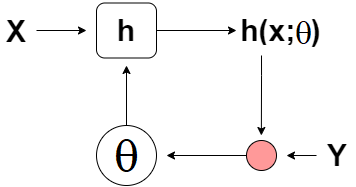
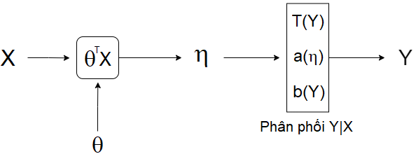

# Tóm tắt

Mở đầu bài viết, ta giới thiệu về mô hình học có giám sát và định nghĩa Exponential Family.

Tiếp đến, ta xây dựng Generalized Linear Model (**GLM**) và thiết lập các tính chất hữu ích của nó.

Cuối cùng, ta đưa ra quy trình áp dụng **GLM** cho bài toán bất kỳ và áp dụng quy trình đó để xây dựng: Linear Regression, Logistic Regression và Softmax Regression.

# Tổng quan

Mô hình học có giám sát khi được đặt dưới những giả thiết nhất định thì trở thành Generalized Linear Model (**GLM**). Đối với một **GLM**, ta sẽ dễ dàng xây dựng được hàm giả thiết, công thức cập nhật tham số và biện luận về tính lồi của hàm Negative Log-Likelihood. Từ đó, ta có thể đưa ra một quy trình tổng quát để thiết kế các mô hình học có giám sát trên.

# Mô hình học có giám sát
Xét tập dữ liệu: $$S= \{(x^{(1)}, y^{(1)}), (x^{(2)}, y^{(2)}),...,(x^{(n)}, y^{(n)}) \}$$. Trong đó, mỗi $$x^{(i)} \in \mathcal{X}$$ được gọi là một điểm dữ liệu và giá trị $$y^{(i)} \in \mathcal{Y}$$ tướng ứng được gọi là nhãn của điểm dữ liệu đó.

Khi này, ta muốn tìm một hàm giả thiết được tham số bởi $$\theta \in \Theta$$:

$$
\begin{equation}
\begin{split}
h:\mathcal{X} &\to \mathcal{Y} \\
x &\mapsto h(x; \theta)
\end{split}
\end{equation}
$$

Sao cho $$h(x^{(i)}; \theta)$$ là một xấp xỉ đủ tốt của $$y^{(i)}$$.

> Để xây dựng được hàm giả thiết như mong đợi ta cần:
>
> - Chọn dạng của hàm số $$h$$. Việc làm này sẽ phụ thuộc vào đánh giá của người thiết kế dựa trên không gian $$\mathcal{X},\mathcal{Y}$$  và mục tiêu của mô hình.
> - Chọn tham số $$\theta$$. Được thực hiện bằng cách "so sánh" giữa $$h(x^{(i)}; \theta)$$ và $$y^{(i)}$$.
>

|  |
| :---: |
| *Hình 1: Mô phỏng quá trình cập nhật tham số $$\theta$$.* |

# Exponential family

Trước khi bước vào xây dựng Generalized Linear Model (**GLM**), ta sẽ đề cập đến một thành phần quan trọng trong **GLM** là *exponential family*. Ta sẽ định nghĩa khi nào một phân phối thuộc *exponential family* và chỉ ra một vài phân phối thường gặp như: phân phối chuẩn, phân phối Bernoulli cũng thuộc vào *exponential family*.

## Định nghĩa

Một phân phối thuộc *exponential family* là khi hàm xác suất của nó có thể biểu diễn dưới dạng

$$
\begin{equation}
p(y; \eta) = b(y) \exp (\eta^T T(y) - a(\eta))
\end{equation}
$$

Trong đó:

- $$\eta$$ được gọi là *natural parameter* (hoặc *canonical parameter*) của phân phối.
- $$T(y)$$ được gọi là *sufficient statistic*.
- $$a(\eta)$$ được gọi là *log partition function*.

> Với những hàm $$T, a, b$$ cố định, ta có họ phân phối được tham số bởi $$\eta$$. Khi thay đổi $$\eta$$, ta có được một phân phối cụ thể trong họ phân phối đó.
>

Ví du: Với những hàm $$T, a, b$$ cố định, ta có họ phân phối chuẩn $$\mathcal{N}(\mu, \sigma)$$. Với một giá trị $$\eta_0$$ cụ thể, ta được một phân phối chuẩn $$\mathcal{N}(\mu_0, \sigma_0)$$.

Ngoài ra, giá trị $$\exp(-a(\eta))$$ đóng vai trò là hằng số chuẩn hóa khiến hàm xác suất khi lấy tích phân luôn bằng 1.

## Ví dụ

### Phân phối Bernoulli

Xét một phân phối $$\text{Bernoulli}(\phi)$$ có hàm khối xác suất là:

$$
\begin{aligned}
p(y; \phi) &= \phi^y(1-\phi)^{1-y} \\
&= \exp(y \log \phi + (1-y)\log(1 - \phi)) \\
&= \exp \left( \left( \log \left( \frac{\phi}{1-\phi} \right) \right)y + \log(1 - \phi) \right)
\end{aligned}
$$

Khi này, ta chọn:

$$
\begin{equation}
\begin{split}
\eta &= \log \left( \frac{\phi}{1 - \phi} \right) \\
T(y) &= y \\
a(\eta) &= - \log(1 - \phi) \\
&= \log(1 + e^{\eta}) \\
b(y) &= 1
\end{split}
\end{equation}
$$

Vậy phân phối Bernoulli thuộc exponential family.

### Phân phối chuẩn

Xét một phân phối chuẩn $$\mathcal{N}(\mu, \sigma)$$ có hàm mật độ xác suất là:

$$
\begin{aligned}
f(y;\mu,\sigma) &= \frac{1}{\sigma \sqrt{2\pi}}\exp\left(-\frac{(y- \mu)^2}{2\sigma^2} \right) \\
&=\frac{1}{\sqrt{2\pi}}\exp \left(\frac{\mu}{\sigma^2}y - \frac{1}{2\sigma^2}y^2 - \left( \frac{\mu^2}{2\sigma^2} + \log \sigma\right) \right)
\end{aligned}
$$

Khi đó, ta chọn:

$$
\begin{equation}
\begin{split}
\eta &= \left[\frac{\mu}{\sigma^2}, -\frac{1}{2\sigma^2} \right]^T \\
T(Y) &= [y, -y^2]^T \\
a(\eta) &= \frac{\mu^2}{2\sigma^2} + \log \sigma \\
&= -\frac{\eta_1^2}{4\eta_2} + \frac{1}{2} \log \left \vert \frac{1}{2 \eta_2} \right \vert \\
b(y)&= \frac{1}{\sqrt{2\pi}}
\end{split}
\end{equation}
$$

Vậy phân phối chuẩn thuộc exponential family.

Ngoài ra, ta có thể biến đổi hàm mật độ của phân phối chuẩn $$\mathcal{N}(\mu, 1)$$ như sau:

$$
\begin{aligned}
f(y;\mu,1) &= \frac{1}{\sqrt{2\pi}}\exp\left(-\frac{1}{2}(y- \mu)^2 \right) \\
&=\frac{1}{\sqrt{2\pi}} \exp \left( - \frac{1}{2}y^2 \right) \exp\left(\mu y - \frac{1}{2}\mu^2 \right)
\end{aligned}
$$

Khi đó, ta chọn:

$$
\begin{aligned}
\eta &= \mu \\
T(y) &= y \\
a(\eta) &= \frac{\mu^2}{2} \\
&= \frac{\eta^2}{2} \\
b(y) &= \frac{1}{\sqrt{2\pi}}\exp \left(- \frac{y^2}{2} \right)
\end{aligned}
$$

> Trong thực tế, ta sẽ thường mô hình dựa trên phân phối chuẩn $$\mathcal{N}(\mu, 1)$$ nhiều hơn là trên phân phối chuẩn tổng quát $$\mathcal{N}(\mu, \sigma)$$. Do vậy, cách chọn tham số $$\eta$$ và các hàm $$T, a, b$$ trong trường hợp 2 sẽ thường gặp hơn.

# Xây dựng GLM

Xét một điểm điểm dữ liệu $$x \in \mathcal{X}$$ là giá trị xác định của vector ngẫu nhiên $$X$$. Nhãn của điểm dữ liệu $$x$$ là $$y \in \mathcal{Y}$$, với $$y$$ là giá trị xác định của vector ngẫu nhiên $$Y$$. Ở đây, ta xét trường hợp rộng là $$X$$ và $$Y$$ đều là vector ngẫu nhiên nhưng sẽ hoàn toàn tương tự trong trường hợp một trong hai hoặc cả hai là biến ngẫu nhiên.

Khi này, để mô hình học có giám sát trở thành một **GLM** thì ta cần đưa ra những giả thiết sau:

1. $$Y \vert X \sim \text{ExponentialFamily}(\eta)$$. Nói cách khác, khi biết $$x$$, giá trị của $$y$$ sẽ tuân theo một phân phối thuộc *exponential family*.
2. Giá trị ta muốn dự đoán là kỳ vọng của $$T(Y) \vert X$$. Nói cách khác, hàm giả thiết sẽ có dạng $$h(x) = \mathbb{E}[T(Y) \vert X]$$   Trong những trường hợp phổ biến thì $$T(Y) = Y$$, lúc này ta đang muốn dự đoán $$Y \vert X$$, hay hàm giả thiết sẽ có dạng $$h(x) = \mathbb{E}[Y \vert X]$$.
3. Tham số $$\eta$$ có mối quan hệ tuyến tính với $$x$$, hay $$\eta = \theta^T x$$. Trong đó, $$\theta \in \Theta$$.

Giả thiết 2 là một giả thiết rất tự nhiên để tìm dạng của hàm giả thiết $$h$$.

Giả thiết 3 phần nào khó giả thích khi đưa ra mối quan hệ tuyến tính trên, nhưng nhờ vậy ta đưa mô hình ban đầu thành **GLM** từ đó có những tính chất rất hữu ích.

|  |
| :---: |
| *Hình 2: Mô phỏng quá trình tạo ra nhãn của điểm dữ liệu.* |

# Tính chất của GLM

Từ giả thiết của phần trước, ta có $$Y \vert X \sim \text{ExponentialFamily}(\eta)$$ nên $$Y\vert X$$ sẽ có hàm xác suất là:

$$
p(y ; \eta) = b(y) \exp (\eta^T T(y) - a(\eta))
$$

Vì $$\eta = \theta^T x$$ nên ta thường viết $$\mathbb{E}[T(y) \vert X]$$ thành $$\mathbb{E}[T(y); \eta]$$; viết $$\text{Var}(T(Y) \vert X)$$ thành $$\text{Var}(T(Y); \eta)$$ nhằm nhấn mạnh hàm số được tham số bởi $$\eta$$.

## $$\mathbb{E}[T(Y) ; \eta] = \frac{\partial}{\partial \eta} a(\eta)$$

Với tính chất này, ta sẽ có một cơ sở chặt chẽ để chọn hàm giả thiết cho mô hình vì: $$h(x) = \mathbb{E}[T(Y) ; \eta] = \frac{\partial}{\partial \eta} a(\eta)$$. Trong đó, hàm số $$a$$ đã xác định khi ta chọn phân phối cho $$Y \vert X$$. Ngoài ra, việc tính $$\frac{\partial}{\partial \eta}a(\eta)$$ tương đối dễ.

Ta sẽ đi chứng minh tính chất trên.

Vì $$p(y; \eta)$$ là hàm xác suất nên:

$$
\begin{aligned}
\int_{\mathcal{Y}}p(y; \eta)dy &= 1 \\
\implies \int_{\mathcal{Y}}b(y) \exp(\eta^T \; T(y)) \frac{1}{\exp(a(\eta))}dy&= 1 \\
\implies \int_{\mathcal{Y}}b(y) \exp(\eta^T \; T(y))dy &= \exp(a(\eta)) \\
\implies \frac{\partial}{\partial \eta} \int_{\mathcal{Y}} b(y) \exp(\eta^T \; T(y))dy &= \frac{\partial}{\partial \eta}\exp(a(\eta)) \\
\implies \int_{\mathcal{Y}} b(y) \frac{\partial}{\partial \eta} \exp(\eta^T \; T(y))dy &=\exp(a(\eta)) \frac{\partial}{\partial \eta} a(\eta) \\
\implies \int_{\mathcal{Y}} T(y) b(y)  \exp(\eta^T\; T(y)) \frac{1}{\exp(a(\eta))}dy &= \frac{\partial}{\partial \eta} a(\eta) \\
\implies \int_{\mathcal{Y}} T(y) b(y)  \exp(\eta^T \; T(y) - a(\eta))dy &= \frac{\partial}{\partial \eta} a(\eta) \\
\implies \mathbb{E}[T(y); \eta] &= \frac{\partial}{\partial \eta} a(\eta)
\end{aligned}
$$

Vậy ta đã chứng minh được tính chất trên.

## $$\text{Cov}(T(Y); \eta) = \frac{\partial^2}{\partial \eta^2} a(\eta)$$

Chứng minh tính chất này sẽ giúp ta lập luận về tính lồi của hàm Negative Log-Likelihood.

Ta có:

$$
\begin{aligned}
\frac{\partial}{\partial \eta} a(\eta) &= \int_{\mathcal{Y}} T(y) b(y)  \exp(\eta \; T(y) - a(\eta))dy \\
\implies \frac{\partial^2}{\partial \eta^2} a(\eta) &= \frac{\partial}{\partial \eta} \int_{\mathcal{Y}} T(y) b(y)  \exp(\eta \; T(y) - a(\eta)) dy \\
&=\int_{\mathcal{Y}} T(y) b(y)  \exp(\eta \; T(y) - a(\eta)) \left(T(y) - \frac{\partial}{\partial \eta} a(\eta)\right)dy \\ 
&=\int_{\mathcal{Y}} T(y)^2 b(y)  \exp(\eta \; T(y) - a(\eta))dy - \frac{\partial}{\partial \eta} a(\eta) \int_{\mathcal{Y}} T(y) b(y)  \exp(\eta \; T(y) - a(\eta))dy \\
&= \mathbb{E}[T(Y)^2; \eta] - \frac{\partial}{\partial \eta} a(\eta) \mathbb{E}[T(Y); \eta] \\
&= \mathbb{E}[T(Y)^2; \eta] - \mathbb{E}[T(Y); \eta]^2 \\
&= \text{Cov}(T(Y); \eta)
\end{aligned}
$$

## Công thức cập nhật $$\theta$$

Với mọi phân phối thuộc *exponential family* thì công thức cập nhật $$\theta$$ luôn cố định

Ta xây dựng được hàm Negative Log-Likehood của tập dữ liệu:

$$
\begin{aligned}
\ell(\theta) &= - \log\left(\prod_{i = 1}^n p(y^{(i)} \vert x^{(i)}) \right)\\ 
&= - \sum_{i=1}^n \log p(y^{(i)}; \eta) \\
&= - \sum_{i=1}^n \left[ \log b\left(y^{(i)}\right) + \left(\eta^T  \; T(y^{(i)}) - a(\eta)\right) \right] \\
&= - \sum_{i=1}^n \left[ \log b\left(y^{(i)}\right) + \left(\left(\theta^T x^{(i)}\right)^T  \; T(y^{(i)}) - a(\theta^T x^{(i)})\right) \right] \\
\end{aligned}
$$

Khi này, vector gradient của hàm Negative Log-Likehood là:

$$
\begin{aligned}
\nabla_{\theta} \;\ell(\theta) &= - \sum_{i=1}^n \left[ x^{(i)}\left(T(y^{(i)})\right)^T - \nabla_{\theta} \eta \; \nabla_{\eta} a(\theta^T x^{(i)})  \right] \\
&= -\sum_{i=1}^n \left[ x^{(i)} \left(T(y^{(i)})\right)^T - x^{(i)} \mathbb{E}[T(Y^{(i)}); \eta]  ^T\right] \\
&= -\sum_{i=1}^n x^{(i)} \left[T(y^{(i)}) - h(x^{(i)};\theta) \right]^T
\end{aligned}
$$

Vậy công thức cập nhật tham số $$\theta$$ là:

$$
\begin{equation}
\theta := \theta +  \alpha \sum_{i=1}^n x^{(i)} \left[T(y^{(i)}) - h(x^{(i)};\theta) \right]^T
\end{equation}
$$

## Hàm Negative Log-Likelihood lồi

Việc chứng minh hàm Negative Log-Likelihood lồi sẽ đảm bảo khi ta tối ưu hàm đó bằng thuật toán tối ưu như *Gradient descent*, thuật toán sẽ hội tụ.

Ta có:

$$
\begin{aligned}
\nabla_{\theta}^2 \ell(\theta) &= \nabla_{\theta}(\nabla_\theta \; \ell(\theta))\\
&= \nabla_{\theta} \left(-\sum_{i=1}^n x^{(i)} \left[T(y^{(i)}) - h(x^{(i)};\theta) \right]^T \right)\\
&= \sum_{i=1}^nx^{(i)} \nabla_{\theta} \; h(x^{(i)}; \theta)^T \\
&= \sum_{i = 1}^n x^{(i)} \text{Cov}(T(Y^{(i)});\eta)x^{(i)^T}
\end{aligned}
$$

Với $$z \in \mathcal{X}$$, ta có:

$$
\begin{aligned}
z^T \nabla_{\theta}^2 \ell(\theta)z &= z^T \left(\sum_{i = 1}^n x^{(i)} \text{Cov}(T(Y^{(i)});\eta)x^{(i)^T} \right)z\\
&=\sum_{i=1}^n (x^{(i)^T}z)^T \text{Cov}(T(Y^{(i)}); \eta) (x^{(i)^T}z)
\end{aligned}
$$

Vì ma trận $$\text{Cov}(T(Y^{(i)}; \eta))$$ nửa xác định dương nên $$z^T \nabla_{\theta}^2 \ell(\theta)z \geq 0$$. Do vậy ma trận $$\nabla_{\theta}^2\ell(\theta)$$ nửa xác định dương.

Vậy hàm Negative Log-Likelihood lồi.

# Quy trình áp dụng GLM cho bài toán

> **Input**: Tập dữ liệu $$\{ (x^{(1)}, y^{(1)}), (x^{(2)}, y^{(2)}),...,(x^{(n)}, y^{(n)}) \}$$. Trong đó: $$x^{(i)} \in \mathcal{X}$$ và $$y^{(i)} \in \mathcal{Y}$$.
>
> 1. Dựa vào mục tiêu bài toán và không gian $$\mathcal{X}, \mathcal{Y}$$. Ta lựa chọn phân phối $$Y \vert X \sim \text{ExponentialFamily}(\eta)$$.
> 2. Thiết lập hàm giả thiết bằng tính chất: $$h(x; \theta) = \mathbb{E}[T(y); \eta] = \frac{\partial}{\partial \eta} a(\eta)$$
> 3. Cập nhật tham số $$\theta$$ bằng công thức:
>
>
> $$
> \theta := \theta + \alpha \sum_{i=1}^n x^{(i)} \left[T(y^{(i)}) - h(x^{(i)};\theta) \right]^T
> $$
>
>**Dự đoán**: Với một điểm dữ liệu mới $$x_0 \in \mathcal{X}$$ thì nhãn của điểm dữ liệu này là $$h(x_0; \theta)$$.

# Áp dụng GLM

Trong phần này, ta sẽ đưa các bài toán về **GLM** theo quy trình 3 bước trên. Ta áp dụng cho 3 mô hình:

1. Linear Regression: $$\mathcal{X} = \mathbb{R}^d, \; \mathcal{Y} = \mathbb{R}$$.
2. Logistic Regression: $$\mathcal{X} = \mathbb{R}^d, \; \mathcal{Y} = \{0,1 \}$$.
3. Softmax Regression:  $$\mathcal{X} = \mathbb{R}^d, \; \mathcal{Y} = \{0,1 \}^k$$.

Qua đó cho thấy được tính linh hoạt của **GLM** khi chỉ cần theo đúng 3 quy trình trên sẽ thiết lập được nhiều mô hình khác nhau.

## Linear Regression

Trong bài toán này, ta có tập dữ liệu  $$\{ (x^{(1)}, y^{(1)}), (x^{(2)}, y^{(2)}),...,(x^{(n)}, y^{(n)}) \}$$. Trong đó: $$x^{(i)} \in \mathbb{R}^d$$ và $$y^{(i)} \in \mathbb{R}$$.

**Bước 1**

Vì $$x^{(i)} \in \mathbb{R}^d$$ và $$y^{(i)} \in \mathbb{R}$$ nên một lựa chọn phổ biến cho phân phối $$Y \vert X$$ là phân phối chuẩn $$\mathcal{N}(\mu; 1)$$.

Như đã xây dựng ở phần trước, khi này ta có:

$$
\begin{aligned}
\eta &= \mu \\
T(y) &= y \\
a(\eta) &= \frac{\eta^2}{2} \\
b(y) &= \frac{1}{\sqrt{2\pi}}\exp \left(- \frac{y^2}{2} \right)
\end{aligned}
$$

**Bước 2**

Ta thiết lập được hàm giả thiết là:

$$
h(x; \theta) = \frac{\partial}{\partial \eta} \left( \frac{\eta^2}{2} \right) = \eta = \theta^Tx
$$

Đây là một hàm tuyến tính nên mô hình này có tên gọi là **Linear** Regression.

**Bước 3**

Ta cập nhật tham số $$\theta$$ bằng công thức:

$$
\begin{equation}
\theta := \theta + \alpha \sum_{i = 1}^n x^{(i)}(y^{(i)} - \theta^Tx^{(i)})
\end{equation}
$$

**Dự đoán**: Với một điểm dữ liệu mới $$x_0 \in \mathbb{R}^d$$ thì nhãn của điểm dữ liệu này là:

$$
\begin{equation}
h(x_0; \theta) = \theta^T x_0
\end{equation}
$$

## Logistic Regression

 Trong bài toán này, ta có tập dữ liệu  $$\{ (x^{(1)}, y^{(1)}), (x^{(2)}, y^{(2)}),...,(x^{(n)}, y^{(n)}) \}$$. Trong đó: $$x^{(i)} \in \mathbb{R}^d$$ và $$y^{(i)} \in \{0,1 \}$$.

**Bước 1**

Vì $$x^{(i)} \in \mathbb{R}^d$$ và $$y^{(i)} \in \{0, 1 \}$$ nên một lựa chọn phổ biến cho phân phối $$Y \vert X$$ là phân phối $$\text{Bernoulli}(\phi)$$.

Như đã xây dựng ở phần trước, khi này ta có:

$$
\begin{equation}
\begin{split}
\eta &= \log \left( \frac{\phi}{1 - \phi} \right) \\
T(y) &= y \\
a(\eta) &= \log(1 + e^{\eta}) \\
b(y) &= 1
\end{split}
\end{equation}
$$

**Bước 2**

Ta thiết lập được hàm giả thiết là:

$$
h(x; \theta) = \frac{\partial}{\partial\eta} \log(1 + e^{\eta}) = \frac{e^{\eta}}{1+ e^{\eta}} = \frac{1}{1 + e^{-\eta}} = \frac{1}{1+e^{-\theta^Tx}}
$$

Đây là hàm *Logistic* nên mô hình này có tên gọi là **Logistic** Regression.

**Bước 3**

Ta cập nhật tham số $$\theta$$ bằng công thức:

$$
\begin{equation}
\theta := \theta + \alpha \sum_{i = 1}^n x^{(i)}\left(y^{(i)} - \frac{1}{1+e^{-\theta^Tx^{(i)}}}\right)
\end{equation}
$$

**Dự đoán**: Với một điểm dữ liệu mới $$x_0 \in \mathbb{R}^d$$ thì nhãn của điểm dữ liệu này là:

$$
\begin{equation}
h(x_0; \theta) = \frac{1}{1+e^{-\theta^Tx_0}}
\end{equation}
$$

## Softmax Regression

Trong bài toán này, ta có tập dữ liệu  $$\{ (x^{(1)}, y^{(1)}), (x^{(2)}, y^{(2)}),...,(x^{(n)}, y^{(n)}) \}$$. Trong đó: $$x^{(i)} \in \mathbb{R}^d$$ và $$y^{(i)} \in \{0,1 \}^k$$. Cụ thể hơn, vector $$y^{(i)}$$ có hai trường hợp:

- Chỉ có duy nhất một giá trị $$y_j^{(i)} = 1$$ và $$y_q^{(i)} = 0$$ với $$q \neq j$$. Thế hiện cho điểm dữ liệu $$x^{(i)}$$ thuộc nhóm từ 1 đến $$k$$.
- Vector không. Thể hiện điểm dữ liệu $$x^{(i)}$$ thuộc nhóm $$k+1$$.

**Bước 1**

Vì $$x^{(i)} \in \mathbb{R}^d$$ và $$y^{(i)} \in \{0, 1 \}^k$$ nên một lựa chọn phổ biến cho phân phối $$Y \vert X$$ là phân phối $$\text{Categorical}(\phi_1, \phi_2,...,\phi_{k+1})$$. Trong đó: 

- Với $$1\leq i\leq k$$ thì $$\phi_i \geq 0$$.
- $$\phi_{k+1} = 1 - \sum_{i=1}^k \phi_i$$.

Khi này, ta có hàm khối xác suất của $$Y \vert X$$ là:

$$
\begin{aligned}
p(y; \phi) &= \phi_{1}^{1\{ y_1 = 1 \}} \phi_{2}^{1\{ y_2 = 1 \}} ...\phi_{k}^{1\{ y_k = 1 \}} \phi_{k+1}^{1 - \sum_{i=1}^k 1\{ y_i = 1 \}} \\
&=\exp \left(1\{y_1 = 1 \} \log\phi_{1} + 1\{y_2 = 1 \} \log\phi_{2} + ... +\left(1 - \sum_{i = 1}^k 1 \{y_i = 1 \} \right)\log\phi_k \right) \\
&= \exp \left( 1\{y_1 = 1 \} \log \frac{\phi_1}{\phi_{k+1}} + 1\{y_2 = 1 \} \log \frac{\phi_2} {\phi_{k+1}} + ... +\log \phi_{k+1} \right) \\
&= b(y) \exp(\eta^T T(y) - a (\eta))
\end{aligned}
$$

Khi đó, ta chọn:

$$
\begin{equation}
\begin{split}
\eta &= \begin{bmatrix}
\log(\phi_1/ \phi_{k+1}) \\
\log(\phi_2/ \phi_{k+1}) \\
\vdots \\
\log(\phi_k/ \phi_{k+1}) \\
\end{bmatrix} \\
T(y) &= \begin{bmatrix}
1\{y_1 = 1 \} \\
1\{y_2 = 1 \} \\
\vdots \\
1\{y_k = 1 \}
\end{bmatrix} = y \\
a(\eta) &= - \log \phi_{k+1} \\
b(y) &= 1
\end{split}
\end{equation}
$$

Để thuận tiện cho việc trình bày, ta thiết lập thêm: $$\eta_{k+1} = \log\frac{\phi_{k+1}}{\phi_{k+1}} = 0$$ và $$\theta_{k+1} = \vec{0} $$ sao cho $$\eta_{k+1} = \theta_{k+1}^Tx$$ = 0. 

Với $$i \in \{1,2,...,k, k+1\}$$, ta có:

$$
\begin{aligned}
\eta_{i} &= \log \frac{\phi_i}{\phi_{k+1}} \\
\exp({\eta_{i}}) &= \frac{\phi_i}{\phi_{k+1}} \\
\phi_{k+1} \exp({\eta_{i}}) &= \phi_i \\
\phi_{k+1} \sum_{i =1}^{k+1} \exp({\eta_i}) & = \sum_{i =1}^{k+1} \phi_i = 1 \\
\phi_{k+1} &= \frac{1}{\sum_{i =1}^{k+1} \exp({\eta_i})}
\end{aligned}
$$

Do đó:

$$
\begin{aligned}
a(\eta) &= -\log\phi_{k+1} \\
&= \log\left( \sum_{i=1}^{k+1} \exp({\eta_i})\right) \\
\end{aligned}
$$

**Bước 2**:

Ta thiết lập được hàm giả thiết là:

$$
\begin{aligned}
h(x; \theta) &= \frac{\partial}{\partial \eta} a(\eta) = \frac{\partial}{\partial \eta}\log\left( \sum_{i=1}^{k+1} \exp({\eta_i})\right) \\
&= \begin{bmatrix}
\exp({\eta_1}) / \sum_{i=1}^{k+1} \exp({\eta_i}) \\
\exp({\eta_2}) / \sum_{i=1}^{k+1} \exp({\eta_i}) \\
\vdots \\
\exp({\eta_k}) / \sum_{i=1}^{k+1} \exp({\eta_i}) \\
\end{bmatrix} \\
&= \begin{bmatrix}
\exp({\theta_1^T x}) / \sum_{i=1}^{k+1} \exp({\theta_i^Tx}) \\
\exp({\theta_2^T x}) / \sum_{i=1}^{k+1} \exp({\theta_i^Tx}) \\
\vdots \\
\exp({\theta_k^T x}) / \sum_{i=1}^{k+1} \exp({\theta_i^T x}) \\
\end{bmatrix}
\end{aligned}
$$

Trong đó: 

$$
\theta = \begin{bmatrix}
\vert & \vert & & \vert \\
\theta_1 & \theta_2 & \cdots & \theta_k \\
\vert & \vert && \vert
\end{bmatrix} \in \mathbb{R}^{d \times k}
$$

Hàm giả thiết $$h$$ có dạng của hàm *Softmax* nên mô hình này có tên là **Softmax** Regression.

**Bước 3**

Ta cập nhật tham số $$\theta$$ bằng công thức:

$$
\begin{equation}
\theta := \theta + \alpha \sum_{i=1}^n x^{(i)} \left(y^{(i)} - \begin{bmatrix}
\exp({\theta_1^T x^{(i)}}) / \sum_{i=1}^{k+1} \exp({\theta_i^Tx^{(i)}}) \\
\exp({\theta_2^T x^{(i)}}) / \sum_{i=1}^{k+1} \exp({\theta_i^Tx^{(i)}}) \\
\vdots \\
\exp({\theta_k^T x^{(i)}}) / \sum_{i=1}^{k+1} \exp({\theta_i^T x^{(i)}}) \\
\end{bmatrix}  \right)^T
\end{equation}
$$

**Dự đoán**: Với một điểm dữ liệu mới $$x_0 \in \mathbb{R}^d$$ thì nhãn của điểm dữ liệu này là: 

$$
\begin{equation}
h(x_0; \theta) =\begin{bmatrix}
\exp({\theta_1^T x_0}) / \sum_{i=1}^{k+1} \exp({\theta_i^Tx_0}) \\
\exp({\theta_2^T x_0}) / \sum_{i=1}^{k+1} \exp({\theta_i^Tx_0}) \\
\vdots \\
\exp({\theta_k^T x_0}) / \sum_{i=1}^{k+1} \exp({\theta_i^T x_0}) \\
\end{bmatrix}
\end{equation}
$$

# Kết luận

Generalized Linear Models (**GLM**) là mô hình tổng quát cho một nhóm mô hình học có giám sát. Khi một mô hình được trình bày như **GLM** sẽ có nhiều tính chất hữu ích giúp việc thiết lập hàm giả thiết, xây dựng công thức cập nhật tham số và biện luận về tính lồi của hàm Negative Log-Likelihood một cách dễ dàng.

Phần chứng minh các tính chất của **GLM** ở đây phần nào vẫn chưa được chặt chẽ. Nhưng các kết quả đó đã được chứng minh đúng và công nhận trong lĩnh vực Machine Learning.

Nội dung bài viết này dựa trên khóa học CS229 của Stanford. [^1] [^2]

# Thuật ngữ sử dụng

| Tiếng Việt          | Tiếng Anh                    | Tiếng Việt         | Tiếng Anh              |
| ------------------- | ---------------------------- | ------------------ | ---------------------- |
| Biến ngẫu nhiên     | Random variable              | Lồi                | Convex                 |
| Điểm dữ liệu        | Datapoint                    | Mô hình tuyến tính | Linear model           |
| Hàm giả thiết       | Hypothesis function          | Nhãn               | Label                  |
| Hàm khối xác suất   | Probability mass function    | Nửa xác định dương | Positive Semi-Definite |
| Hàm mật độ xác suất | Probability density function | Phân phối chuẩn    | Normal distribution    |
| Học có giám sát     | Supervised learning          | Tập dữ liệu        | Dataset                |
| Hồi quy             | Regression                   | Vector ngẫu nhiên  | Random vector          |
| Kỳ vọng             | Expectation                  |                    |                        |

[^1]: Stanford. CS229. Summer 2019. Lecture 6 - Exponential Family & GLM.
[^2]: Stanford. CS229. Summer 2019. Problems set 1
