# Tóm tắt

Mục đích của bài viết là giải thích những khái niệm cơ bản trong *xử lí hình ảnh kỹ thuật số* từ đó dễ dàng hơn khi nói về *nhận diện cạnh* ở bài viết tiếp theo.

Mở đầu bài viết, ta định nghĩa một cách toán học cho những khái niệm: *hình ảnh*, *lát cắt cường độ*, *bộ lọc*, *tích chập*.

Từ những khái niệm trên, ta xây dựng cách *lọc hình ảnh* và đề cập đến kỹ thuật **padding**.

# Định nghĩa

Ở phần này, ta sẽ đưa ra định nghĩa một cách toán học cho các khái niệm: *hình ảnh*, *lát cắt cường độ*, *bộ lọc*, *tích chập*. Việc định nghĩa một cách toán học cho các khái niệm này sẽ giúp dễ dàng trình bày hơn ở những phần sau.

## Hình ảnh

*Hình ảnh* là hàm số $$\mathcal{I}$$, được định nghĩa:

$$
\begin{equation}
\mathcal{I}:G \rightarrow \{0,1,...,255\}^c \subset \mathbb{N}^c 
\end{equation}
$$

Trong đó:

- $$G = \{1,2,...,h\} \times \{1,2,...,w\} \subset \mathbb{N}^2 $$, với $$h$$ và $$w$$ lần lượt là chiều chiều dài và chiều rộng của *hình ảnh* hiển thị trên các thiết bị kỹ thuật số theo đơn vị (pixel). Ngoài ra, $$G$$ còn được gọi là *lưới hình ảnh*.
- $$c \in \mathbb{N}^+$$ được gọi là *kênh*. Ứng với mỗi giá trị của $$c$$, hình ảnh được thể hiện trên các thang cường độ khác nhau. Với $$c = 1$$, ta có *thang độ xám*. Với $$c\geq3$$, ta có *thang màu* (Phổ biến nhất là *mô hình màu* RGB, mỗi pixel được thể hiện bằng cường độ của ba màu: Đỏ, Xanh lá cây và Xanh nước biển. Ngoài ra, còn những *mô hình màu* khác như: CMY, CMYK,...). Với $$c$$ là các giá trị lớn như $$c=20$$, ta có *thang siêu phổ*.

| 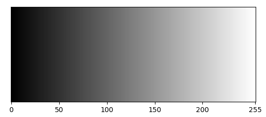 |
| :-------------------------------------: |
|         *Hình 1: Thang độ xám.*         |

| 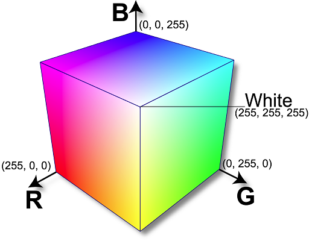 |
| :------------------------------------: |
|       *Hình 2: Mô hình màu RGB*        |

Với mỗi $$p \in G$$, $$p$$ được gọi là một *pixel*. Giá trị của $$\mathcal{I}$$ tại một pixel, thể hiện cường độ của pixel tại vị trí đó. Ví dụ: $$\mathcal{I}(p) = 0$$ ứng với màu đen trong *thang độ xám* tại vị trí pixel $$p$$. $$\mathcal{I}(p) = [255, 0,0]$$ ứng với màu đỏ trong *mô hình màu RGB* tại vị trí pixel $$p$$. Ngoài ra, giá trị $$\mathcal{I}(p)$$ còn được gọi là *cường độ* của pixel $$p$$.

Để hiểu rõ hơn những hình ảnh kỹ thuật số được biểu diễn thế nào dưới dạng hàm số $$\mathcal{I}$$, ta sẽ tìm hiểu qua một vài ví dụ.

|           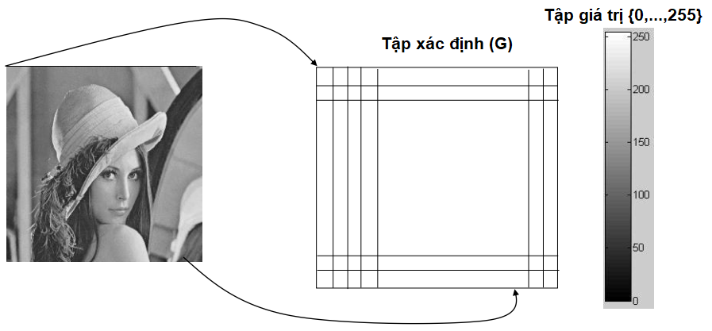            |
| :----------------------------------------------------------: |
| *Hình 3: Tập giá trị và tập xác định của hàm số $$\mathcal{I}$$ khi biểu diễn hình ảnh **lena stego** [^CAP5415]* |

Khi này, mọi giá trị của hàm số $$\mathcal{I}$$ tại vị trí pixel $$p$$ là một số thuộc $$\{0,...,255\}$$.

|           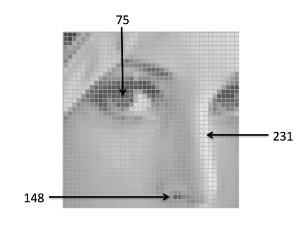            |
| :----------------------------------------------------------: |
| *Hình 4: Hình ảnh **lena stego** trong thang độ xám* [^CAP5415] |

Ngoài ra, nếu hình ảnh kỹ thuật số ban đầu được chụp có màu thì ta có thể biểu diễn bằng hàm số $$\mathcal{I}$$ với *kênh* $$c=3$$ trong *mô hình màu RGB*.

|           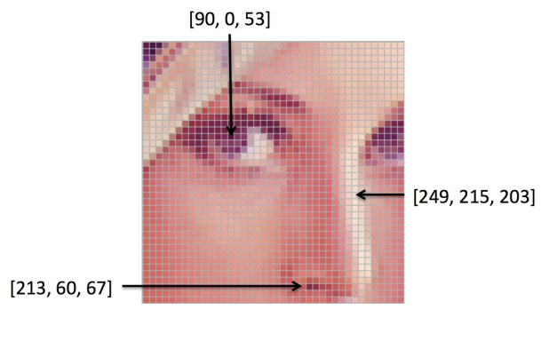            |
| :----------------------------------------------------------: |
| *Hình 5: Hình ảnh **lena stego** trong mô hình màu RGB* [^CAP5415] |

> Trong bài viết sẽ đề cập chủ yếu *hình ảnh* trong thang độ xám.
>

Trong thực tế, tập xác định của hàm số $$\mathcal{I}$$ không nhất thiết là $$ \{0,1,2,...,255\}^c \subset \mathbb{N}^c $$ như trên mà có thể khác phụ thuộc vào cách lựa chọn *mô hình màu*. Ví dụ: trong *mô hình màu*: Lab, HSV, HSL,... tập xác định của hàm số $$\mathcal{I}$$ không giống như trên. Nhưng vì ở đây ta đề cập chủ yếu hình ảnh trong thang độ xám nên xây dựng hàm số $$\mathcal{I}$$ như trên sẽ thuận tiện cho việc trình bày sau này.

## Lát cắt cường độ

Xét *hình ảnh* $$\mathcal{I}: \{1,...,h\} \times \{1,...,w\} \rightarrow \{0,...,255\}^c $$. *Lát cắt cường độ* của *hình ảnh* $$\mathcal{I}$$ tại hàng $$h_0$$ là hàm số $$\mathcal{P}$$, được định nghĩa:

$$
\begin{equation}
\begin{split}
\mathcal{P}: \; \{1,2,...,w\} &\rightarrow \{0,1,...,255\}^c \\
x &\rightarrow \mathcal{I}(h_0, x)
\end{split}
\end{equation}
$$

Để hiểu rõ hơn về định nghĩa trên, ta sẽ xem *lát cắt cường độ* của *hình ảnh* **lena stego** tại hàng 70.

|           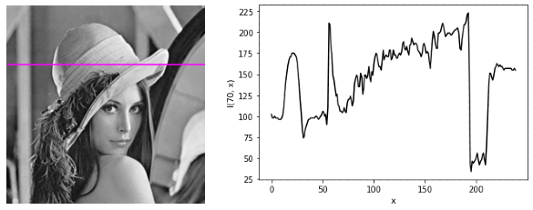            |
| :----------------------------------------------------------: |
| *Hình 6: Hàng 70 của hình ảnh **lena stego** (màu tím, trái). Lát cắt cường độ hình ảnh **lena stego** tại hàng 70 (phải).* |

Một cách tương tự, ta có thể định nghĩa *lát cắt cường độ* cho cột của *hình ảnh*, nhưng trong bài viết chỉ sử dụng *lát cắt cường độ* cho hàng của *hình ảnh*.

> Một cách nôm na, ta có thể hiểu *lát cắt cường độ* là *hình ảnh* một chiều, *hình ảnh* có một hàng và $$w$$ cột. Do đó ta có thể xây dựng những khái niệm trong *xử lí hình ảnh* trên *lát cắt cường độ* sau đó tổng quát lên *hình ảnh* thật (*hình ảnh* hai chiều) sẽ dễ hiểu hơn.
>

|           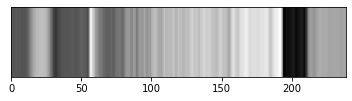            |
| :----------------------------------------------------------: |
| *Hình 7: Lát cắt cường độ của hình ảnh **lena stego** tại hàng 70 dưới dạng hình ảnh một chiều.* |

## Bộ lọc

Đây là khái niệm được dùng nhiều trong bài viết. Nhưng sau khi tham khảo nhiều nguồn thì mình không tìm được định nghĩa nào chặt chẽ cho khái niệm *bộ lọc*. Nên ở đây, ta sẽ định nghĩa *bộ lọc* là hàm số $$f$$ nhằm thuận tiện cho việc trình bày sau này.

### Bộ lọc một chiều

*Bộ lọc một chiều* là hàm số $$f$$, được định nghĩa:

$$
\begin{equation}
f:D \subset \mathbb{Z} \rightarrow \mathbb{R}
\end{equation}
$$

Trong đó, $$D = \{a_1, a_2,...,a_n\}$$ là một tập hợp hữu hạn phần tử với số lượng phần tử rất ít. Các giá trị thường gặp của $$n$$ là: $$2, 3, 5, 7,...$$ 

Khi này, *bộ lọc một chiều* $$f$$ được ký hiệu là:

$$
\begin{equation}
f \triangleq \left[ f(a_1) \quad f(a_2) \quad \dots \quad f(a_n) \right]
\end{equation}
$$

Ta có thể hiểu rõ hơn qua một vài ví dụ:

- Với $$D = \{0, 1\}$$, ta có bộ lọc: $$[1, -1]$$. Khi này: $$f(0) = 1; \; f(1) = -1$$
- Với $$D = \{-1, 0, 1\}$$, ta có bộ lọc: $$ [\frac{1}{3} , \frac{1}{3}, \frac{1}{3}] $$. Khi này: $$f(-1) = \frac{1}{3}; \; f(0) = \frac{1}{3}; \; f(1) = \frac{1}{3}$$.

### Bộ lọc hai chiều

*Bộ lọc hai chiều* là *bộ lọc một chiều* được tổng quát lên.

*Bộ lọc hai chiều* là hàm số $$f$$, được định nghĩa:

$$
\begin{equation}
f:D \subset \mathbb{Z}^2 \rightarrow \mathbb{R}
\end{equation}
$$

Trong đó, $$D = \{a_1, a_2,...,a_m\} \times \{b_1, b_2,...,b_n \}$$ là một tập hợp hữu hạn phần tử với số lượng phần tử rất ít. Các giá trị thường gặp của $$(m,n)$$ là:  $$(2,2), (3,3), (5,5),...$$

Khi này, *bộ lọc hai chiều* $$f$$ được ký hiệu là:

$$
\begin{equation}
f \triangleq \begin{bmatrix}
f(a_1, b_1) & \dots & f(a_1, b_n) \\ 
\vdots & \ddots & \vdots \\
f(a_m, b_1) & \dots & f(a_m, b_n)
\end{bmatrix}
\end{equation}
$$

Ta có thể hiểu rõ hơn qua một vài ví dụ:

Với $$D = \{0, 1\} \times \{0, 1\}$$, ta có bộ lọc $$2 \times 2$$: 

$$
\begin{aligned}
\begin{bmatrix}
\frac{1}{4} & \frac{1}{4} \\
\frac{1}{4} & \frac{1}{4} 
\end{bmatrix}
\end{aligned}
$$

Khi này:

- $$ f(0, 0) = \frac{1}{4}; \; f(0, 1) = \frac{1}{4} $$ 

- $$ f(1, 0) = \frac{1}{4}; \; f(1, 1) = \frac{1}{4} $$   

Với $$D = \{-1, 0, 1\} \times \{-1, 0, 1\} $$, ta có bộ lọc $$ 3 \times 3 $$: 

$$
\begin{aligned}
\begin{bmatrix}
-1 & 0 & 1 \\
-2 & 0 & 2 \\
-1 & 0 & 1 \\
\end{bmatrix}
\end{aligned}
$$

Khi này:

-  $$ f(-1, -1) = -1; \; f(-1, 0) = 0; \; f(-1, 1) = 1$$ 
- $$ f(0, -1) = -2; \; f(0, 0) = 0; \; f(0, 1) = 2 $$ 
- $$ f(1, -1) = -1; \; f(1, 0) = 0; \; f(1, 1) = 1 $$

### Lưu ý

> Trong nhiều bài viết, *bộ lọc* còn được gọi với tên khác như: *mặt nạ*, *kernel*. Nhưng ở đây ta thống nhất gọi là *bộ lọc*.
>

Ở đây, ta định nghĩa *bộ lọc* là một hàm số $$f$$ có tập xác định $$D$$ và tập giá trị $$\mathbb{R}$$ rất cụ thể nhưng trong nhiều bài viết *bộ lọc* không được định nghĩa cụ thể như vậy. Đa phần *bộ lọc* được định nghĩa là một lưới ô vuông. Ví dụ: bộ lọc $$3 \times 3$$ được định nghĩa:

$$
\begin{aligned}
\begin{array}{|c|c|c|}
\hline
-1 & 0 & 1 \\
\hline
-2 & 0 & 2 \\
\hline
-1 & 0 & 1 \\
\hline
\end{array}
\end{aligned}
$$

Mục đích việc định nghĩa *bộ lọc* là hàm số $$f$$ cụ thể như trên nhằm thuận tiện hơn cho việc trình bày về sau.

Cuối cùng, ký hiệu của hàm số $$f$$ ở trên ($$ [ .]$$) khá giống với ký hiệu của *ma trận*. Quả đúng như vậy, ở một góc độ nào đó, ta có thể xem hàm số $$f$$ là một ma trận. 

Ví dụ: Xét *bộ lọc* $$ f: \{1, 2\} \times \{ 1, 2\} \rightarrow \mathbb{R}$$

$$
\begin{aligned}
f = 
\begin{bmatrix}
f(1,1) & f(1, 2) \\
f(2,1) & f(2, 2)
\end{bmatrix}
=
\begin{bmatrix}
\frac{1}{4} & \frac{1}{4} \\
\frac{1}{4} & \frac{1}{4}
\end{bmatrix}
\end{aligned}
$$

Khi này, hàm số $$f$$ có thể được xem như ma trận $$A \in \mathbb{R}^{2 \times 2} $$

$$
\begin{aligned}
A =
\begin{bmatrix}
A_{11} & A_{12} \\
A_{21} & A_{22}
\end{bmatrix}
=
\begin{bmatrix}
\frac{1}{4} & \frac{1}{4} \\
\frac{1}{4} & \frac{1}{4}
\end{bmatrix}
\end{aligned}
$$

Lý do ta định nghĩa *bộ lọc* là hàm số vì khi đó ta có thể sử dụng kí hiệu $$f(.,.)$$ sẽ thuận tiện hơn cho việc trình bày. Bên cạnh đó, ta có thể thay đổi tập xác định $$D$$ để thể hiện các số chỉ âm. 

Ví dụ: Với tập xác định $$ D = \{ -1, 0, 1\} \times \{ -1, 0, 1\} $$ thì ta có giá trị của hàm $$f$$ tại điểm $$(-1, -1) $$ là $$f(-1, -1)$$. Trong khi, nếu ta sử dụng kí hiệu cho giá trị của ma trận tại vị trí $$(-1, -1)$$ là $$A_{-1 -1}$$ sẽ gây khó hiểu.

> Tóm lại, việc định nghĩa *bộ lọc* như trên nhằm thuận tiện cho việc trình bày.
>

## Tích chập

Trong bài viết chỉ sử dụng *tích chập* của hai hàm số **một biến rời rạc** và *tích chập* của hai hàm số **hai biến rời rạc** nên ta chỉ định nghĩa  *tích chập* trong hai trường hợp trên. Tích chập có thể mở rộng lên hàm số nhiều hơn hai biến và liên tục.

### Ví dụ

Ta sẽ dễ hiểu hơn về *tích chập* của hai hàm số qua việc tìm hiểu [ví dụ](https://www.youtube.com/watch?v=QmcoPYUfbJ8&ab_channel=Discretised) sau.

Giả sử ta có một hộp diêm. **Mỗi** que diêm sau khi được đốt sẽ tỏa khói ra ngoài không khí. Lượng khói tỏa ra ngoài không khí sẽ là hàm số $$S(t)$$ phụ thuộc vào Thời gian $$t$$

|           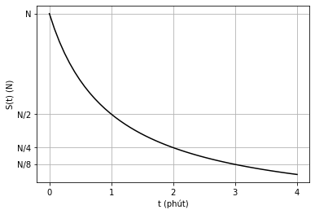            |
| :----------------------------------------------------------: |
| *Hình 8: Đồ thị sự phụ thuộc của "Lượng khói tỏa ra ngoài không khí" và "Thời gian".* |

Ta có thể hiểu, ở thời điểm $$t=0$$ khi vừa đốt que diêm, que diêm sẽ cháy với lượng khói tối đa $$N$$. Sau một phút, lượng khói sẽ giảm một nửa so với lượng khói trước đó một phút.

Bên cạnh đó, tại mỗi thời điểm $$t$$, ta sẽ đốt $$f(t)$$ que diêm. Khi đó, Số lượng que diêm đốt sẽ là hàm số $$f(t)$$ phụ thuộc vào Thời gian $$t$$

|           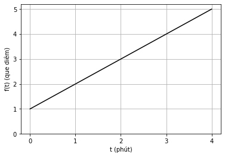            |
| :----------------------------------------------------------: |
| *Hình 9: Đồ thị sự phụ thuộc của "Số lượng que diêm đốt" và "Thời gian".* |

Ta có thể hiểu, ở thời điểm $$t=0$$, ta sẽ đốt $$1$$ que diêm; ở thời điểm $$t=1$$, ta sẽ đốt $$2$$ que diêm,...

> Khi này, ta quan tâm đến Tổng lượng khói tỏa ra ngoài không khí và muốn tìm công thức tính cho đại lượng này. Giả sử Tổng lượng khói tỏa ra ngoài không khí là hàm số $$g(t)$$ phụ thuộc vào Thời gian $$t$$. Ta sẽ bắt đầu bằng việc tìm giá trị của hàm số $$g(t)$$ ở những thời điểm $$t$$ nhất định.
>

Với $$t=0$$, khi này:

- Ta vừa đốt $$f(0)=1$$ que diêm nên $$f(0) = 1$$ que diêm đó sẽ tỏa ra $$S(0) = N$$ lượng khói. 

Do đó, ta có:

$$
\begin{aligned}
g(0) &= f(0)S(0) \\
&=1 \times N \\
&= N
\end{aligned}
$$

Với $$t=1$$, khi này:

-  $$f(0) = 1$$ que diêm ở thời điểm $$t=0$$ đã cháy được $$1$$ phút nên $$f(0)=1$$ que diêm đó sẽ tỏa ra $$S(1)= \frac{N}{2}$$ lượng khói.
- Ta vừa đốt $$f(1)=2$$ que diêm nên $$f(1) = 2$$ que diêm đó sẽ tỏa ra $$S(0) = N$$ lượng khói. 

Do đó, ta có:

$$
\begin{aligned}
g(1) &= f(0)S(1) + f(1)S(0) \\
&= 1 \times \frac{N}{2} + 2 \times N \\
&= 2.5 \times N
\end{aligned}
$$

Với $$t=2$$, khi này:

-  $$f(0) = 1$$ que diêm ở thời điểm $$t=0$$ đã cháy được $$2$$ phút nên $$f(0)=1$$ que diêm đó sẽ tỏa ra $$S(2)= \frac{N}{4}$$ lượng khói.
-  $$f(1) = 2$$ que diêm ở thời điểm $$t=1$$ đã cháy được $$1$$ phút nên $$f(1)=2$$ que diêm đó sẽ tỏa ra $$S(1)= \frac{N}{2}$$ lượng khói.
- Ta vừa đốt $$f(2)=3$$ que diêm nên $$f(2) = 3$$ que diêm đó sẽ tỏa ra $$S(0) = N$$ lượng khói. 

Do đó, ta có:

$$
\begin{aligned}
g(2) &= f(0)S(2) + f(1)S(1) + f(2)S(0) \\
&= 1 \times \frac{N}{4} + 2 \times \frac{N}{2} + 3 \times N	 \\
&= 4.34 \times N
\end{aligned}
$$

Bằng lập luận tương tự, ở thời điểm $$t$$, Tổng lượng khói tỏa ra ngoài không khí sẽ là:

$$
\begin{equation}
g(\textcolor{red}{t}) = \sum_{\textcolor{yellow}{\tau} = 0}^{\textcolor{red}{t}} f(\textcolor{yellow}{\tau}) \, S(\textcolor{red}{t}-\textcolor{yellow}{\tau})
\end{equation}
$$

Để hiểu rõ hơn về quá trình trên, ta có thể quan sát đồ thị sau:

|           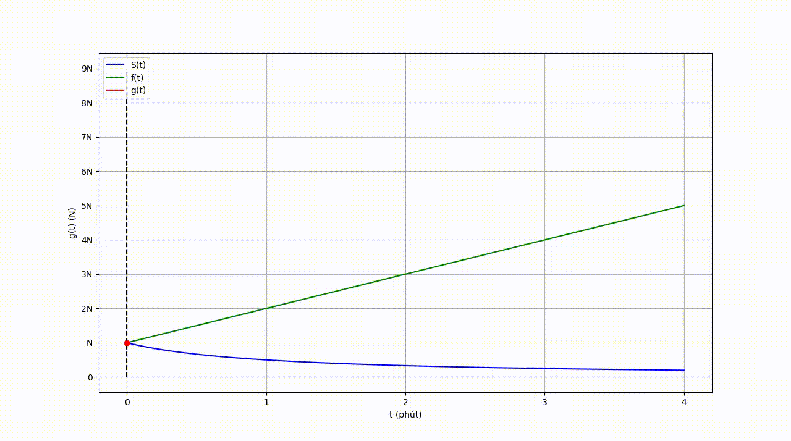            |
| :----------------------------------------------------------: |
| *Hình 10: Đồ thị sự phụ thuộc của "Tổng lượng khói tỏa ra ngoài không khí" và "Thời gian".* |

Hàm số $$g(t)$$ ta vừa tìm được còn được gọi là **Tích chập của $$f(t)$$ và $$S(t)$$**. Ký hiệu $$g(t) = f * S $$.

> Một cách trực quan, ta có thể hiểu, tích chập của hai hàm số là một hàm số kết hợp của hai hàm số ban đầu giúp ta theo dõi sự thay đổi của chúng theo thời gian.

### Tích chập của hai hàm số một biến rời rạc

Xét hai hàm số một biến rời rạc:

$$
\begin{equation}
\begin{split}
f: D \subset \mathbb{Z} \rightarrow \mathbb{R} \\
\mathcal{I}: G \subset \mathbb{Z} \rightarrow \mathbb{R}
\end{split}
\end{equation}
$$

Khi này, *tích chập* của hai hàm số $$f$$ và $$\mathcal{I}$$ được định nghĩa là:

$$
\begin{equation}
\mathcal{I}^{'}(\textcolor{red}{t}) \triangleq f * \mathcal{I} \triangleq \sum_{\textcolor{yellow}{\tau} \in D} f(\textcolor{yellow}{\tau}) \, \mathcal{I}(\textcolor{red}{t} - \textcolor{yellow}{\tau})
\end{equation}
$$

### Tích chập của hai hàm số hai biến rời rạc

Xét hai hàm số hai biến rời rạc:

$$
\begin{equation}
\begin{split}
f: H \times W \subset \mathbb{Z}^2 \rightarrow \mathbb{R}  \\
\mathcal{I}: G \subset \mathbb{Z}^2 \rightarrow \mathbb{R} 
\end{split}
\end{equation}
$$

Khi này, *tích chập* của hai hàm số $$f$$ và $$\mathcal{I}$$ được định nghĩa là:

$$
\begin{equation}
\mathcal{I}^{'}(x,y) \triangleq f * \mathcal{I} \triangleq \sum_{a \in H} \sum_{b \in W}f(a,b) \, \mathcal{I}(x-a, y-b)
\end{equation}
$$

### Lưu ý

Cách định nghĩa *tích chập* như trên có phần không chặt chẽ vì sẽ có một vài vị trị hàm số $$\mathcal{I}$$ không xác định. Hạn chế này sẽ được nói rõ hơn ở những phần sau.

# Lọc lát cắt cường độ và hình ảnh

Khi đã có những định nghĩa về: *hình ảnh*, *bộ lọc*, *tích chập*; ta sẽ tìm hiểu về khái niệm *lọc hình ảnh*. Nhưng trước khi thực hiện lọc trên *hình ảnh* thật (hình ảnh 2 chiều), sẽ dễ hiểu hơn khi ta tim hiểu về lọc *lát cát cường độ* (hình ảnh 1 chiều).

## Lọc lát cắt cường độ

Xét *lát cắt cường độ* $$\mathcal{P}$$ trong *thang độ xám*:

$$
\mathcal{P}: \{1,2,...,w\} \subset \mathbb{N} \rightarrow \{0,1,...,255\}
$$

Và *bộ lọc một chiều* $$f$$:

$$
f: D = \{a_1, a_2,...,a_n\} \subset \mathbb{Z} \rightarrow \mathbb{R}
$$

Khi này, hành động *lọc lát cắt cường độ* $$\mathcal{P}$$ bằng *bộ lọc* $$f$$ được hiểu là, ta sẽ tính *tích chập* của hai hàm số trên:

$$
\begin{equation}
\mathcal{P}^{'}(t) = f* \mathcal{P} = \sum_{\tau \in D} f(\tau) \mathcal{P}(t-\tau)
\end{equation}
$$

Ta dễ dàng nhận thấy, hàm số $$\mathcal{P}$$ sẽ không xác định tại những vị trí ngoài rìa. Cách xử lý hiện tại, ta xem như hàm số $$\mathcal{P}^{'}$$ cũng không xác định tại những vị trí đó. Về sau ta sẽ đề cập đến kỹ thuật **padding** để khắc phục hạn chế trên.

### Chuẩn hóa

Trong một vài trường hợp, ta cần xem $$\mathcal{P}^{'}$$ như một *lát cắt cường độ*. Nhưng vì tập giá trị của $$\mathcal{P}^{'}$$ là trên $$\mathbb{R}$$ nên ta vẫn chưa thể xem $$\mathcal{P}^{'}$$ là một *lát cắt cường độ*. Để giải quyết vần đề đó, ta sẽ chuẩn hóa $$\mathcal{P}^{'}$$ qua hai bước:

- Đưa $$ \min \mathcal{P}^{'}$$ về $$\min \mathcal{P}$$,  $$\max \mathcal{P}^{'}$$ về $$\max \mathcal{P}$$ và trải đều các giá trị khác trên đoạn $$[\min \mathcal{P}, \max \mathcal{P}]$$
- Đưa mọi giá trị của $$\mathcal{P}^{'}$$ về giá trị nguyên lớn nhất liền trước nó. 

Việc làm này được thể hiện bằng một cách toán học như sau:

$$
\begin{equation}
\begin{split}
&\forall i \in \{1,2,...,w\} \\
&\mathcal{P}^{'}(i) :=  \left \lfloor \frac{\mathcal{P}^{'}(i) - \min \mathcal{P}^{'}}{\max \mathcal{P}^{'} - \min \mathcal{P}^{'}} (\max \mathcal{P} - \min \mathcal{P}) + \min \mathcal{P} \right \rfloor
\end{split}
\end{equation}
$$

Trong đó: $$\lfloor . \rfloor$$ là hàm *floor*.

Khi này, ta có thêm xem hàm số $$\mathcal{P}^{'}$$ là *lát cắt cường độ* có được sau khi lọc *lát cắt cường độ* $$\mathcal{P}$$ bằng bộ lọc $$f$$.

> Việc chuẩn hóa hàm số $$\mathcal{P}^{'}$$ sau khi thực hiện phép lọc là **không bắt buộc**. Việc chuẩn hóa giúp ta có thể xem $$\mathcal{P}^{'}$$ là *lát cắt cường độ* từ đó có thể vẽ trên *thang độ xám*.

### Ví dụ

Để hiểu rõ hơn về *lọc lát cắt cường độ*, ta sẽ tìm hiểu qua ví dụ sau.

Xét *lát cắt cường độ* của hình ảnh **lena stego** tại hàng 70:

$$
\mathcal{P}: \{1,2,...,239\} \rightarrow \{0,1,...,255\}
$$

|          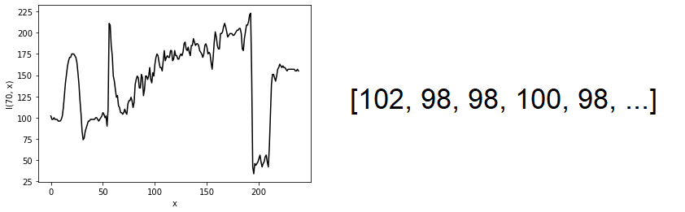           |
| :----------------------------------------------------------: |
| *Hình 11: Lát cắt cường độ hình ảnh **lena stego** tại hàng 70 (trái). Các giá trị của lát cắt cường độ: $$\mathcal{P}(1), \; \mathcal{P}(2), \; \mathcal{P}(3),...$$ (phải)* |

Và *bộ lọc* $$f$$:

$$
\begin{equation}
\begin{split}
&f: \{-1, 0, 1\} \rightarrow \mathbb{R} \\
&f = [-1, 0, 1]
\end{split}
\end{equation}
$$

Khi này, áp dụng công thức đã xây dựng ta có được:

$$
\mathcal{P}{'}(t) = \sum_{\tau = -1}^1 f(\tau) \, \mathcal{P}(t-\tau)
$$

Dựa vào công thức, ta có thể hiểu theo một cách thao tác, ta có thể xây dựng $$\mathcal{P}^{'}(t)$$ qua các bước sau:

- Xoay *bộ lọc* $$f$$ một góc $$180^o$$ thành: $$[1, 0, -1]$$.
- Trượt $$[1, 0, -1]$$ theo *lát cắt cường độ*.
- Tính tích phần tử theo phần tử sau đó cộng các kết quả lại với nhau.
- Kết quả có được là giá trị của $$\mathcal{P}^{'}(t)$$ tại vị trí tương ứng.

Việc làm trên có thể được biểu diễn bằng hình ảnh sau:

|           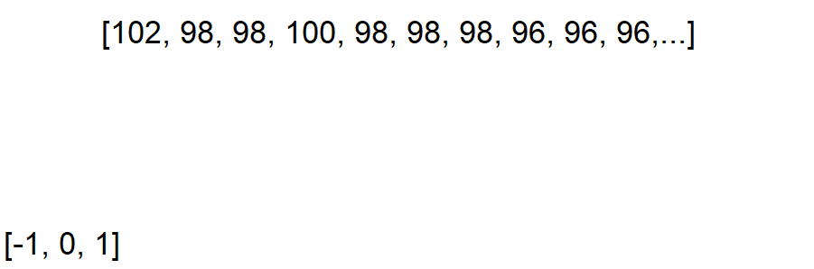            |
| :----------------------------------------------------------: |
| *Hình 12: Mô phỏng quá trình xây dựng hàm số $$\mathcal{P}^{'}(t)$$.* |

Sau khi chuẩn hóa hàm số $$\mathcal{P}^{'}$$, ta thu được *lát cắt cường độ*:

$$
\mathcal{P}^{'}:\{2,3,...,238\} \rightarrow \{0,1,...,255\}
$$

Khác với hàm số $$\mathcal{P}$$, ta nhận thấy hàm số $$\mathcal{P}^{'}$$ không xác định tại $$t = 1$$ và $$t=239$$ vì hàm số $$\mathcal{P}$$ không xác định tại $$t=0$$ và $$t=240$$:

$$
\mathcal{P}^{'}(1) = f(-1) \, \mathcal{P}(2) + f(0) \, \mathcal{P}(1) + f(1) \, \textcolor{red}{\mathcal{P}(0)} \\
\mathcal{P}^{'}(239) = f(-1) \, \textcolor{red}{\mathcal{P}(240)} + f(0) \, \mathcal{P}(239) + f(1) \, \mathcal{P}(238)
$$

Đây là hạn chế đã đề cập phía trên, tạm thời ta xem hàm số $$\mathcal{P}^{'}$$ cũng không xác định tại những vị trí đó. Do đó, sau khi thực hiện *lọc*, tập xác định của hàm số $$\mathcal{P}^{'}$$ nhỏ hơn hàm số $$\mathcal{P}$$ ban đầu.

|           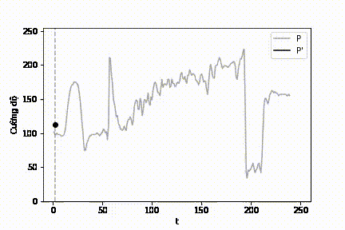            |
| :----------------------------------------------------------: |
| *Hình 13: Mô phỏng quá trình lọc lát cắt cường độ $$\mathcal{P}$$.* |

Ngoài ra, ta có thể xem *lát cắt cường độ* $$\mathcal{P}^{'}$$ như hình ảnh một chiều:

|          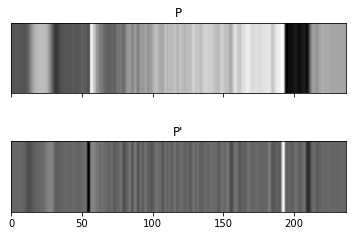           |
| :----------------------------------------------------------: |
| *Hình 14: Lát cắt cường độ $$\mathcal{P}$$ dưới dạng hình ảnh một chiều (trên). Lát cắt cường độ $$\mathcal{P}^{'}$$ dưới dạng hình ảnh một chiều (dưới).* |

Ta nhận thấy, trên *lát cắt cường độ* $$\mathcal{P}^{'}$$, có hai vị trí đặc biệt:

- Vị trí gần $$50$$: một vệt đen ($$\mathcal{P}^{'}(t) \approx 0$$) ứng với vị trí thay đổi **đột ngột** từ *đen* sang *trắng* của $$\mathcal{P}$$.
- Vị trí gần $$200$$: một vệt trắng ($$\mathcal{P}^{'}(t) \approx 255$$) ứng với vị trí thay đổi **đột ngột** từ *trắng* sang *đen* của $$\mathcal{P}$$.

Hiện tượng trên xảy ra là do cách chọn bộ lọc $$f = [-1, 0, 1]$$, chi tiết sẽ được giải thích ở phần sau.

## Lọc hình ảnh

Xét *hình ảnh* $$\mathcal{I}$$ trong *thang độ xám*:

$$
\mathcal{I}: \{1, 2,..., h\} \times \{1,2,...,w\} \subset \mathbb{N}^2 \rightarrow \{0,1,...,255\}
$$

Và *bộ lọc hai chiều* $$f$$:

$$
f:\{a_1,a_2,...,a_m\} \times \{b_1,b_2,...,b_n\} \subset \mathbb{Z}^2 \rightarrow \mathbb{R}
$$

Khi này, hành động *lọc hình ảnh* $$\mathcal{I}$$ bằng *bộ lọc* $$f$$ được hiểu là, ta sẽ tính *tích chập* của hai hàm số trên:

$$
\begin{equation}
\mathcal{I}^{'}(x,y) = f* \mathcal{I} = \sum_{a \in \{1,...,h\}} \sum_{b \in \{1,...,w\}} f(a,b) \mathcal{I}(x-a, y-b)
\end{equation}
$$

Ta dễ dàng nhận thấy, hàm số $$\mathcal{I}$$ sẽ không xác định tại những vị trí ngoài rìa. Cách xử lý hiện tại, ta xem như hàm số $$\mathcal{I}^{'}$$ cũng không xác định tại những vị trí đó.

### Chuẩn hóa

Trong một vài trường hợp, ta cần xem $$\mathcal{I}^{'}$$ như một *hình ảnh*. Nhưng vì tập giá trị của $$\mathcal{I}^{'}$$ là trên $$\mathbb{R}$$ nên ta vẫn chưa thể xem $$\mathcal{I}^{'}$$ là một *hình ảnh*. Để giải quyết vần đề đó, ta sẽ chuẩn hóa $$\mathcal{I}^{'}$$ qua hai bước:

- Đưa $$ \min \mathcal{I}^{'}$$ về $$\min \mathcal{I}$$,  $$\max \mathcal{I}^{'}$$ về $$\max \mathcal{I}$$ và trải đều các giá trị khác trên đoạn $$[\min \mathcal{I}, \max \mathcal{I}]$$
- Đưa mọi giá trị của $$\mathcal{I}^{'}$$ về giá trị nguyên lớn nhất liền trước nó. 

Việc làm này được thể hiện bằng một cách toán học như sau:

$$
\begin{equation}
\begin{split}
&\forall i \in \{1,2,...,h\}; \qquad \forall j \in \{1,2,...,w\} \\
&\mathcal{I}^{'}(i,j) :=  \left \lfloor \frac{\mathcal{I}^{'}(i,j) - \min \mathcal{I}^{'}}{\max \mathcal{I}^{'} - \min \mathcal{I}^{'}} (\max \mathcal{I} - \min \mathcal{I}) + \min \mathcal{I} \right \rfloor
\end{split}
\end{equation}
$$

Trong đó: $$\lfloor . \rfloor$$ là hàm *floor*.

Khi này, ta có thể xem hàm số $$\mathcal{I}^{'}$$ là *hình ảnh* có được sau khi lọc *hình ảnh* $$\mathcal{I}$$ bằng bộ lọc $$f$$.

> Việc chuẩn hóa hàm số $$\mathcal{I}^{'}$$ sau khi thực hiện phép lọc là **không bắt buộc**. Việc chuẩn hóa giúp ta có thể xem $$\mathcal{I}^{'}$$ là *hình ảnh* từ đó có thể vẽ trên *thang độ xám*.

### Ví dụ

Để hiểu rõ hơn về *lọc hình ảnh*, ta sẽ tìm hiểu qua ví dụ sau.

Xét hình ảnh **lena stego**:

$$
\mathcal{P}: \{1,2,...,239\} \times\{1,2,...,239\} \rightarrow \{0,1,...,255\}
$$

|          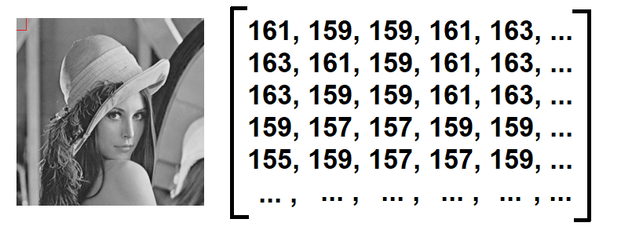           |
| :----------------------------------------------------------: |
| *Hình 15: Hình ảnh **lena stego** (trái), lưới ô vuông pixel $$5 \times 5$$ đầu tiên của hình ảnh (trái, ô vuông màu đỏ). Giá trị của lưới ô vuông pixel $$5 \times 5$$ (phải).* |

Trong phần tiếp theo, ta thể hiện chủ yếu các thao tác trên lưới ô vuông pixel $$ 5 \times 5$$ để dễ hình dung. Ngoài ra, các giá trị của lưới ô vuông pixel $$ 5 \times 5$$ rất gần nhau nên khi vẽ trên *thang độ xám* sẽ khó phân biệt. Do đó, ta sẽ *chuẩn hóa* lưới ô vuông pixel $$5 \times 5$$ về $$ \min = 0; \; \max = 255 $$.

**Lưu ý, việc *chuẩn hóa* chỉ phục vụ cho mục đích trình bày, trên *hình ảnh* thật ta không thực hiện chuẩn hóa**.

|          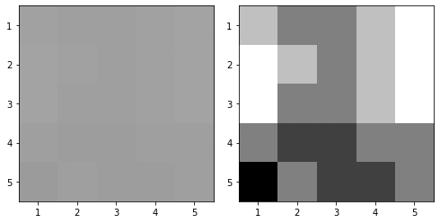           |
| :----------------------------------------------------------: |
| *Hình 16: Lưới ô vuông pixel $$5 \times 5$$ trước khi chuẩn hóa (trái). Lưới ô vuông pixel $$5 \times 5$$ sau khi chuẩn hóa (phải).* |

Tiếp đến, ta sẽ xét *bộ lọc* $$f$$:

$$
\begin{equation}
\begin{split}
&f: \{-1, 0, 1\} \times \{-1, 0, 1\} \rightarrow \mathbb{R} \\
&f = 
\begin{bmatrix}
\frac{1}{16} & \frac{2}{16} & \frac{1}{16} \\
\frac{2}{16} & \frac{4}{16} & \frac{2}{16} \\
\frac{1}{16} & \frac{2}{16} & \frac{1}{16}
\end{bmatrix}
= \frac{1}{16} \;
\begin{bmatrix}
1 & 2 & 1 \\
2 & 4 & 2 \\
1 & 2 & 1
\end{bmatrix}
\end{split}
\end{equation}
$$

Khi này, áp dụng công thức đã xây dựng ta có được:

$$
\mathcal{I}{'}(x, y) = \sum_{a=-1}^1 \sum_{b = -1}^1 f(a, b) \, \mathcal{I}(x - a, y-b)
$$

Dựa vào công thức, ta có thể hiểu theo một cách thao tác, ta có thể xây dựng $$\mathcal{I}^{'}(x, y)$$ qua các bước sau:

- Xoay *bộ lọc* $$f$$​ một góc $$180^o$$​ thành: $$\frac{1}{16} \;
  \begin{bmatrix}
  1 & 2 & 1 \\
  2 & 4 & 2 \\
  1 & 2 & 1
  \end{bmatrix}$$​ (bộ lọc $$f$$ vẫn giống như cũ vì bộ lọc $$f$$ đối xứng).
- Trượt $$\frac{1}{16} \;
  \begin{bmatrix}
  1 & 2 & 1 \\
  2 & 4 & 2 \\
  1 & 2 & 1
  \end{bmatrix}$$​ theo *hình ảnh*.
- Tính tích phần tử theo phần tử sau đó cộng các kết quả lại với nhau.
- Kết quả có được là giá trị của $$\mathcal{I}^{'}(x, y)$$ tại vị trí tương ứng.

Việc làm trên có thể được biểu diễn bằng hình ảnh sau:

|           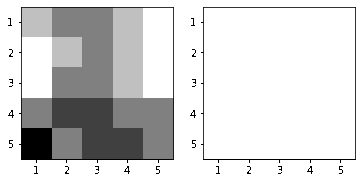            |
| :----------------------------------------------------------: |
| *Hình 17: Mô phỏng quá trình lọc hình ảnh $$\mathcal{I}$$. Lưới ô vuông pixel $$5 \times 5$$ trước khi lọc (trái). Lưới ô vuông pixel $$5 \times 5$$ sau khi lọc (phải) .* |

Ta dễ dàng nhận thấy, hàm số $$\mathcal{I}$$ không xác định tại những vị trị rìa nên tập xác định của hàm số $$\mathcal{I}^{'}$$ sẽ nhỏ hơn tập xác định của hàm số $$\mathcal{I}$$

$$
\mathcal{I}^{'}: \{2,3,...,238\} \times \{2, 3,..., 238\} \rightarrow \{0,1,...,255\}
$$

Khi đặt hai hình ảnh ở cạnh nhau, ta sẽ nhận ra nhiều điểm đặc biệt:

|                     |
| :----------------------------------------------------------: |
| *Hình 18: Hình ảnh **lena stego** gốc (trái). Hình ảnh **lena stego** sau khi lọc (phải). Những giá trị ngoài rìa không xác định (phải, màu đỏ).* |

Ta nhận thấy, trên *hình ảnh* $$\mathcal{I}^{'}$$, có những điểm đặc biệt:

- *Hình ảnh* $$\mathcal{I}^{'}$$ **nhỏ** hơn *hình ảnh* $$\mathcal{I}$$.
- *Hình ảnh* $$\mathcal{I}^{'}$$ **mờ** hơn *hình ảnh* $$\mathcal{I}$$.

Hiện tượng trên xảy ra là do cách chọn bộ lọc $$f = \frac{1}{16} \;
\begin{bmatrix}
1 & 2 & 1 \\
2 & 4 & 2 \\
1 & 2 & 1
\end{bmatrix}$$, chi tiết sẽ được giải thích ở phần sau.

## Lưu ý

Lọc *lát cắt cường độ* và *hình ảnh* bằng cách tính *tích chập* của hai hàm số là cách làm được công nhận và sử dụng rộng rãi thế nhưng trong khoảng 20 năm trở lại đây với sự trở lại của những hệ thống học sâu, các bài viết về học sâu thường sử dụng cách thức khác để lọc *hình ảnh*. Đó là sử dụng **tương quan chéo**

Xét hai hàm số hai biến rời rạc:

$$
f: H \times W \subset \mathbb{Z}^2 \rightarrow \mathbb{R} \\
\mathcal{I}: G \subset \mathbb{Z}^2 \rightarrow \mathbb{R}
$$

Khi này, **tương quan chéo** của hai hàm số $$f$$ và $$\mathcal{I}$$ được định nghĩa là:

$$
\begin{equation}
\begin{split}
\mathcal{I}^{'}(x, y) \triangleq f \star \mathcal{I} \triangleq \sum_{a \in H} \sum_{b \in W} f(a, b) \, \mathcal{I}(x \textcolor{red}{+} a, y \textcolor{red}{+} b)
\end{split}
\end{equation}
$$

Một cách thao tác, ta có thể hiểu cách tính **tương quan chéo** của hai hàm số tương tự như cách tính **tích chập** của hai hàm số, ngoại trừ việc ta không thực hiện bước "quay *bộ lọc* một góc $$180^o$$" khi tính **tương quan chéo**.

Một điều kỳ lạ là trong những bài viết về học sâu, họ tính **tương quan chéo** giữa hai hàm số nhưng vẫn gọi đó là tính **tích chập** của hai hàm số nên có thể gây khó hiểu cho người đọc.

Ở đây, ta định nghĩa việc *lọc hình ảnh* là tính **tích chập** của hai hàm số.

> Lời giải thích cho việc tại sao người viết hay sử dụng **tương quan chéo** thay vì **tích chập** trong những bài viết về học sâu có thể là. Trong các hệ thống học sâu, các *bộ lọc* sẽ được chính hệ thống học sâu cập nhật và cải thiện, nên không quan trọng lựa chọn cách thức nào thì các hệ thống học sâu vẫn tìm ra được *bộ lọc* tối ưu. Bên cạnh đó, việc bỏ qua bước "quay bộ lọc một góc $$180^o$$" sẽ giúp người đọc dễ theo dõi hơn.
>

# Padding

Như đã đề cập ở phần trước, khi thực hiện *lọc lát cát cường độ* và *hình ảnh* thì tập xác định của *lát cắt cường độ* và *hình ảnh* sẽ bị thu nhỏ lại. Ở phần này, ta sẽ đề cập đến kỹ thuật **padding** để khắc phục hạn chế này. Để dễ hình dung, ta sẽ bắt đầu trước với *lát cắt cường độ*, trong trường hợp *hình ảnh* sẽ được mở rộng tương tự.

## Padding lát cắt cường độ

Xét lát cắt cường độ $$\mathcal{P}$$:

$$
\mathcal{P}: \{1,2,...,w\} \rightarrow \{0,1,...,255\}
$$

*Padding* lát cắt cường độ $$\mathcal{P}$$ với giá trị $$p$$ nghĩa là: Ta sẽ mở rộng tập xác định của hàm số $$\mathcal{P}$$ ở mỗi rìa thêm $$p$$ vị trị, những vị trí mới của hàm số $$\mathcal{P}$$ được gán bằng 0.

Khi đó, ta có được lát cắt cường độ mới $$\mathcal{P}_{\text{pad}}$$:

$$
\begin{equation}
\begin{split}
\mathcal{P}_{\text{pad}} :& \; \{\textcolor{red}{1-p}, \textcolor{red}{2-p},...,1,2,...,w, \textcolor{red}{w+1},...,\textcolor{red}{w+p-1}, \textcolor{red}{w+p}\} \\
&\rightarrow \{0,1,...,255\} \\
&\text{Trong đó:} \qquad \forall i \in \{1,2,...,p\} \\
&\mathcal{P}_{\text{pad}}(i-p) = 0 \\
&\mathcal{P}_{\text{pad}}(w+i) = 0
\end{split}
\end{equation}
$$

Ví dụ: Xét lát cắt cường độ $$\mathcal{P}$$:

$$
\mathcal{P}: \{1,2,3,4\} \rightarrow \{0,1,...,255\} \\
$$

Khi này, *padding* lát cắt cường độ $$\mathcal{P}$$ với giá trị $$p=2$$, ta có được lát cắt cường độ mới $$\mathcal{P}_{\text{pad}}$$:

$$
\begin{aligned}
\mathcal{P}_{\text{pad}}:& \; \{-1,0,...,5,6\} \rightarrow \{0,1,...,255\} \\
&\text{Trong đó:} \\
&\mathcal{P}_{\text{pad}}(-1) = 0; \qquad \mathcal{P}_{\text{pad}}(0) = 0 \\
&\mathcal{P}_{\text{pad}}(5) = 0; \qquad \mathcal{P}_{\text{pad}}(6) = 0
\end{aligned}
$$

## Padding hình ảnh

Xét hình ảnh $$\mathcal{I}$$:

$$
\mathcal{I}: \{1,2,...,h\} \times \{1,2,...,w\} \rightarrow \{0,1,...,255\}
$$

*Padding* hình ảnh $$\mathcal{I}$$ với giá trị $$p$$ nghĩa là: Ta sẽ mở rộng tập xác định của hàm số $$\mathcal{I}$$ ở mỗi rìa thêm $$p$$ vị trị, những vị trí mới của hàm số $$\mathcal{I}$$ được gán bằng 0.

Khi đó, ta có được hình ảnh mới $$\mathcal{I}_{\text{pad}}$$:

$$
\begin{equation}
\begin{split}
\mathcal{I}_{\text{pad}} :& \; \{\textcolor{red}{1-p},...,1,...,\textcolor{red}{h+p}\} \times \{\textcolor{red}{1-p},...,1,...,\textcolor{red}{w+p}\} \\
&\rightarrow \{0,1,...,255\} \\
& \text{Trong đó:} \quad \forall i,j \in \{1,2,...,p\} \\
&\mathcal{I}_{\text{pad}}(i-p, j-p) = 0 \\
&\mathcal{I}_{\text{pad}}(w+i, w+j) = 0
\end{split}
\end{equation}
$$

Ví dụ: Xét hình ảnh $$\mathcal{I}$$:

$$
\mathcal{I}:\{1,2,...,5\} \times \{1,2,...,5\} \rightarrow \{0,1,...,255\}
$$

Khi này, *padding* hình ảnh $$\mathcal{I}$$ với giá trị $$p=1$$, ta có được hình ảnh mới $$\mathcal{I}_{\text{pad}}$$:

$$
\mathcal{I}_{\text{pad}}: \{0,1,...,6\} \times \{0,1,...,6\} \rightarrow \{0,1,...,255\}
$$

|          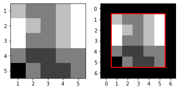           |
| :----------------------------------------------------------: |
| *Hình 19: Hình ảnh $$\mathcal{I}$$ (trái). Hình ảnh $$\mathcal{I}_{\text{pad}}$$ (phải).* |

## Chế độ padding khi lọc

Xét hình ảnh $$\mathcal{I}$$, và bộ lọc hai chiều $$f$$:

$$
f: \{a_1,a_2,...,a_n\} \times \{b_1,b_2,...,b_n\} \rightarrow \mathbb{R}
$$

**Chế độ 'valid'**: Ở chế độ này, ta không thực hiện *padding* cho hình ảnh $$\mathcal{I}$$ mà lọc hình ảnh trực tiếp bằng bộ lọc $$f$$. Khi này:

$$
\begin{equation}
\begin{split}
\mathcal{I} = \mathcal{I}_{\text{pad}} \\
\mathcal{I}^{'} = \mathcal{I}^{'}_{\text{pad}} 
\end{split}
\end{equation}
$$

**Chế độ 'same'**: Ở chế độ này, ta thực hiện *padding* cho hình ảnh $$\mathcal{I}$$ với giá trị $$p$$ thỏa mãn:

$$
\begin{equation}
p = \left \lfloor \frac{n-1}{2} \right \rfloor
\end{equation}
$$

Trong đó: $$\lfloor . \rfloor$$ là hàm *floor*.

Ta sử dụng bộ lọc $$f$$ trên hình ảnh $$\mathcal{I}_{\text{pad}}$$, khi này ta sẽ thu được hình ảnh mới với tập xác định giữ nguyên so với hình ảnh $$\mathcal{I}$$. Từ đó ta khắc phục được hạn chế hình ảnh bị thu nhỏ lại sau khi lọc.

Ví dụ: Ta sẽ thực hiện lọc hình ảnh **lena stego** bằng bộ lọc $$f=\frac{1}{16} \;
\begin{bmatrix}
1 & 2 & 1 \\
2 & 4 & 2 \\
1 & 2 & 1
\end{bmatrix}$$ với *padding* $$p=1$$:

|                     |
| :----------------------------------------------------------: |
| *Hình 20: Hình ảnh **lena stego** gốc (trái). Hình ảnh **lena stego** sau khi lọc (phải).* |

Ta nhận thấy, trên hình ảnh **lena stego** sau khi lọc, có những đặc điểm sau:

- Hình ảnh sau khi lọc có cùng kích thước với hình ảnh ban đầu.
- Viền của hình ảnh sau khi lọc có màu đen là do ta thực hiện *padding*.

# Kết luận

Bài viết trên mục đích chính là đưa ra những khái niệm cơ bản nên vì thế vẫn chưa cho thấy được ứng dụng thực tế của những khái niệm trên. Ở bài viết tiếp theo, ta sẽ sử dụng những khái niệm đó vào **nhận diện cạnh** trong *xử lí hình ảnh kỹ thuật số*.

# Thuật ngữ đã sử dụng

| Tiếng Việt                 | Tiếng Anh                |
| -------------------------- | ------------------------ |
| Bộ lọc                     | Filter                   |
| Học sâu                    | Deep learning            |
| Kênh                       | Channel                  |
| Lát cắt cường độ           | Intensity profile        |
| Lọc hình ảnh               | Image Filtering          |
| Lưới                       | Grid                     |
| Mặt nạ                     | Mask                     |
| Mô hình màu                | Color model              |
| Siêu phổ                   | Hyperspectral            |
| Thang độ xám               | Greyscale                |
| Thang màu                  | Color scale              |
| Tích chập                  | Convolution              |
| Tương quan chéo            | Cross-Correlation        |
| Xử lí hình ảnh kĩ thuật số | Digital image processing |

[^CAP5415]: Yogesh S Rawat. UCF. CAP5415. Fall 2020. Lecture 3: Filtering