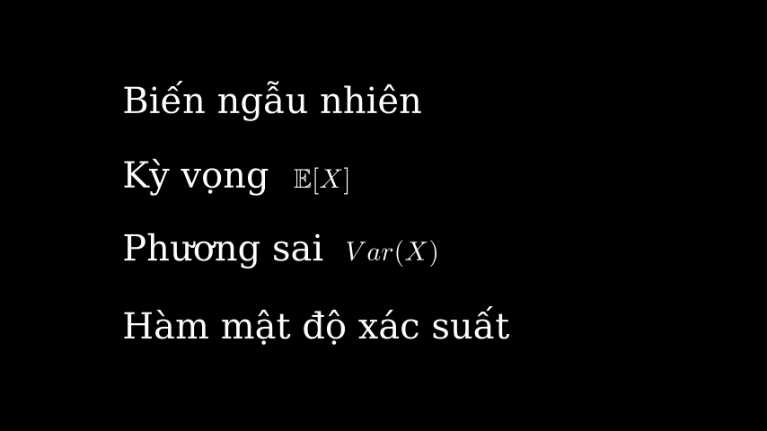

# Tóm tắt (trang bìa)

Trong bài viết hôm nay chúng ta sẽ tìm hiểu một cách trực quan về phân phối thường xuất hiện rất nhiều trong khoa học cũng như đời sống hằng ngày, đó là phân phối chuẩn/phân phối Gaussian.

Mở đầu bài viết, ta tìm hiểu về bài khảo sát chiều cao các học sinh và nhận xét rút ra được từ phân phối đó.

Tiếp đến, ta sẽ tìm hiểu về hàm mật độ xác suất của phân phối chuẩn và đồ thị của hàm số thay đổi như thế nào khi ta thay đổi các tham số.

Cuối cùng, ta sẽ mở rộng phân phối chuẩn trong không gian 2-chiều và nhiều chiều hơn.

# Kiến thức yêu cầu (trang 1)

Để hiểu nội dung bài viết các bạn cần biết về những khái niệm trong xác suất thống kê như sau:

# Khảo sát chiều cao (trang 2)

Phân phối chuẩn xuất hiện trong những dữ liệu có số lượng tập trung nhiều ở giá trị trung bình và giảm dần khi ra xa. Một trong những đặc điểm của con người thường tuân theo phân phối chuẩn là chiều cao. Để hiểu rõ hơn, ta thực hiện khảo sát chiều cao của 200 bạn học sinh.

<iframe width="960" height="540" src="../assets/post_video/pima_submission/v1.mp4" frameborder="0" allowfullscreen></iframe>

