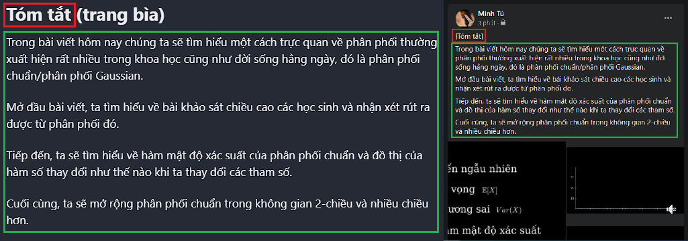

# Cách trình bày trên Facebook

Phần này sẽ không có trong bài viết chính thức trên Facebook. Ở phần này, em sẽ nói rõ hơn cách bài post này được trình bày thế nào khi đưa lên trang fanpage Facebook.

Những Heading ở đây bỏ phần dấu "()" là phần được viết trong "[]" trên bài viết Facebook.

Trang bìa là trang đầu tiên của bài post trên fanpage.

Trang có số là những trang sau đó.

# Tóm tắt (trang bìa)

Trong bài viết hôm nay chúng ta sẽ tìm hiểu một cách trực quan về phân phối thường xuất hiện rất nhiều trong khoa học cũng như đời sống hằng ngày, đó là phân phối chuẩn/phân phối Gaussian.

Mở đầu bài viết, ta tìm hiểu về bài khảo sát chiều cao các học sinh và nhận xét rút ra được từ phân phối đó.

Tiếp đến, ta sẽ tìm hiểu về hàm mật độ xác suất của phân phối chuẩn và đồ thị của hàm số thay đổi như thế nào khi ta thay đổi các tham số.

Cuối cùng, ta sẽ mở rộng phân phối chuẩn trong không gian 2-chiều và nhiều chiều hơn.

# Kiến thức yêu cầu (trang 1)

Để hiểu nội dung bài viết các bạn cần biết về những khái niệm trong xác suất thống kê như sau:

# Khảo sát chiều cao (trang 2)

Phân phối chuẩn xuất hiện trong những dữ liệu có số lượng tập trung nhiều ở giá trị trung bình và giảm dần khi ra xa. Một trong những đặc điểm của con người thường tuân theo phân phối chuẩn là chiều cao. Để hiểu rõ hơn, ta thực hiện khảo sát chiều cao của 200 bạn học sinh.

<iframe width="960" height="540" src="../assets/post_video/pima_submission/v1.mp4" frameborder="0" allowfullscreen></iframe>

# Nhận xét về phân phối của chiều cao (trang 3)

Qua khảo sát trên, ta có nhận xét:

- Phân phối của chiều cao các bạn có dạng hình cong, đường cong này thường được gọi là đường cong chuông.
- Chiều cao trung bình của các bạn khoảng: 170cm.
- Nhiều bạn học sinh có chiều cao gần chiều cao trung bình (Hình chữ nhật màu xanh).
- Ít bạn học sinh có chiều cao xa với chiều cao trung bình (Hình chữ nhật màu đỏ).

<iframe width="960" height="540" src="../assets/post_video/pima_submission/v2.mp4" frameborder="0" allowfullscreen></iframe>

# Hàm mật độ xác suất của biến ngẫu nhiên (trang 4)

Ta có thể phát biểu một cách toán học như sau, gọi chiều cao của mỗi bạn trong khảo sát trên là một giá trị xác định của biến ngẫu nhiên $$X$$. Nếu biến ngẫu nhiên $$X$$ được lấy mẫu từ phân phối chuẩn thì ta sẽ có được hàm mật độ xác suất của $$X$$ như sau:

<iframe width="960" height="540" src="../assets/post_video/pima_submission/v3.mp4" frameborder="0" allowfullscreen></iframe>

# Thay đổi giá trị kỳ vọng (trang 5)

Để hiểu rõ hơn về hàm mật độ xác suất trên, ta sẽ xem đồ thị hàm số sẽ thay đổi như thế nào khi $$\mu$$ thay đổi.

Ta thấy được đồ thị hàm số sẽ bị dịch sang trái hoặc dịch sang phải khi $$\mu$$ thay đổi.

<iframe width="960" height="540" src="../assets/post_video/pima_submission/v4.mp4" frameborder="0" allowfullscreen></iframe>

# Thay đổi giá trị phương sai (trang 6)

Để hiểu rõ hơn về hàm mật độ xác suất trên, ta sẽ xem đồ thị hàm số sẽ thay đổi như thế nào khi $$\sigma^2$$ thay đổi.

Ta thấy được đồ thị hàm số sẽ rộng ra hoặc hẹp lại khi $$\sigma^2$$ thay đổi.

<iframe width="960" height="540" src="../assets/post_video/pima_submission/v5.mp4" frameborder="0" allowfullscreen></iframe>

# Mở rộng trong không gian 2-chiều (trang 7)

Ngoài ra, hàm mật độ xác suất trên có thể mở rộng lên trong không gian 2-chiều. Đồ thị của hàm số có dạng như sau:

<iframe width="960" height="540" src="../assets/post_video/pima_submission/v6.mp4" frameborder="0" allowfullscreen></iframe>

# Mở rộng trong không gian nhiều chiều (trang 8)

Hàm mật độ xác suất trong không gian nhiều chiều có dạng tương tự trong không gian 1-chiều. Bên cạnh đó, ta sử dụng thêm những khái niệm trong đại số tuyến tính như: vector, ma trận; để biểu diễn hàm số.

<iframe width="960" height="540" src="../assets/post_video/pima_submission/v7.mp4" frameborder="0" allowfullscreen></iframe>

# Kết luận (trang 9)

Hy vọng qua bài viết này, các bạn có được cái nhìn trực quan về phân phối chuẩn.

Ngoài ra, các bạn có thể tìm đọc thêm nhiều tính chất khác của phân phối chuẩn cũng như những phân phối khác thường được nhắc đến như: phân phối Binomial, phân phối Poisson,...

Cảm ơn các bạn đã đọc bài viết.

<iframe width="960" height="540" src="../assets/post_video/pima_submission/v8.mp4" frameborder="0" allowfullscreen></iframe>

